# 03. User Flow

## 1. Mục đích

Tài liệu này mô tả luồng tương tác giữa người dùng và hệ thống KaiwaUp.

Mục tiêu:

* Thống nhất cách người dùng sử dụng từng chức năng.
* Xác định các bước chính trong mỗi hành trình.
* Xác định các trường hợp thành công, thất bại và ngoại lệ.
* Làm cơ sở để thiết kế giao diện, API, database và module hệ thống.

---

# 2. Luồng tổng quan

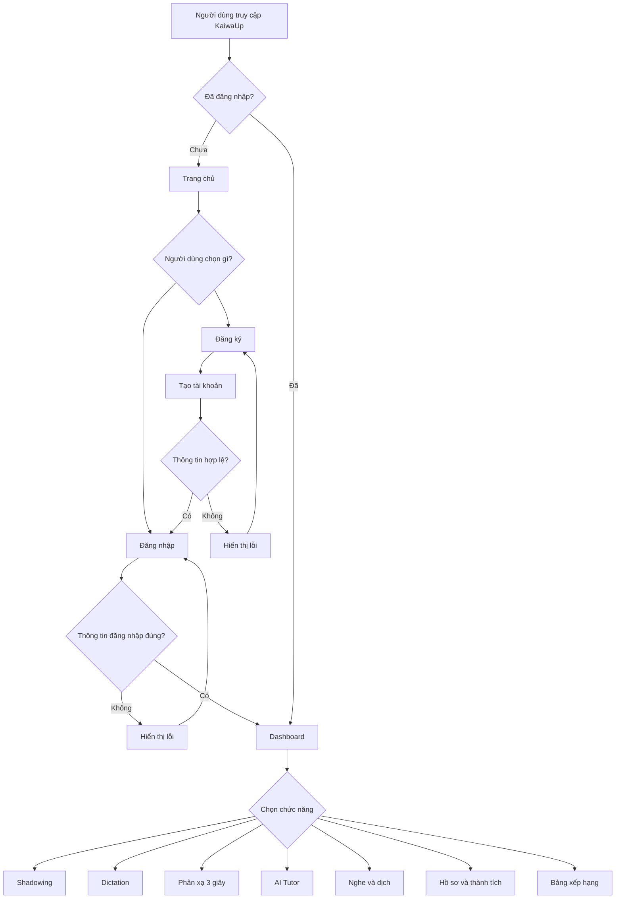

---

# 3. Luồng đăng ký

## 3.1. Luồng chính

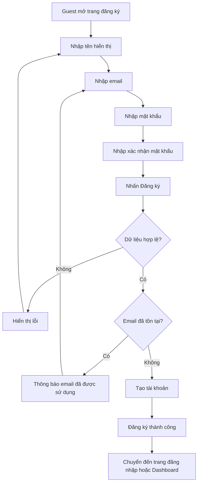

## 3.2. Luồng ngoại lệ

* Email không đúng định dạng.
* Mật khẩu không đáp ứng yêu cầu.
* Mật khẩu xác nhận không khớp.
* Email đã được sử dụng.
* Hệ thống không thể tạo tài khoản.
* Mất kết nối mạng trong quá trình đăng ký.

---

# 4. Luồng đăng nhập

## 4.1. Luồng chính

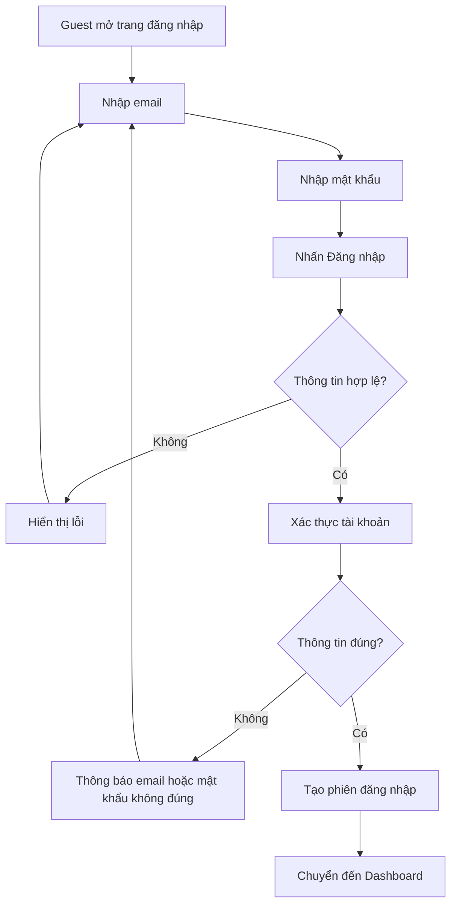

## 4.2. Luồng ngoại lệ

* Email hoặc mật khẩu để trống.
* Email không đúng định dạng.
* Email không tồn tại.
* Mật khẩu không đúng.
* Hệ thống không thể xác thực.
* Mất kết nối mạng.

---

# 5. Luồng Dashboard

Sau khi đăng nhập thành công, người dùng được chuyển đến Dashboard.

Dashboard hiển thị:

* Lời chào và thông tin người dùng.
* Cấp độ hiện tại.
* Tổng EXP.
* Tiến độ học tập.
* Các bài học hoặc bài luyện được đề xuất.
* Các bài cần ôn lại.
* Thành tích gần đây.
* Vị trí hiện tại trên bảng xếp hạng nếu có.

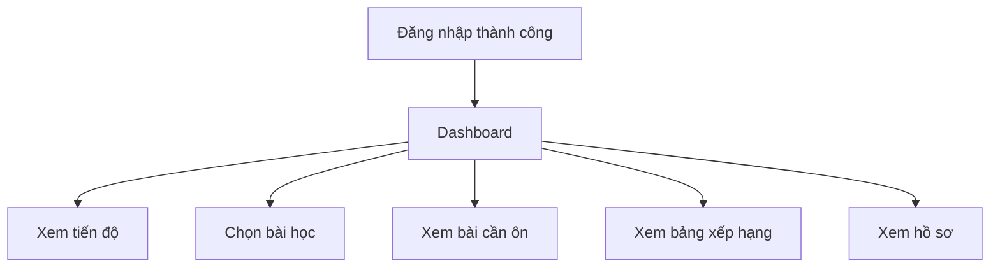

---

# 6. Luồng luyện Shadowing kép

## 6.1. Luồng chính

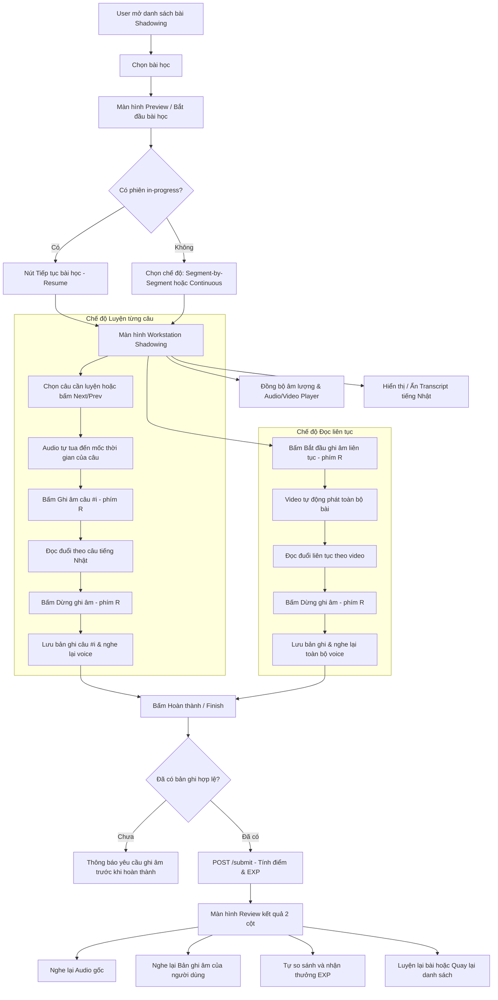

## 6.2. Các phím tắt hỗ trợ trong quá trình luyện tập

* `Space` / `Ctrl+Space` / `Cmd+Space`: Phát hoặc tạm dừng video / audio bài học.
* `R` / `Alt+R`: Bật hoặc dừng ghi âm giọng nói (tự động bỏ qua khi đang gõ phím trong ô nhập liệu).
* `→` / `Ctrl+→` / `Cmd+→`: Chuyển sang câu tiếp theo (chế độ Segment).
* `←` / `Ctrl+←` / `Cmd+←`: Quay lại câu trước đó (chế độ Segment).

## 6.3. Luồng lỗi và xử lý ngoại lệ

* **Audio không tải được**: Hiển thị cảnh báo lỗi tải audio; người dùng vẫn có thể ghi âm để tự luyện tập.
* **Người dùng từ chối quyền microphone**: Hiển thị cảnh báo yêu cầu cấp quyền microphone trong trình duyệt kèm nút thử lại.
* **Tải lên bản ghi thất bại**: Hiển thị Toast thông báo lỗi mạng; bản ghi được lưu tạm trong bộ nhớ cục bộ.
* **Tiếp tục phiên đang dở**: Tự động khôi phục danh sách các câu đã ghi âm trước đó.

---

# 7. Luồng luyện Dictation

## 7.1. Luồng chính

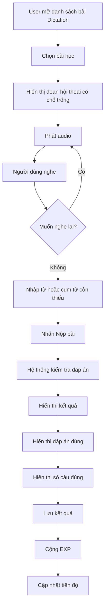

## 7.2. Luồng lỗi

* Audio không tải được.
* Người dùng chưa điền đủ câu trả lời.
* Không thể nộp bài.
* Hệ thống không thể kiểm tra kết quả.

---

# 8. Luồng phản xạ 3 giây

## 8.1. Luồng chính

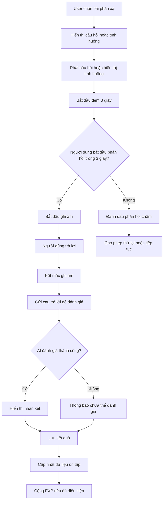

## 8.2. Quy tắc thời gian

Trong phiên bản hiện tại:

* Người dùng có **3 giây để bắt đầu phản hồi**.
* Thời gian trả lời sau khi đã bắt đầu ghi âm không bị giới hạn cứng, trừ khi có quy định riêng cho từng bài.
* Nếu người dùng không bắt đầu phản hồi trong 3 giây, hệ thống đánh dấu lượt đó là phản hồi chậm.
* Người dùng có thể được phép thử lại tùy theo thiết kế bài học.

---

# 9. Luồng lặp lại ngắt quãng

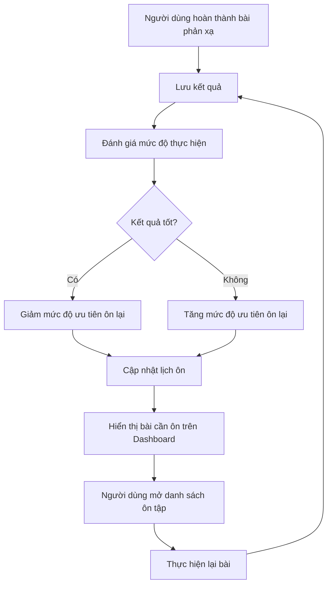

Trong phiên bản đầu:

* Các câu hỏi có kết quả thấp hoặc phản hồi chậm được ưu tiên đưa vào danh sách ôn tập.
* Thuật toán tính khoảng thời gian ôn sẽ được xác định sau.
* Hệ thống cần lưu kết quả để tạo danh sách ôn tập cá nhân.

---

# 10. Luồng AI Tutor 1-1

## 10.1. Luồng chính

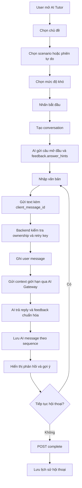

## 10.2. Luồng lỗi

* Không thể tạo phiên hội thoại.
* AI không phản hồi.
* Nội dung gửi lên không hợp lệ.
* Kết nối bị gián đoạn.
* Retry với cùng `client_message_id` phải trả lại kết quả cũ, không tạo user message trùng.

Nếu AI gặp lỗi, hệ thống phải hiển thị thông báo và cho phép người dùng thử lại.
User message hợp lệ đã ghi nhận không bị mất khi AI timeout; retry tiếp tục dùng cùng
`client_message_id`.

---

# 11. Luồng luyện nghe và dịch

## 11.1. Luồng chính

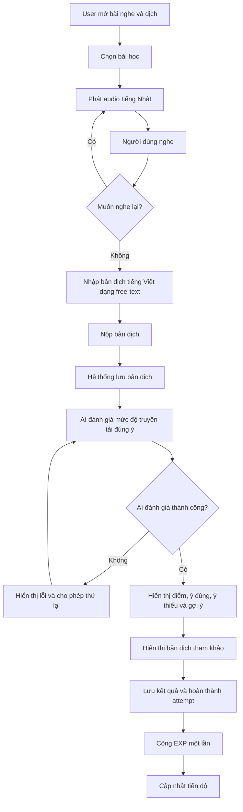

---

# 12. Luồng nhận EXP và tăng cấp

Cấp được tính từ tổng EXP, không tra bảng mốc: từ level `L` lên `L+1` cần thêm `50 × L` EXP.
Việc ghi sổ EXP, cộng `user_progress.total_exp` và tính lại `current_level` nằm trong cùng
transaction; hệ thống khóa tiến độ của user để hai attempt hoàn thành đồng thời không làm mất EXP.

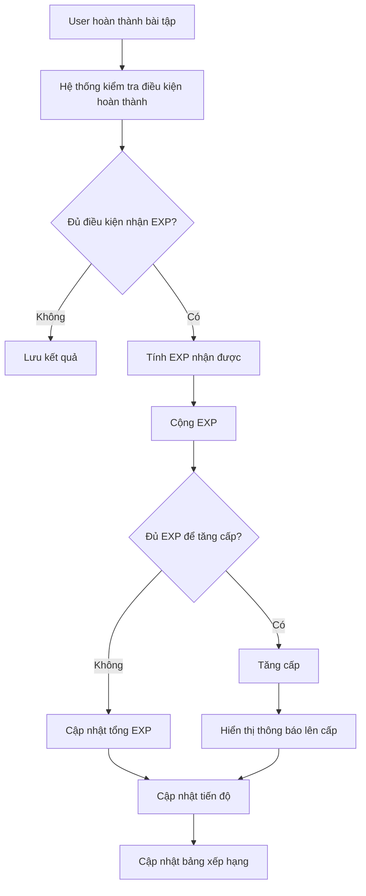

---

# 13. Luồng nhận thành tích

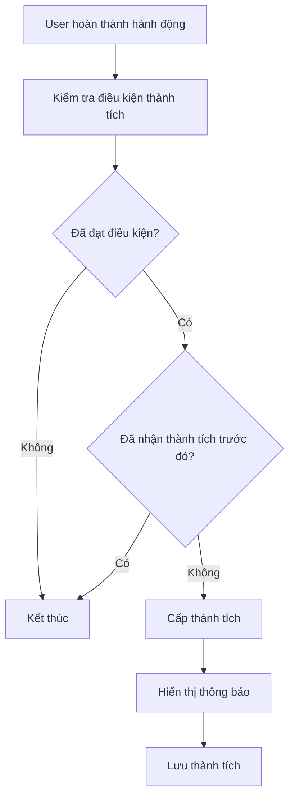

---

# 14. Luồng xem bảng xếp hạng

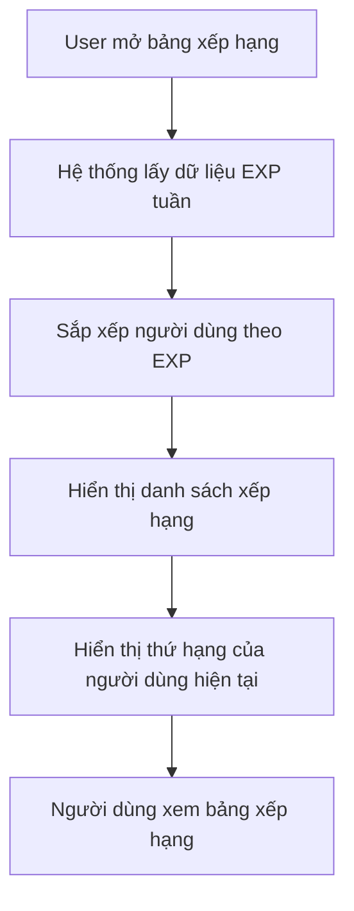

Thông tin hiển thị:

* Thứ hạng.
* Tên hiển thị.
* Ảnh đại diện nếu có.
* EXP đạt được trong tuần.
* Vị trí của người dùng hiện tại.

---

# 15. Luồng xem và cập nhật hồ sơ

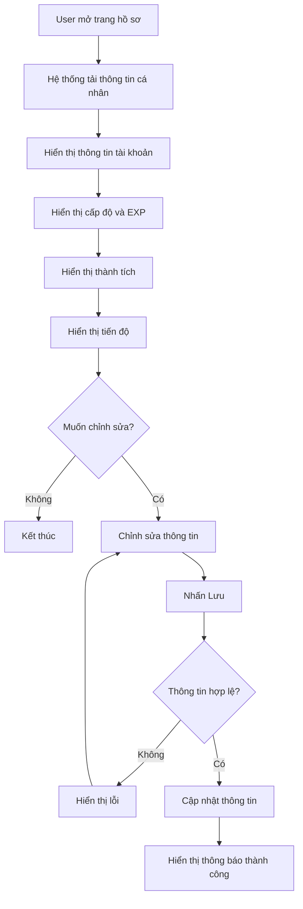

---

# 16. Các điểm thiết kế còn mở ngoài quyết định Phase 2

Các nội dung sau cần được chốt trong giai đoạn thiết kế kiến trúc và database:

1. Audio bài học được lưu ở đâu.
2. Bản ghi âm của người dùng có cần lưu lâu dài hay chỉ xử lý tạm thời.
3. AI đánh giá Shadowing bằng cách nào.
4. AI đánh giá phản xạ dựa trên tiêu chí nào.
5. Thuật toán lặp lại ngắt quãng được sử dụng.
6. Quy tắc EXP thưởng thêm ngoài `base_exp`, nếu có.
7. Điều kiện hoàn thành từng loại bài tập.
8. Cách quản lý và thêm mới nội dung bài học khi chưa có giao diện quản trị.
