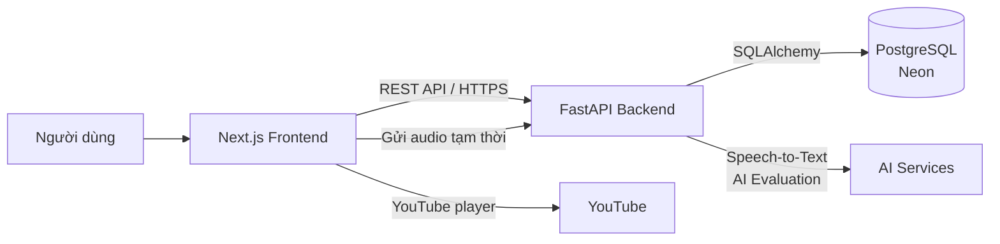
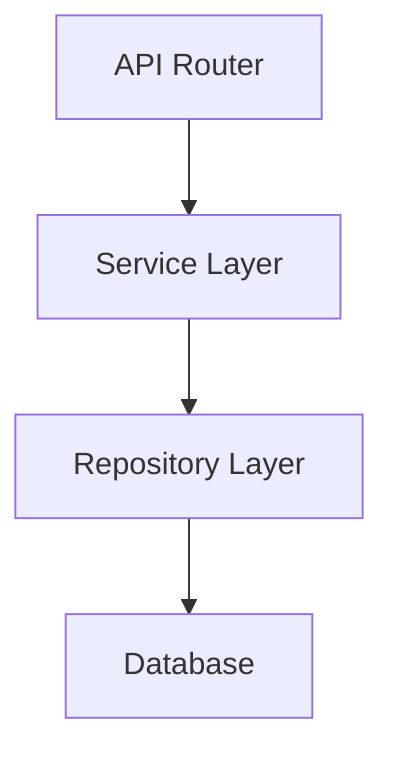
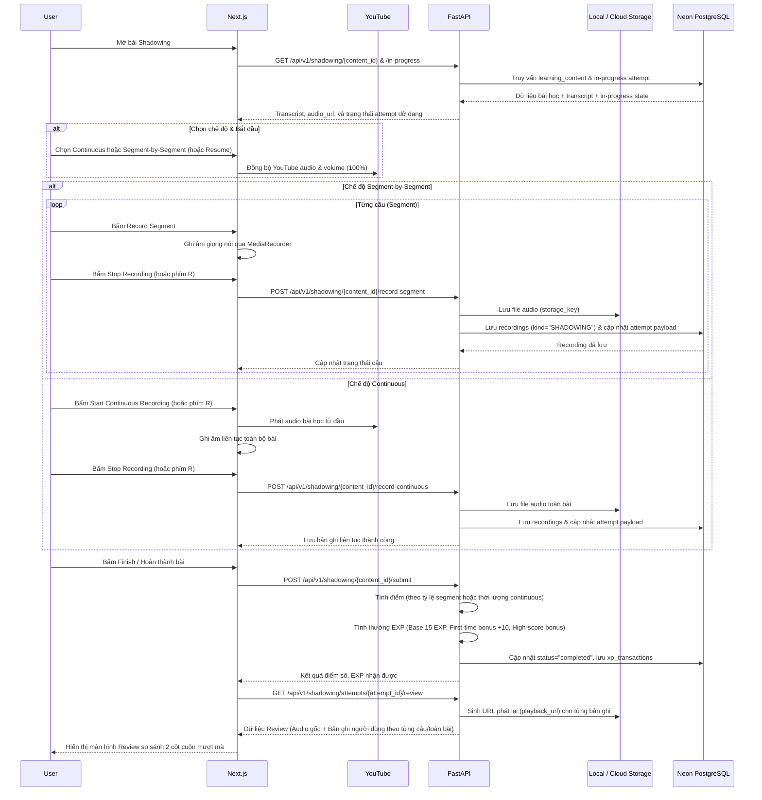
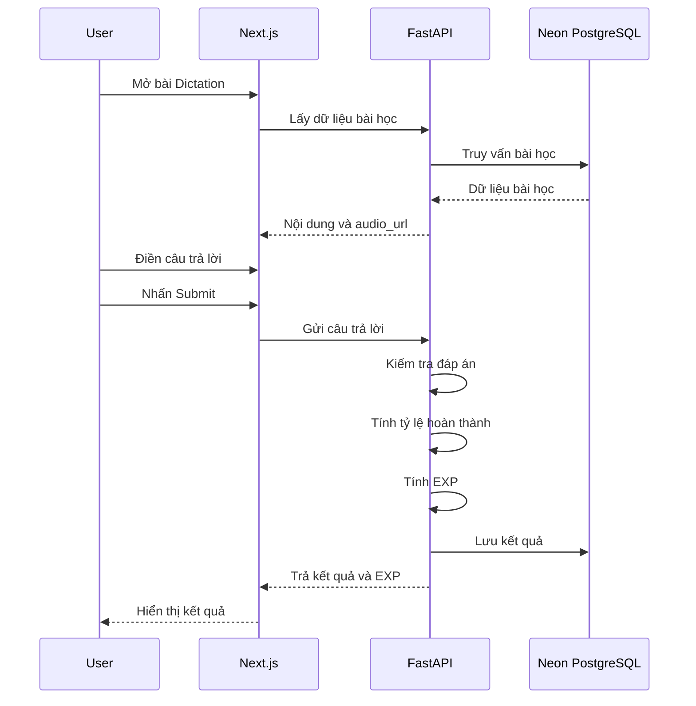
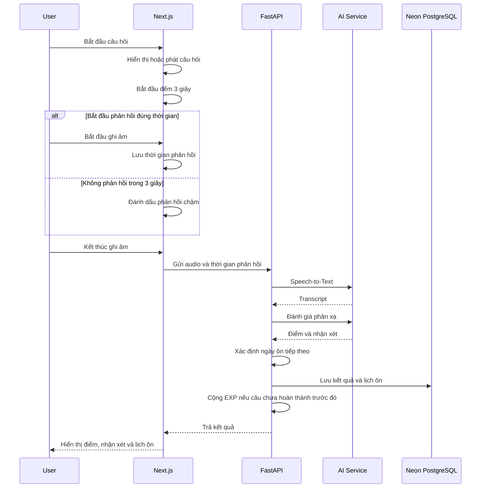
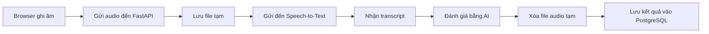
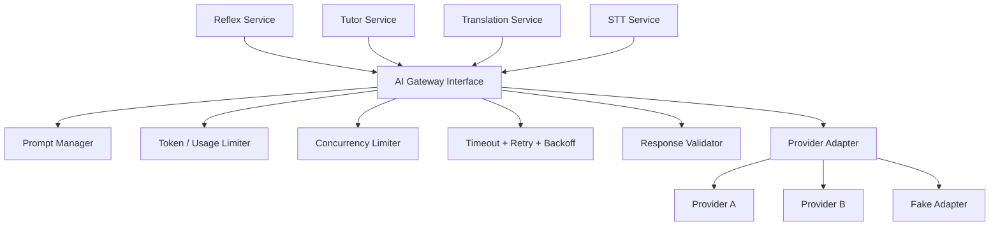

# 04. Architecture

## 1. Mục đích

Tài liệu này mô tả kiến trúc tổng thể của hệ thống **KaiwaUp**.

Mục tiêu:

* Xác định các thành phần chính của hệ thống.
* Xác định trách nhiệm của từng thành phần.
* Mô tả cách các thành phần giao tiếp với nhau.
* Làm cơ sở để thiết kế database, API và cấu trúc mã nguồn.
* Hạn chế việc thay đổi kiến trúc lớn trong quá trình triển khai.

---

# 2. Công nghệ sử dụng

| Thành phần            | Công nghệ                           |
| --------------------- | ----------------------------------- |
| Frontend              | Next.js                             |
| Backend               | FastAPI                             |
| Database              | PostgreSQL                          |
| Database Cloud        | Neon                                |
| Nguồn audio bài học | YouTube (cho shadowing/dictation), Cloudinary (cho reflex)                                |
| Xử lý AI              | Chưa chốt nhà cung cấp hoặc mô hình |
| Xác thực              | JWT                                 |
| Triển khai Frontend   | Chưa chốt                           |
| Triển khai Backend    | Chưa chốt                           |

> Công nghệ AI và nền tảng triển khai sẽ được lựa chọn sau khi team đánh giá khả năng tích hợp, chi phí và thời gian phát triển.

---

# 3. Kiến trúc tổng thể

KaiwaUp sử dụng kiến trúc client-server.

* **Next.js** chịu trách nhiệm xây dựng giao diện và xử lý tương tác của người dùng.
* **FastAPI** chịu trách nhiệm xử lý nghiệp vụ, xác thực, quản lý dữ liệu và tích hợp AI.
* **PostgreSQL trên Neon** lưu dữ liệu nghiệp vụ.
* **YouTube** lưu video nguồn dùng để phát audio của các bài học.
* Dịch vụ AI xử lý Speech-to-Text và đánh giá câu trả lời.



---

# 4. Trách nhiệm của từng thành phần

## 4.1. Next.js Frontend

Frontend chịu trách nhiệm:

* Hiển thị giao diện người dùng.
* Điều hướng giữa các trang.
* Quản lý trạng thái giao diện.
* Gửi yêu cầu đến FastAPI.
* Hiển thị dữ liệu nhận được từ backend.
* Phát audio bài học bằng YouTube player từ URL do API trả về.
* Xin quyền truy cập microphone.
* Ghi âm giọng nói của người dùng.
* Phát lại bản ghi âm tạm thời.
* Hiển thị kết quả đánh giá từ AI.
* Hiển thị EXP, cấp độ, tiến độ và bảng xếp hạng.

Frontend không chịu trách nhiệm:

* Kiểm tra quyền truy cập ở mức bảo mật.
* Tính EXP chính thức.
* Tính cấp độ chính thức.
* Xác định lịch ôn tập.
* Đánh giá AI.
* Truy cập trực tiếp vào PostgreSQL.
* Lưu khóa API hoặc thông tin bí mật.

Các quy tắc nghiệp vụ quan trọng phải được xử lý tại FastAPI để tránh việc người dùng thay đổi dữ liệu hoặc logic từ phía trình duyệt.

---

## 4.2. FastAPI Backend

Backend chịu trách nhiệm:

* Đăng ký tài khoản.
* Đăng nhập và xác thực người dùng.
* Tạo và kiểm tra JWT.
* Kiểm tra quyền truy cập.
* Quản lý hồ sơ người dùng.
* Cung cấp danh sách bài học.
* Lưu kết quả học tập.
* Kiểm tra đáp án Dictation.
* Xử lý kết quả Shadowing.
* Nhận audio tạm thời từ frontend.
* Gửi audio đến dịch vụ Speech-to-Text.
* Gửi nội dung đến AI để đánh giá.
* Xóa audio tạm sau khi xử lý.
* Tính EXP theo cơ chế của từng chức năng.
* Cập nhật tổng EXP và cấp độ.
* Cập nhật bảng xếp hạng tuần.
* Tạo và cập nhật lịch ôn tập.
* Trả dữ liệu cho frontend thông qua REST API.

Backend không lưu audio bài học trong hệ thống.

---

## 4.3. PostgreSQL trên Neon

PostgreSQL lưu các dữ liệu nghiệp vụ như:

* Thông tin người dùng.
* Vai trò người dùng.
* Thông tin bài học.
* Nội dung bài tập.
* URL audio bài học.
* Kết quả học tập.
* Tiến độ học tập.
* Tổng EXP.
* Cấp độ.
* Lịch sử nhận EXP.
* Dữ liệu bảng xếp hạng.
* Dữ liệu lặp lại ngắt quãng.
* Thành tích và danh hiệu.

PostgreSQL không lưu:

* File audio bài học.
* File audio gốc của người dùng.
* File audio tạm sau khi AI đã xử lý.

---

## 4.4. YouTube

YouTube được sử dụng làm nguồn media cho audio bài học. `learning_contents.audio_url` lưu URL video
YouTube, không phải URL file `.mp3` trực tiếp.

YouTube chịu trách nhiệm:

* Lưu video nguồn của các bài học.
* Cung cấp URL video để phát phần âm thanh.
* Phân phối media cho frontend qua YouTube player.

PostgreSQL chỉ lưu thông tin tham chiếu:

```text
audio_url
```

Ví dụ:

```text
https://www.youtube.com/watch?v=<video_id>
```

Frontend phát nội dung qua YouTube IFrame Player hoặc thư viện player tương thích; không truyền URL
YouTube trực tiếp cho thẻ HTML `<audio>`.

Backend không proxy luồng media YouTube trong trường hợp phát bài học thông thường.

---

## 4.5. Dịch vụ AI

Dịch vụ AI được sử dụng cho:

* Chuyển giọng nói tiếng Nhật thành văn bản.
* Đánh giá mức độ khớp nội dung trong Shadowing.
* Đánh giá phản xạ của người dùng.
* Tạo nhận xét và gợi ý cải thiện.

Nhà cung cấp hoặc mô hình AI chưa được chốt.

Các dịch vụ AI phải được gọi thông qua FastAPI.

Frontend không được gọi trực tiếp đến dịch vụ AI vì:

* Không làm lộ khóa API.
* Backend có thể kiểm soát dữ liệu gửi đi.
* Backend có thể chuẩn hóa kết quả.
* Có thể thay đổi nhà cung cấp AI mà không phải sửa nhiều mã frontend.

---

# 5. Kiến trúc Backend

Backend sử dụng kiến trúc phân lớp.



Các tầng có trách nhiệm như sau:

| Tầng       | Trách nhiệm                                                         |
| ---------- | ------------------------------------------------------------------- |
| API Router | Nhận request, kiểm tra dữ liệu đầu vào, gọi service và trả response |
| Service    | Xử lý nghiệp vụ                                                     |
| Repository | Truy vấn và thay đổi dữ liệu                                        |
| Database   | Lưu trữ dữ liệu                                                     |

---

## 5.1. API Router

API Router chịu trách nhiệm:

* Định nghĩa endpoint.
* Nhận request từ frontend.
* Kiểm tra dữ liệu đầu vào bằng Pydantic.
* Lấy thông tin người dùng đã đăng nhập.
* Gọi Service phù hợp.
* Trả response cho frontend.

API Router không nên:

* Viết truy vấn SQL trực tiếp.
* Chứa logic tính EXP phức tạp.
* Gọi AI trực tiếp nếu logic đó có thể được tách thành Service.
* Chứa logic nghiệp vụ lớn.

Ví dụ:

```text
POST /api/v1/shadowing/attempts
        ↓
Shadowing Router
        ↓
Shadowing Service
        ↓
AI Service + Progress Service
        ↓
Repository
        ↓
PostgreSQL
```

---

## 5.2. Service Layer

Service Layer chứa logic nghiệp vụ.

Các service dự kiến:

| Service             | Trách nhiệm                             |
| ------------------- | --------------------------------------- |
| AuthService         | Đăng ký, đăng nhập, tạo và kiểm tra JWT |
| UserService         | Quản lý thông tin người dùng            |
| LessonService       | Lấy danh sách và chi tiết bài học       |
| ShadowingService    | Xử lý kết quả Shadowing                 |
| DictationService    | Kiểm tra đáp án Dictation               |
| ReflexService       | Xử lý phản xạ 3 giây                    |
| AIService           | Giao tiếp với dịch vụ AI                |
| ProgressService     | Cập nhật tiến độ học tập                |
| GamificationService | Tính EXP, cấp độ và thành tích          |
| ReviewService       | Tạo và cập nhật lịch ôn tập             |
| LeaderboardService  | Tính và trả dữ liệu bảng xếp hạng       |

---

## 5.3. Repository Layer

Repository chịu trách nhiệm:

* Truy vấn dữ liệu.
* Thêm dữ liệu.
* Cập nhật dữ liệu.
* Xóa dữ liệu.

Repository không nên:

* Tính EXP.
* Đánh giá câu trả lời.
* Xác định cấp độ.
* Chứa logic nghiệp vụ của bài học.

Ví dụ:

```text
UserRepository
LessonRepository
ShadowingRepository
DictationRepository
ReflexRepository
ProgressRepository
ExpRepository
LeaderboardRepository
ReviewRepository
```

---

# 6. Kiến trúc Frontend

Frontend sử dụng Next.js App Router và được tổ chức theo hướng **route-first colocation**:

- Route, layout và code chỉ phục vụ một feature được đặt gần nhau trong `src/app`.
- Route group tổ chức các khu vực giao diện mà không làm thay đổi URL.
- Private folder bắt đầu bằng `_` chứa implementation riêng của route và không tạo URL segment.
- Thư mục cấp `src` chỉ chứa code thực sự dùng chung giữa nhiều route/feature.

Cấu trúc dự kiến:

```text
apps/web/src/
├── app/
│   ├── layout.tsx                    # Root layout
│   ├── globals.css
│   ├── (public)/
│   │   └── page.tsx                  # /
│   ├── (auth)/
│   │   ├── layout.tsx
│   │   ├── login/page.tsx
│   │   └── register/page.tsx
│   └── (protected)/
│       ├── layout.tsx
│       ├── dashboard/
│       │   ├── _components/
│       │   ├── _hooks/
│       │   ├── _types/
│       │   ├── _utils/
│       │   ├── loading.tsx
│       │   ├── error.tsx
│       │   └── page.tsx
│       ├── shadowing/
│       │   ├── _components/
│       │   ├── _hooks/
│       │   ├── [lessonId]/page.tsx
│       │   └── page.tsx
│       ├── dictation/
│       │   ├── _components/
│       │   ├── [lessonId]/page.tsx
│       │   └── page.tsx
│       ├── reflex/
│       │   ├── _components/
│       │   ├── _hooks/
│       │   ├── [lessonId]/page.tsx
│       │   └── page.tsx
│       ├── review/page.tsx
│       ├── listening-translation/    # P2
│       │   ├── [lessonId]/page.tsx
│       │   └── page.tsx
│       ├── ai-tutor/                 # P2
│       │   ├── _components/
│       │   ├── _hooks/
│       │   ├── [conversationId]/page.tsx
│       │   └── page.tsx
│       ├── leaderboard/page.tsx
│       └── profile/page.tsx
├── components/
│   ├── ui/                           # Primitive từ thư viện UI
│   ├── common/                       # Component dùng chung do dự án xây dựng
│   └── layouts/                      # Application shell và navigation
├── hooks/                            # Hook thực sự dùng chung
├── lib/                              # Adapter/helper dùng chung, không phụ thuộc UI
└── types/                            # Type nội bộ thực sự dùng chung
```

## 6.1. Route group và private folder

- `(public)`, `(auth)` và `(protected)` là route group; tên trong dấu ngoặc không xuất hiện trong URL.
- Route group dùng để chia sẻ layout hoặc phân khu giao diện, không thay thế kiểm tra authorization ở
  FastAPI.
- `_components`, `_hooks`, `_types` và `_utils` là private folder của route. Chúng không tạo URL và
  không được import tùy tiện từ feature không liên quan.
- Dynamic segment như `[lessonId]` và `[conversationId]` biểu diễn resource cụ thể trên URL.
- Chỉ `page.tsx` hoặc `route.ts` làm một route có thể truy cập; file colocate khác không tự trở thành
  route.

## 6.2. Code dùng riêng và code dùng chung

- Component, hook, type và utility chỉ phục vụ một route phải được colocate trong route đó.
- Code dùng chung cho một nhánh route được đặt ở route cha gần nhất.
- Chỉ chuyển code lên `src/components`, `src/hooks`, `src/lib` hoặc `src/types` khi nó được dùng bởi
  nhiều route/feature và không còn phụ thuộc context riêng.
- `components/ui` chứa UI primitive từ thư viện như shadcn/ui.
- `components/common` chứa component dùng chung do dự án tự xây dựng.
- `components/layouts` chứa application shell, header, sidebar và navigation dùng lại.
- Không tạo thêm `src/features/` để sao chép logic đã colocate trong route.
- Không tạo `services/api/` chỉ để bọc lại API client mà không bổ sung trách nhiệm rõ ràng.

## 6.3. Rendering và giao tiếp backend

- Dùng Server Component mặc định. Chỉ thêm `"use client"` khi cần React client hook, event handler,
  microphone hoặc browser API.
- Tải dữ liệu ban đầu trong Server Component, Server Action hoặc Route Handler phù hợp; không dùng
  `useEffect` chỉ để tải dữ liệu ban đầu.
- Client Component được giữ nhỏ và đặt sâu nhất có thể trong component tree.
- Dùng `loading.tsx`, `error.tsx` và `not-found.tsx` tại route boundary cần các trạng thái tương ứng.
- FastAPI/OpenAPI là nguồn chuẩn của API contract.
- Frontend sử dụng type và client function từ `@kaiwa-app/api-client`; không sao chép request/response
  type hoặc tạo một API service layer song song.
- Frontend vẫn phải xử lý đầy đủ pending, empty, error và success state.

Thiết kế module frontend chi tiết được mô tả trong `07-module-design.md`; quy tắc đặt tên và vị trí file
được mô tả trong `08-coding-convention.md`.

---

# 7. Luồng xử lý Shadowing



Quy tắc thực hành và chấm điểm Shadowing:

* **Dual-Mode**:
  * **Segment-by-Segment**: Người dùng chọn từng câu, nghe và ghi âm riêng cho từng segment. Điểm số = `(số câu đã ghi âm / tổng số câu) * 100`.
  * **Continuous Shadowing**: Người dùng nghe và đọc đuổi liên tục từ đầu đến cuối một lần duy nhất. Điểm số = `min(100.0, (thời lượng ghi âm / tổng thời lượng bài học) * 100)`.
* **Lưu trữ bản ghi**: Các bản ghi âm của người dùng được lưu trữ qua Storage Service và gắn liên kết với bảng `recordings` (loại `SHADOWING`, có `storage_key`, `duration_seconds`, `attempt_id`).
* **Tính điểm và EXP**:
  * EXP cơ bản: 15 EXP khi hoàn thành bài.
  * Thưởng lần đầu hoàn thành: +10 EXP.
  * Thưởng điểm cao (Score >= 80%): +5 EXP.
  * Khấu trừ nghe lại (Replay penalty): Giảm dần nếu nghe lại nhiều lần.
* **Màn hình Review**: Cung cấp giao diện so sánh 2 cột với danh sách câu cuộn độc lập (`ScrollArea`), cho phép nghe lại audio gốc và nghe lại từng đoạn giọng nói của người dùng để tự đối chiếu ngữ điệu.

---

# 8. Luồng xử lý Dictation



Quy tắc MVP:

* Một câu được tính là đã thực hiện khi người dùng nhấn **Submit**.
* Không tính lại số lần làm lại vào tỷ lệ hoàn thành ban đầu.
* Tỷ lệ hoàn thành được tính dựa trên số câu đã được submit so với tổng số câu.
* EXP được tính theo tỷ lệ hoàn thành và cơ chế riêng của Dictation.
  * `0%`: `0 EXP`.
  * Trên `0%` và dưới `5%`: `5 EXP`.
  * Từ `5%` đến dưới `25%`: `15 EXP`.
  * Từ `25%` đến dưới `50%`: `25 EXP`.
  * Từ `50%` đến dưới `75%`: `40 EXP`.
  * Từ `75%` trở lên: `50 EXP`.
* Kết quả kiểm tra đáp án được lưu để hiển thị lại cho người dùng.

---

# 9. Luồng xử lý phản xạ 3 giây



Tiêu chí đánh giá dự kiến:

| Tiêu chí              | Điểm tối đa |
| --------------------- | ----------: |
| Tốc độ phản hồi       |          20 |
| Mức độ phù hợp        |          35 |
| Độ chính xác ngôn ngữ |          25 |
| Độ tự nhiên           |          20 |
| **Tổng**              |     **100** |

Quy tắc MVP:

* Người dùng có 3 giây để bắt đầu phản hồi.
* AI trả về điểm từ 0 đến 100.
* Điểm AI được sử dụng để xác định khoảng thời gian ôn lại.
* Câu có điểm thấp sẽ được ôn lại sớm hơn.
* Câu có điểm cao sẽ có khoảng thời gian ôn dài hơn.
* Một câu chỉ được cộng EXP khi hoàn thành lần đầu.
* Các lần ôn lại không cộng EXP cho cùng một câu.

---

# 10. Cơ chế lặp lại ngắt quãng

MVP sử dụng cơ chế đơn giản dựa trên điểm AI.

```text
Điểm AI
    ↓
Xác định mức độ làm tốt hoặc chưa tốt
    ↓
Xác định số ngày đến lần ôn tiếp theo
    ↓
Lưu next_review_at
```

Khoảng thời gian cụ thể sẽ được xác định sau.

Ví dụ cấu hình ban đầu:

| Điểm AI | Lần ôn tiếp theo |
| ------: | ---------------: |
|    0–49 |       Sau 1 ngày |
|   50–69 |       Sau 3 ngày |
|   70–84 |       Sau 5 ngày |
|  85–100 |       Sau 7 ngày |

Bảng trên là cấu hình ban đầu và có thể thay đổi sau khi thử nghiệm.

---

# 11. Cơ chế EXP và cấp độ

## 11.1. Nguyên tắc

* Mỗi chức năng có cơ chế tính EXP riêng.
* EXP được tính tại backend.
* Frontend chỉ hiển thị EXP nhận được.
* Không tin dữ liệu EXP do frontend gửi lên.
* Mỗi lần cộng EXP phải được lưu lịch sử.
* Mỗi attempt hoàn thành chỉ tạo tối đa một bút toán EXP; tổng EXP được cập nhật dưới khóa dòng để
  tránh lost update khi nhiều attempt hoàn thành đồng thời.

---

## 11.2. Điều kiện tính tiến độ

| Chức năng      | Cách xác định tiến độ                         |
| -------------- | --------------------------------------------- |
| Shadowing      | Số câu có bản ghi hợp lệ chia cho tổng số câu |
| Dictation      | Số câu đã Submit lần đầu chia cho tổng số câu |
| Phản xạ 3 giây | Câu được hoàn thành lần đầu                   |
| Nghe và dịch   | Số câu đã Submit lần đầu chia cho tổng số câu |
| AI Tutor       | Chưa thuộc phạm vi MVP                        |

Bản ghi Shadowing hợp lệ khi:

```text
Đã nhấn Stop Recording
AND
Thời lượng bản ghi > 2 giây
```

---

## 11.3. Cấp độ

Cấp độ được xác định trực tiếp từ tổng EXP, không dùng bảng mốc và không có giới hạn level được
định nghĩa trước. Từ level `L` lên `L+1` cần `50 × L` EXP; tổng EXP tối thiểu của level `L` là
`25 × L × (L-1)`. Backend là nguồn tính toán có thẩm quyền; frontend chỉ hiển thị kết quả API.

---

# 12. Cơ chế Leaderboard

Leaderboard được tính dựa trên EXP người dùng nhận trong tuần.

Thứ tự sắp xếp:

```text
weekly_exp DESC
→ user_id ASC
```

Quy tắc:

1. Người có EXP tuần cao hơn đứng trước.
2. Nếu bằng EXP, sắp `user_id` tăng dần trước khi gán rank để kết quả có thể tái tạo.

Dữ liệu leaderboard có thể được tính trực tiếp từ lịch sử EXP trong MVP.

Chưa cần sử dụng Redis hoặc hệ thống cache riêng.

---

# 13. Quản lý nội dung bài học

Do không phát triển giao diện quản trị trong MVP, nội dung bài học được quản lý bằng dữ liệu seed.

Cấu trúc dự kiến:

```text
backend/
├── app/
│   ├── models/
│   ├── repositories/
│   ├── services/
│   └── api/
│
├── seeds/
│   ├── shadowing.json
│   ├── dictation.json
│   ├── reflex.json
│   └── listening_translation.json
│
└── scripts/
    └── seed_data.py
```

Quy trình thêm bài học:

```text
Đăng video nguồn lên YouTube
        ↓
Lấy URL video YouTube làm audio_url
        ↓
Thêm nội dung bài học vào file JSON
        ↓
Chạy seed script
        ↓
Dữ liệu được thêm vào PostgreSQL
```

Nguyên tắc:

* Không thêm dữ liệu bài học thủ công trực tiếp trên Neon trong môi trường chính thức.
* Nội dung bài học được quản lý bằng Git.
* Mỗi thay đổi dữ liệu cần được review.
* Seed script phải có cơ chế tránh tạo dữ liệu trùng lặp.

---

# 14. Xử lý audio của người dùng

Audio do người dùng ghi được xử lý tạm thời.



Nguyên tắc:

* Không lưu file audio người dùng lâu dài.
* Không lưu URL audio người dùng trong PostgreSQL.
* Audio tạm phải được xóa kể cả khi quá trình xử lý gặp lỗi.
* Backend cần sử dụng cơ chế `try/finally` hoặc cơ chế tương đương để đảm bảo xóa file.
* Frontend có thể giữ bản ghi bằng `Blob` trong phiên hiện tại để phát lại.

---

# 15. Bảo mật kiến trúc

## 15.1. Xác thực

* Sử dụng JWT.
* Frontend gửi token khi gọi API cần xác thực.
* Backend kiểm tra token trước khi xử lý.
* Backend xác định người dùng từ token, không lấy `user_id` đáng tin cậy từ dữ liệu frontend.

---

## 15.2. Phân quyền

Trong MVP:

| Vai trò | Quyền                                        |
| ------- | -------------------------------------------- |
| Guest   | Xem nội dung công khai, đăng ký và đăng nhập |
| User    | Sử dụng chức năng học tập và dữ liệu cá nhân |

Backend phải kiểm tra quyền truy cập đối với:

* Hồ sơ người dùng.
* Tiến độ học tập.
* Lịch sử kết quả.
* Dữ liệu ôn tập.
* Dữ liệu thành tích.

Người dùng không được truy cập hoặc chỉnh sửa dữ liệu riêng của người dùng khác.

---

## 15.3. Quản lý thông tin bí mật

Các thông tin sau phải lưu trong biến môi trường:

```text
DATABASE_URL
JWT_SECRET_KEY
AI_API_KEY
YOUTUBE_API_KEY
```

Không được:

* Đưa khóa API vào mã nguồn.
* Đưa khóa API vào frontend.
* Commit file `.env` lên GitHub.

Repository chỉ nên có file:

```text
.env.example
```

---

# 16. Khả năng mở rộng trong tương lai

Các tính năng sau chưa thuộc MVP nhưng kiến trúc cần có khả năng hỗ trợ:

## 16.1. Phân tích phát âm nâng cao

Trong tương lai, Shadowing có thể phân tích:

* Ngữ điệu.
* Trọng âm.
* Nhịp điệu.
* Cao độ.
* Cách nhấn âm.
* Độ chính xác của từng âm.

Khi đó có thể bổ sung một `PronunciationAnalysisService` riêng mà không thay đổi lớn các module hiện tại.

---

## 16.2. AI Tutor

AI Tutor chưa được phát triển trong MVP.

Trong tương lai có thể bổ sung:

```text
AITutorService
ConversationService
ConversationRepository
```

AI Tutor có thể hỗ trợ:

* Hội thoại bằng văn bản.
* Hội thoại bằng giọng nói.
* Nhận xét ngữ pháp.
* Gợi ý cách diễn đạt tự nhiên.
* Lưu lịch sử hội thoại.

---

## 16.3. Lưu audio lâu dài

Nếu sau này cần cho phép người dùng xem lại lịch sử bản ghi:

```text
User Audio
    ↓
Cloud Storage
    ↓
Lưu audio_url trong PostgreSQL
```

Tính năng này cần bổ sung:

* Chính sách thời gian lưu trữ.
* Chức năng xóa bản ghi.
* Quản lý dung lượng.
* Quyền riêng tư.

---

# 17. Các quyết định kiến trúc đã chốt

| Nội dung           | Quyết định                                             |
| ------------------ | ------------------------------------------------------ |
| Frontend           | Next.js                                                |
| Tổ chức frontend   | App Router, route-first colocation và private folder   |
| Backend            | FastAPI                                                |
| Database           | PostgreSQL trên Neon                                   |
| Audio bài học      | Video YouTube, phát qua YouTube player                 |
| Audio người dùng   | Xử lý tạm thời và xóa sau khi xử lý                    |
| Shadowing MVP      | Speech-to-Text → so sánh nội dung → AI nhận xét        |
| Shadowing nâng cao | Phân tích ngữ điệu, ngữ âm và nhấn nhá trong tương lai |
| Phản xạ 3 giây     | AI chấm điểm và đưa nhận xét                           |
| Lặp lại ngắt quãng | Xác định lịch ôn dựa trên điểm AI                      |
| AI Tutor           | Chưa phát triển trong MVP                              |
| EXP                | Mỗi chức năng có cơ chế tính riêng                     |
| Level              | Công thức tăng dần `50 × level hiện tại`, không có trần |
| Leaderboard        | Dựa trên EXP theo tuần                                 |
| Khi bằng EXP       | Sắp `user_id ASC` trước khi gán rank                   |
| Nội dung bài học   | JSON + seed script                                     |
| Admin UI           | Không thuộc phạm vi MVP                                |
| Cache              | Chưa sử dụng Redis trong MVP                           |

---

# 18. Các nội dung cần chốt tiếp

Các nội dung sau sẽ được làm rõ trong các tài liệu tiếp theo:

* Thiết kế chi tiết các bảng PostgreSQL.
* Quan hệ giữa các bảng.
* Cấu trúc dữ liệu của từng loại bài học.
* Danh sách API và request/response.
* Cơ chế tính EXP cụ thể của từng chức năng.
* Nhà cung cấp hoặc mô hình AI.
* Nền tảng triển khai frontend và backend.
* Quy tắc xử lý lỗi và retry khi dịch vụ AI không phản hồi.

# 19. AI Gateway

AI Gateway cô lập provider AI/STT khỏi business module. Reflex, Tutor, Translation và STT service chỉ
phụ thuộc interface `AiGateway`; việc chọn provider, xây prompt, giới hạn và chuẩn hóa kết quả được
quản lý tập trung. API key chỉ tồn tại ở backend (`.env`), không xuất hiện trong business module và
không bị log dưới mọi hình thức.



Trách nhiệm từng thành phần:

- **Prompt Manager**: xây dựng prompt riêng cho Reflex, Translation và AI Tutor.
- **Token / Usage Limiter**: giới hạn token mỗi request, budget theo window và số lần gọi mỗi user.
- **Concurrency Limiter**: giới hạn số gọi AI song song toàn cục và trên mỗi user.
- **Timeout + Retry + Backoff**: retry có giới hạn với backoff; chỉ retry timeout, 429, 5xx hoặc lỗi
  kết nối.
- **Response Validator**: chuẩn hóa transcript, score, feedback, correction, hints về contract nội bộ.
- **Provider Adapter**: cô lập SDK/HTTP và payload riêng của từng provider; cho phép đổi provider hoặc
  dùng Fake Adapter khi test mà không sửa business service.

Provider được chọn theo cấu hình (STT và LLM có thể dùng provider khác nhau); khi provider không khả
dụng có thể fallback sang provider khác.

### 19.1. Cấu trúc code

AI Gateway nằm trong `apps/api/app/integrations/ai/`, chia theo chức năng:

```text
integrations/ai/
├── __init__.py          # export public + FallbackAiGateway + RoutedAiGateway + build_ai_gateway(settings)
├── base.py              # interface chung AiGateway (STT, Reflex, Shadowing, Translation, Tutor) + AiProviderConfig + HTTP helpers
├── contracts.py         # contract chuẩn hóa: transcript, score, feedback, correction, hints + parser
├── policy.py            # timeout, retry giới hạn, backoff
├── prompts/             # prompt theo từng chức năng
│   ├── common.py        # prompt chung: JSON schema chuẩn + persona + helper build_json_instruction
│   ├── speech2text.py   # build_stt_instruction
│   ├── reflex.py        # build_reflex_eval_prompt
│   ├── shadowing.py     # build_shadowing_eval_prompt
│   ├── translation.py   # build_translation_eval_prompt
│   └── tutor.py         # build_tutor_messages
└── providers/           # adapter provider (dùng httpx, không dùng SDK)
    ├── base.py          # BaseAiGateway: triển khai chung mọi LLM capability qua _chat/transcribe
    ├── openai.py        # OpenAiProviderConfig + OpenAiCompatibleAiGateway (OpenAI, Groq, ...)
    └── fake.py          # FakeAiGateway cho dev/test
```

- **Interface chung**: business module chỉ phụ thuộc protocol `AiGateway` (5 capability: `transcribe`,
  `evaluate_reflex`, `evaluate_shadowing`, `evaluate_translation`, `generate_tutor_reply`); không biết
  provider cụ thể, không lộ API key hay payload riêng của provider.
- **Triển khai chung**: `providers/base.py` (`BaseAiGateway`) dùng chung mọi LLM capability
  (reflex/shadowing/translation/tutor + timeout/retry qua `_call`); provider chỉ triển khai `_chat` và
  `transcribe`. `FakeAiGateway` kế thừa base, chỉ override `_chat` (trả JSON mẫu), `transcribe`,
  `generate_tutor_reply` và `_call` (chạy thẳng).
- **Routing theo chức năng**: `build_ai_gateway(settings)` chia 3 lane — `tutor` (generate_tutor_reply),
  `evaluate` (reflex/shadowing/translation), `stt` (transcribe). Mỗi lane có provider primary + fallback
  riêng (`AI_<LANE>_PROVIDER` / `AI_<LANE>_FALLBACK_PROVIDERS`); lane rỗng hoặc `fake` dùng
  `FakeAiGateway`. Cùng 1 provider cho cả 3 lane → trả adapter đơn, khác nhau → `RoutedAiGateway`.
- **Provider theo dialect**: `OpenAiCompatibleAiGateway` phục vụ mọi API tương thích OpenAI (OpenAI,
  Groq...); cắm dịch vụ mới chỉ cần thêm config `AI_<NAME>_*` + đăng ký trong `_provider_registry` —
  không cần file adapter mới nếu cùng dialect. Không dùng Gemini/GeminiAiGateway nữa.
- **Prompt chung** (`prompts/common.py`): các JSON schema chuẩn (transcription/evaluation/tutor),
  persona dùng chung và helper `build_json_instruction`; prompt riêng từng chức năng kế thừa từ đây để
  tránh trùng lặp schema.
- **Error**: các `Ai*Error` kế thừa `AppError`, định nghĩa trong `app/exceptions/ai.py` và được global
  handler serialize theo error envelope chuẩn (status/code/message/details).
- **Cấu hình**: thông số dùng chung (model override, temperature, top_p, max output tokens, timeout,
  retry) và riêng từng provider (API key, base_url, model) đều qua `app/core/config.py` (biến `AI_*`
  trong `.env`). `build_ai_gateway(settings)` chọn provider + fallback và dùng `FakeAiGateway` khi chưa
  cấu hình key hoặc `AI_PROVIDER=fake`.
