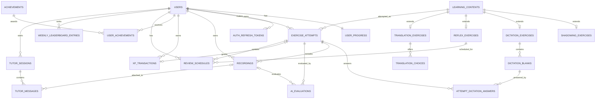
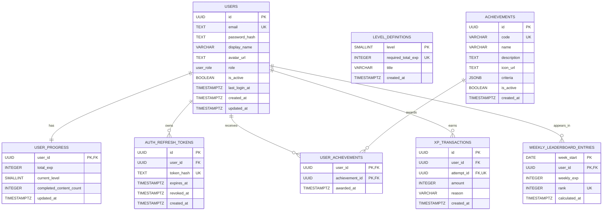
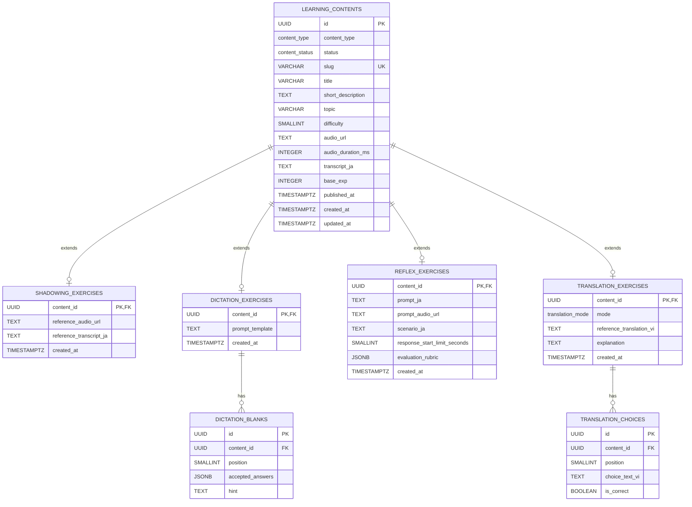
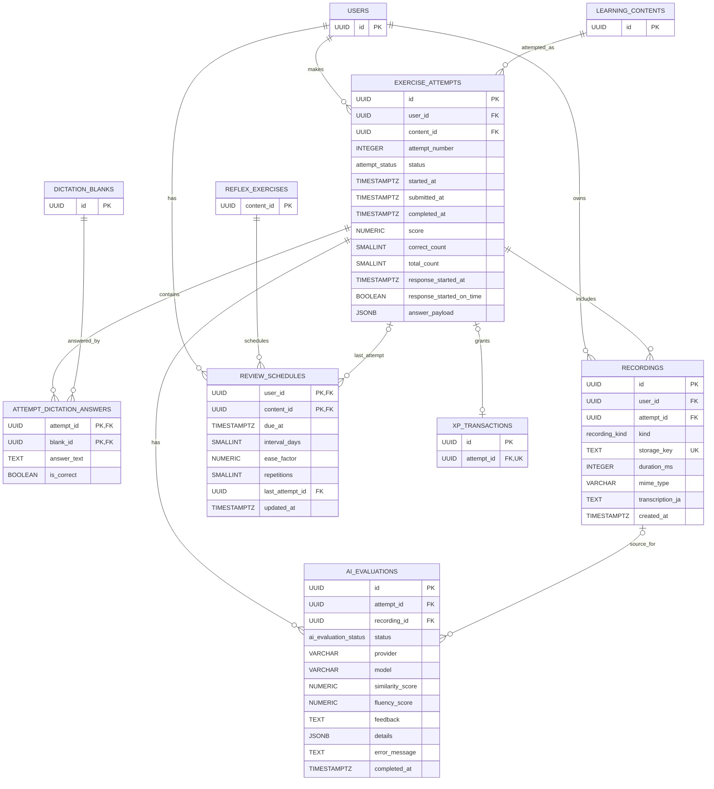
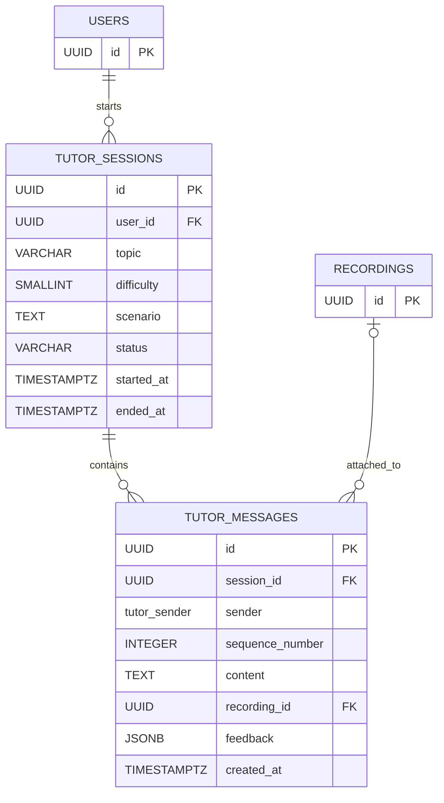
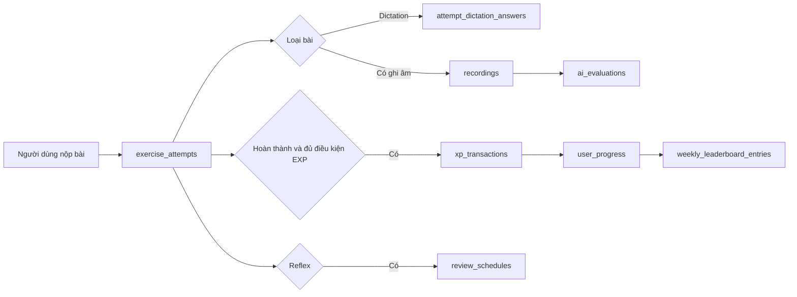

# 05. Database Design

## 1. Phạm vi và quyết định thiết kế

Database dùng **PostgreSQL 15+**. Schema khởi tạo nằm tại [`database/001_initial_schema.sql`](../database/001_initial_schema.sql).

Các quyết định chính:

- Mọi khóa chính dùng UUID; thời gian dùng `TIMESTAMPTZ` theo UTC. Các bảng ghi nhiều (`exercise_attempts`, `xp_transactions`, `recordings`, `ai_evaluations`) dùng **UUIDv7** để index insert tuần tự theo thời gian, giảm phân mảnh B-tree;
- File audio và recording không lưu BLOB trong PostgreSQL. Database chỉ giữ `storage_key`/URL; file được đặt ở private object storage và API trả signed URL ngắn hạn.
- `learning_contents` là danh mục bài chung. Mỗi loại bài có một bảng mở rộng 1–1 để giữ dữ liệu chuyên biệt.
- `exercise_attempts` giữ từng lượt làm bài; đây là nguồn dữ liệu của lịch sử, tiến độ và đánh giá AI. Không ghi đè lượt cũ.
- `xp_transactions` là sổ cái EXP bất biến. `user_progress.total_exp` và `current_level` là cache cho Dashboard, luôn cập nhật trong cùng transaction khi cấp EXP.
- RLS hoặc lớp service bắt buộc giới hạn mọi truy vấn dữ liệu cá nhân theo `user_id`; tài khoản `admin` là dữ liệu chuẩn bị cho quản trị nội bộ, chưa có UI.

## 2. ERD



`||` biểu thị đúng một, `o|` biểu thị không hoặc một, và `o{` biểu thị không hoặc nhiều. Các bảng bài tập mở rộng chỉ hợp lệ khi `learning_contents.content_type` tương ứng; service tạo nội dung phải kiểm tra quy tắc này.

### 2.1. Chi tiết bảng theo nhóm

Các sơ đồ dưới đây thể hiện khóa chính (`PK`), khóa ngoại (`FK`) và các cột nghiệp vụ quan trọng. DDL đầy đủ, gồm constraint, default và index, vẫn là nguồn chuẩn tại [`database/001_initial_schema.sql`](../database/001_initial_schema.sql).

#### Tài khoản và gamification



#### Nội dung bài học



#### Lượt học, ghi âm và đánh giá AI



#### AI Tutor



## 3. Bảng và trách nhiệm

| Nhóm            | Bảng                                                                                                                                 | Mục đích                                                                |
| --------------- | ------------------------------------------------------------------------------------------------------------------------------------ | ----------------------------------------------------------------------- |
| Tài khoản       | `users`, `user_progress`, `auth_refresh_tokens`                                                                                      | Xác thực, hồ sơ, phiên refresh token và số liệu Dashboard.              |
| Nội dung        | `learning_contents`                                                                                                                  | Metadata chung: tiêu đề, chủ đề, độ khó, audio, transcript, EXP cơ bản. |
| Bài chuyên biệt | `shadowing_exercises`, `dictation_exercises`, `dictation_blanks`, `reflex_exercises`, `translation_exercises`, `translation_choices` | Prompt, đáp án và cấu hình riêng cho từng hình thức học.                |
| Học tập         | `exercise_attempts`, `attempt_dictation_answers`, `recordings`, `ai_evaluations`, `review_schedules`                                 | Lượt làm bài, đáp án, bản ghi, nhận xét AI và lặp lại ngắt quãng.       |
| Gamification    | `level_definitions`, `xp_transactions`, `achievements`, `user_achievements`, `weekly_leaderboard_entries`                            | Cấp độ, lịch sử EXP, thành tích và bảng xếp hạng tuần.                  |
| AI Tutor        | `tutor_sessions`, `tutor_messages`                                                                                                   | Lưu phiên hội thoại và từng lượt trao đổi theo thứ tự.                  |

Danh sách bài đề xuất trên Dashboard được tính khi đọc catalog (`learning_contents`) theo độ khó/loại bài/trạng thái chưa hoàn thành, không lưu bảng riêng.

## 4. Cột quan trọng

### 4.1 Tài khoản và gamification

| Bảng                         | Khóa/chỉ mục chính                 | Cột nghiệp vụ đáng chú ý                                           |
| ---------------------------- | ---------------------------------- | ------------------------------------------------------------------ |
| `users`                      | `id` UUID, `email` unique (CITEXT) | `password_hash`, `display_name`, `avatar_url`, `role`, `is_active` |
| `user_progress`              | `user_id` PK/FK                    | `total_exp`, `current_level`, `completed_content_count`            |
| `auth_refresh_tokens`        | `token_hash` unique                | Chỉ lưu hash token, `expires_at`, `revoked_at`                     |
| `level_definitions`          | `level` PK                         | `required_total_exp` unique, `title`                               |
| `xp_transactions`            | `id`; `attempt_id` unique          | `amount`, `reason`, `created_at`; mỗi lượt bài chỉ cấp EXP một lần |
| `weekly_leaderboard_entries` | `(week_start, user_id)`            | `weekly_exp`, `rank`; tuần luôn bắt đầu thứ Hai                    |

### 4.2 Nội dung và kết quả học

| Bảng                  | Quan hệ                           | Cột nghiệp vụ đáng chú ý                                                                 |
| --------------------- | --------------------------------- | ---------------------------------------------------------------------------------------- |
| `learning_contents`   | Cha của mọi bài                   | `content_type`, `status`, `slug`, `difficulty`, `audio_url`, `transcript_ja`, `base_exp` |
| `dictation_blanks`    | N–1 `dictation_exercises`         | `position`, `accepted_answers` JSON array, `hint`                                        |
| `translation_choices` | N–1 `translation_exercises`       | `position`, `choice_text_vi`, `is_correct`                                               |
| `exercise_attempts`   | N–1 user, N–1 content             | `status`, `score`, số đáp án đúng, mốc bắt đầu phản hồi, `answer_payload`                |
| `recordings`          | N–1 user, N–1 attempt             | `storage_key`, `mime_type`, `duration_ms`, transcript từ STT nếu có                      |
| `ai_evaluations`      | N–1 attempt                       | trạng thái xử lý, model/provider, điểm fluency/tương đồng, feedback và JSON chi tiết     |
| `review_schedules`    | PK `(user_id, reflex content_id)` | `due_at`, `interval_days`, `ease_factor`, `repetitions`                                  |

Cấp độ "1 từ / nhiều từ / cả câu" của Dictation (FR-DICT-01) được quy ước qua `learning_contents.difficulty` (1–5); không lưu cột riêng.

Translation dạng `free_text` không có đáp án cố định; kết quả được chấm qua `ai_evaluations` với `recording_id` NULL và lưu `answer_payload`, không dùng `translation_choices`.

## 5. Quan hệ và quy tắc toàn vẹn

- Một `users` luôn có đúng một `user_progress`; trigger tạo khi đăng ký.
- Một `learning_contents` có tối đa một bản ghi bảng mở rộng phù hợp. Xóa nội dung cascade sang cấu hình bài; nội dung đã có attempt bị `RESTRICT` để không làm mất lịch sử.
- Một user có thể làm cùng bài nhiều lần. `UNIQUE (user_id, content_id, attempt_number)` bảo đảm thứ tự attempt không bị trùng.
- Mỗi blank Dictation chỉ có một câu trả lời trong một attempt qua PK `(attempt_id, blank_id)`.
- Bản ghi thuộc user; recording Shadowing/Reflex bắt buộc phải gắn attempt. `tutor_voice` có thể gắn với `tutor_messages` thay vì attempt.
- `review_schedules` chỉ áp dụng cho `reflex_exercises`, đáp ứng danh sách ôn riêng theo user.
- `user_achievements` có khóa ghép nên một thành tích chỉ được cấp một lần cho mỗi user.
- `weekly_leaderboard_entries` là snapshot/cache có thể tái tạo từ `xp_transactions`; nếu bằng EXP, sắp theo `user_id` tăng dần trước khi gán `rank` để kết quả xác định.

## 6. Luồng ghi dữ liệu



Việc ghi `xp_transactions`, cập nhật `user_progress`, kiểm tra achievement và snapshot leaderboard phải được thực hiện trong transaction ở service layer. AI chạy bất đồng bộ: tạo `ai_evaluations(status='pending')`, sau đó worker cập nhật `completed` hoặc `failed`; lỗi AI không chặn việc lưu attempt.

## 7. Index, bảo mật và vận hành

PostgreSQL tự tạo B-tree index cho mọi `PRIMARY KEY` và `UNIQUE`, nên không cần tạo lại index cho `users.id`, `users.email`, `learning_contents.slug`, `xp_transactions.attempt_id`, các khóa ghép của `user_achievements`, `attempt_dictation_answers`, `review_schedules`, `tutor_messages(session_id, sequence_number)`, hay `weekly_leaderboard_entries(week_start, rank)`. Nguyên tắc chung: chỉ thêm index cho truy vấn thực tế; mỗi index thêm vào là chi phí ghi tăng lên, nên giữ tối thiểu.

### 7.1. Index cần cho các truy vấn hiện tại

| Bảng                  | Index / cột                                                                | Loại              | Truy vấn được tối ưu                                                                                         |
| --------------------- | -------------------------------------------------------------------------- | ----------------- | ------------------------------------------------------------------------------------------------------------ |
| `auth_refresh_tokens` | `(user_id, expires_at) WHERE revoked_at IS NULL`                           | Partial B-tree    | Kiểm tra, liệt kê hoặc thu hồi refresh token còn hiệu lực của một user. Không đưa token đã revoke vào index. |
| `learning_contents`   | `(content_type, difficulty, published_at DESC) WHERE status = 'published'` | Partial B-tree    | Catalog bài đã publish, lọc loại bài/độ khó và sắp bài mới nhất.                                             |
| `exercise_attempts`   | `(user_id, completed_at DESC) INCLUDE (content_id, status, score)`         | B-tree (covering) | Lịch sử học gần nhất và Dashboard của một user. Các cột `INCLUDE` cho index-only scan, không cần chạm heap.  |
| `exercise_attempts`   | `(content_id, completed_at DESC)`                                          | B-tree            | Thống kê hoặc xem các lượt làm của một bài.                                                                  |
| `recordings`          | `(user_id, created_at DESC)`                                               | B-tree            | Danh sách recording gần đây của user.                                                                        |
| `ai_evaluations`      | `(attempt_id, created_at DESC)`                                            | B-tree            | Lấy các lần đánh giá AI của một attempt.                                                                     |
| `review_schedules`    | `(user_id, due_at)`                                                        | B-tree            | Danh sách ôn tập đến hạn: `WHERE user_id = ? AND due_at <= now()`.                                           |
| `xp_transactions`     | `(created_at, user_id)`                                                    | B-tree            | Job tổng hợp EXP theo khoảng thời gian/tuần.                                                                 |
| `tutor_sessions`      | `(user_id, started_at DESC)`                                               | B-tree            | Lịch sử phiên AI Tutor gần nhất của user.                                                                    |

`weekly_leaderboard_entries` không cần index riêng: unique constraint `(week_start, rank)` đã tạo đúng index cần thiết để đọc leaderboard của một tuần theo thứ hạng.

Dòng `exercise_attempts` có `INCLUDE (content_id, status, score)` là covering index; schema hiện tại vẫn đang dùng B-tree thường `(user_id, completed_at DESC)` và sẽ chuyển sang covering ở migration khi cần tối ưu Dashboard.

### 7.2. Index chỉ thêm khi tính năng tương ứng được dùng thường xuyên

| Bảng                        | Index đề xuất                                                | Khi cần                                                                     | Lý do                                                                                                                                                                                                                                  |
| --------------------------- | ------------------------------------------------------------ | --------------------------------------------------------------------------- | -------------------------------------------------------------------------------------------------------------------------------------------------------------------------------------------------------------------------------------- |
| `learning_contents`         | GIN `pg_trgm` trên `(title, topic)`                          | Có tính năng tìm kiếm bài học theo từ khóa                                  | `tsvector` mặc định tách từ theo khoảng trắng nên kém hiệu quả với tiếng Nhật; `pg_trgm` (có sẵn, `CREATE EXTENSION pg_trgm`) hỗ trợ `ILIKE '%...%'` và CJK tốt hơn. Không gồm `transcript_ja` vì text dài sẽ phình index GIN rất lớn. |
| `recordings`                | `(attempt_id, created_at DESC) WHERE attempt_id IS NOT NULL` | Trang chi tiết attempt luôn tải recording                                   | FK không tự tạo index trong PostgreSQL; index này tránh quét `recordings` theo `attempt_id`.                                                                                                                                           |
| `xp_transactions`           | `(user_id, created_at DESC)`                                 | Có trang lịch sử EXP theo user                                              | Phục vụ lọc theo user và sắp giao dịch mới nhất; không thay thế index tổng hợp theo tuần.                                                                                                                                              |
| `tutor_messages`            | `(recording_id) WHERE recording_id IS NOT NULL`              | Cần tìm message từ một recording, hoặc xóa/kiểm tra recording có tham chiếu | FK nullable không tự có index. Không cần nếu chỉ đọc message theo `session_id` vì unique `(session_id, sequence_number)` đã đáp ứng.                                                                                                   |
| `attempt_dictation_answers` | `(blank_id)`                                                 | Báo cáo chất lượng từng blank trên nhiều attempt                            | PK hiện tại `(attempt_id, blank_id)` chỉ tối ưu khi biết `attempt_id`.                                                                                                                                                                 |

Không thêm index cho `JSONB` (`criteria`, `answer_payload`, `details`, `feedback`) trước khi có điều kiện lọc thực tế. Nếu sau này cần truy vấn containment như `answer_payload @> ...`, dùng GIN trên đúng cột JSONB đó và đo bằng `EXPLAIN (ANALYZE, BUFFERS)` trước/sau khi thêm. Tương tự với GIN `pg_trgm` ở bảng trên: tạo index sau, đo hiệu năng rồi mới giữ lại.

Các quy tắc bắt buộc khi tích hợp FastAPI:

- Hash mật khẩu bằng Argon2/bcrypt trước khi insert; không bao giờ trả `password_hash` hay `token_hash` qua API.
- Endpoint user truyền `current_user.id` vào điều kiện query/mutation; không nhận `user_id` tự do từ client.
- Mọi query danh sách (lịch sử attempt, leaderboard, tutor sessions, catalog bài, EXP history) đều **bắt buộc phân trang** bằng LIMIT/OFFSET hoặc cursor theo `id`/`created_at`; không trả danh sách tăng vô hạn. Không có `LIMIT` là một lỗi chậm DB phổ biến nhất.
- Object storage bucket private. `storage_key` không phải public URL và cần job xóa object khi recording bị xóa.
- Job hằng tuần tổng hợp `xp_transactions.created_at` theo mốc ISO week rồi upsert `weekly_leaderboard_entries`.
- Seed `level_definitions` và content bằng migration/CLI nội bộ vì MVP chưa có CMS/admin UI.

## 8. Phạm vi MVP và mở rộng

P0 dùng `users`, `learning_contents`, Shadowing/Dictation, `exercise_attempts`, `recordings`, `xp_transactions`, cấp độ và leaderboard. P1 bật `reflex_exercises`, `review_schedules`, `ai_evaluations`. P2 bật Translation và AI Tutor mà không cần thay đổi mô hình lõi.

## 9. Alembic migration và deploy lên Neon

Schema thực tế được quản lý bằng Alembic. Models SQLAlchemy trong `apps/api/app/models/` là nguồn chuẩn; migration được sinh autogenerate rồi review thủ công trước khi áp dụng.

### 9.1. Cấu hình

- `DATABASE_URL` đặt trong `apps/api/.env` (đã gitignore), scheme `postgresql+asyncpg://...` — chỉ riêng async SQLAlchemy/Alembic dùng được.
- Với Neon: `postgresql+asyncpg://<user>:<pass>@<host>/<db>?ssl=require`. Không dùng tham số kiểu psycopg (`sslmode=...`, `channel_binding=...`) vì asyncpg không hiểu.
- Migration nằm tại `apps/api/alembic/versions/`.

### 9.2. Các lệnh (chạy từ `apps/api`)

Sinh migration mới từ models:

```bash
uv run alembic revision --autogenerate -m "<mô tả>"
```

Áp dụng migration lên DB trong `apps/api/.env` (chính là "đẩy lên Neon"):

```bash
uv run alembic upgrade head
```

Kiểm tra phiên bản hiện tại của DB:

```bash
uv run alembic current
```

Kiểm tra drift giữa models và DB (chạy sau mỗi lần đổi model):

```bash
uv run alembic check
```

### 9.3. Quy trình chuẩn khi thay đổi schema

1. Sửa model trong `apps/api/app/models/`.
2. Chạy `uv run ruff check .`, `uv run mypy`, `uv run pytest`.
3. `uv run alembic revision --autogenerate -m "<mô tả>"`.
4. **Review migration đã sinh**: kiểm tra cột, constraint, index (kể cả `postgresql_where`/`postgresql_include`), và bổ sung thao tác đặc biệt (ví dụ `CREATE EXTENSION`).
5. `uv run alembic upgrade head` để áp dụng lên Neon.
6. `uv run alembic check` → cần ra `No new upgrade operations detected.`.

### 9.4. Lệnh hỗ trợ

- Xem lịch sử migration đã chạy: `uv run alembic history`.
- Xem SQL sẽ chạy mà không thực thi: `uv run alembic upgrade head --sql`.
- Làm lại từ đầu (trong migration phát triển, khi chưa có dữ liệu thật): `uv run alembic downgrade base` rồi `uv run alembic upgrade head`.
- Chạy lên một nhánh Neon khác: sửa `DATABASE_URL` trong `apps/api/.env` rồi lặp lại `uv run alembic upgrade head`.
