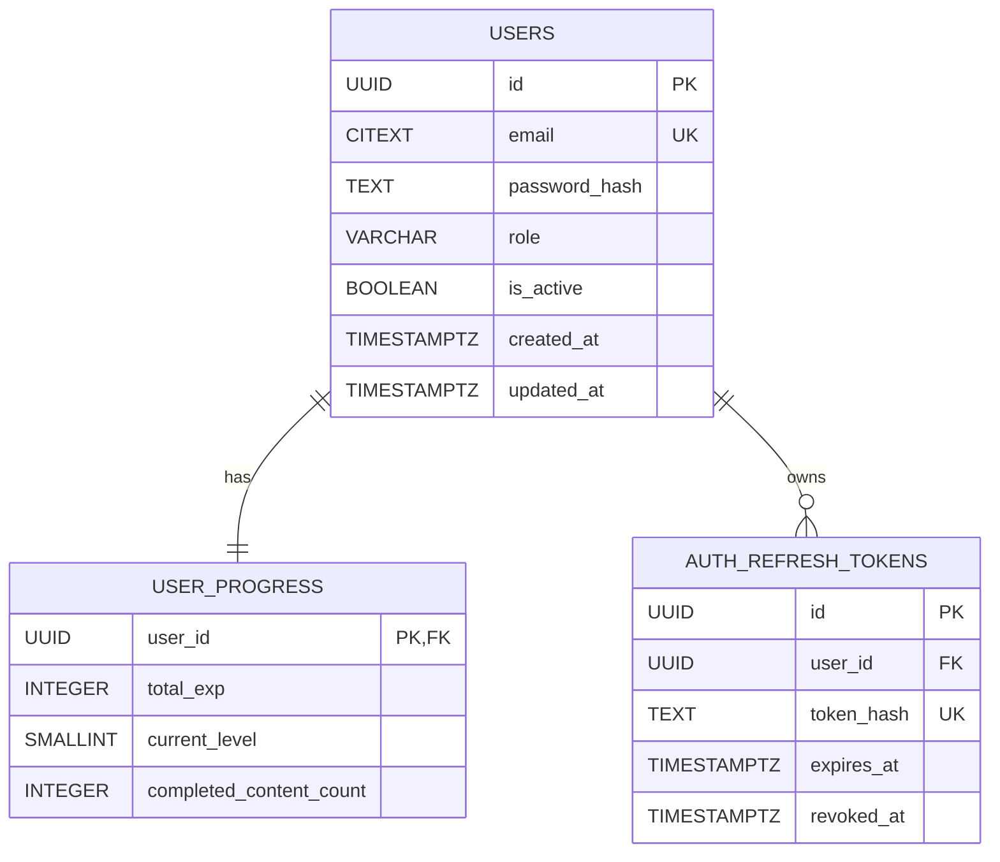
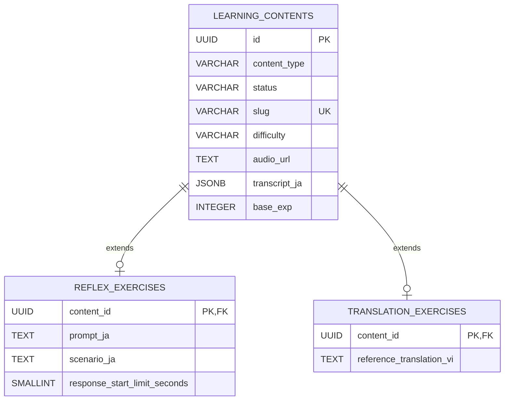
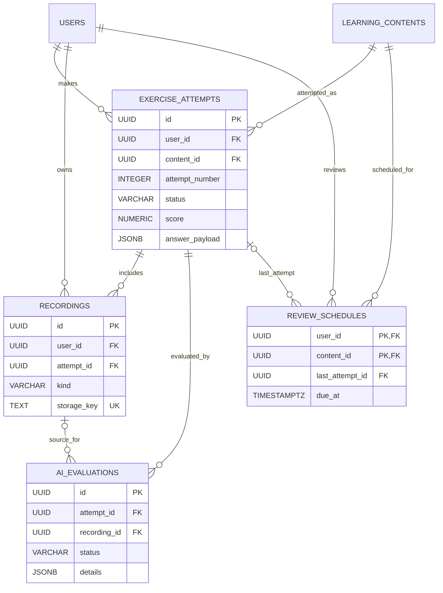
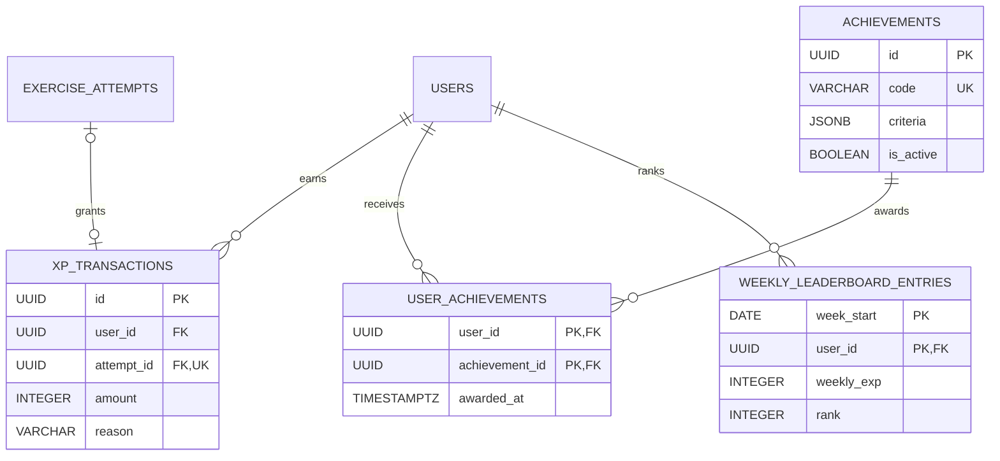
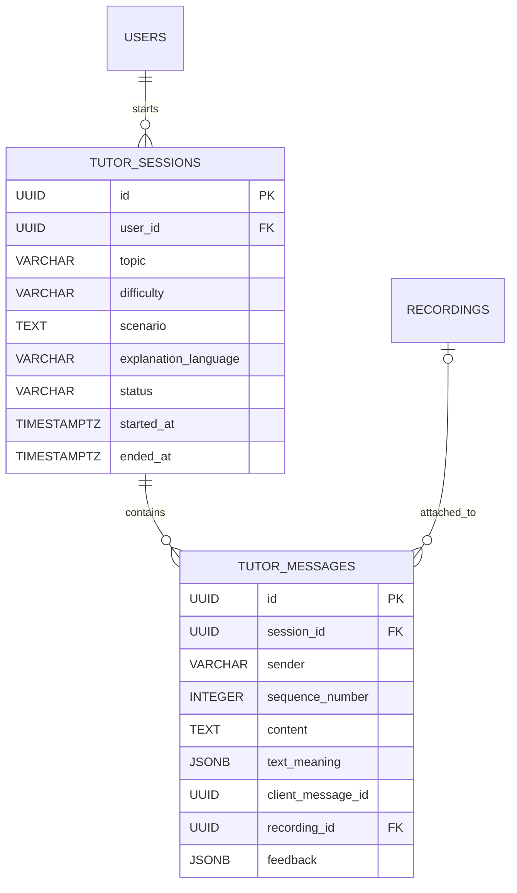
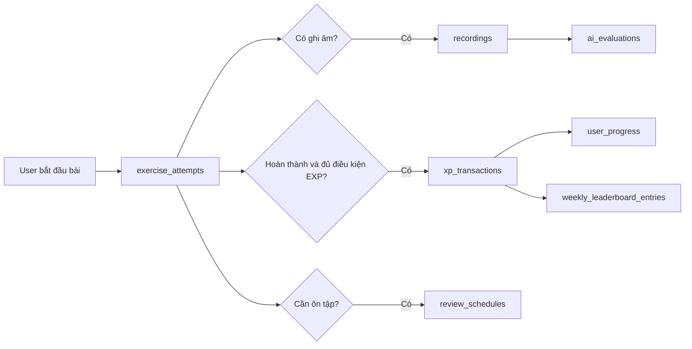

# 05. Thiết kế cơ sở dữ liệu

## 1. Phạm vi và nguồn chuẩn

Kaiwa sử dụng PostgreSQL 15+. SQLAlchemy models trong `apps/api/app/models/` mô tả schema
đích; Alembic migrations trong `apps/api/alembic/versions/` là lịch sử thay đổi dùng để triển khai
schema. Tài liệu này phản ánh schema tại Alembic head `c9f1b4e8d2a6`.

Các nguyên tắc chính:

- Các bảng nghiệp vụ dùng UUIDv7 để khóa chính có tính tuần tự theo thời gian tốt hơn UUID ngẫu
  nhiên. Bảng liên kết và snapshot dùng khóa ghép phù hợp với miền nghiệp vụ.
- Thời điểm được lưu bằng `TIMESTAMPTZ` và xử lý theo UTC.
- Audio bài học không được lưu dạng BLOB. `learning_contents.audio_url` lưu URL video YouTube;
  bản ghi người dùng chỉ lưu `storage_key` của private object storage.
- `learning_contents` chứa dữ liệu chung. Reflex và Translation có bảng mở rộng 1-1;
  Shadowing/Dictation dùng trực tiếp audio và transcript JSONB trên bảng nội dung.
- `exercise_attempts` lưu từng lần làm bài, không ghi đè lịch sử cũ.
- `xp_transactions` là sổ cái EXP. `user_progress` là dữ liệu tổng hợp để đọc nhanh và phải được
  cập nhật cùng transaction với lần cấp EXP.
- Repository chỉ truy vấn và `flush`; service sở hữu transaction và quyết định `commit`.

> Trong các bảng schema bên dưới, “Mặc định DB” chỉ ghi `server_default` thực sự được PostgreSQL
> áp dụng. Giá trị `default` khai báo ở SQLAlchemy như `is_active=True`, `status=DRAFT` hoặc
> `base_exp=50` là mặc định phía application và không được xem là default của database.

## 2. ERD theo miền

Ký hiệu Mermaid: `||` là đúng một, `o|` là không hoặc một và `o{` là không hoặc nhiều.

### 2.1. Tài khoản và xác thực



### 2.2. Nội dung học



Không còn bảng `shadowing_exercises` hoặc `dictation_exercises`. Hai loại này đã được hợp nhất
thành `SHADOWING_DICTATION`; audio và transcript nằm trên `learning_contents`, còn câu trả lời của
user nằm trong `exercise_attempts.answer_payload`.

### 2.3. Lượt học, ghi âm và đánh giá



Database không có FK từ `review_schedules` đến `reflex_exercises`. Việc giới hạn lịch ôn tập cho
đúng loại nội dung là quy tắc nghiệp vụ do service thực thi.

### 2.4. Gamification



Cấp không dùng bảng tham chiếu và không có giới hạn tối đa được định nghĩa trước. Chi phí từ level
`L` lên `L+1` là `50 × L` EXP; tổng EXP tối thiểu của level `L` là `25 × L × (L-1)`.
`user_progress.current_level` là giá trị cache do service tính từ công thức.

### 2.5. AI Tutor



## 3. Danh mục bảng

| Nhóm | Bảng | Trách nhiệm |
| --- | --- | --- |
| Tài khoản | `users` | Thông tin đăng nhập, hồ sơ và trạng thái tài khoản. |
| Tài khoản | `user_progress` | Tổng EXP, cấp độ và số bài đã hoàn thành. |
| Tài khoản | `auth_refresh_tokens` | Refresh token đã băm, hạn dùng và thời điểm thu hồi. |
| Nội dung | `learning_contents` | Catalog chung, audio, transcript và EXP cơ bản. |
| Nội dung | `reflex_exercises` | Dữ liệu riêng của bài Reflex. |
| Nội dung | `translation_exercises` | Bản dịch tiếng Việt tham chiếu. |
| Học tập | `exercise_attempts` | Một lần làm bài và kết quả chấm. |
| Học tập | `recordings` | Metadata bản ghi âm thuộc user/attempt. |
| Học tập | `ai_evaluations` | Trạng thái và kết quả đánh giá AI. |
| Học tập | `review_schedules` | Lịch ôn tập theo user và nội dung. |
| Gamification | `achievements` | Định nghĩa thành tích và điều kiện. |
| Gamification | `user_achievements` | Thành tích đã cấp cho user. |
| Gamification | `xp_transactions` | Lịch sử cộng/trừ EXP bất biến. |
| Gamification | `weekly_leaderboard_entries` | Snapshot bảng xếp hạng tuần. |
| AI Tutor | `tutor_sessions` | Phiên hội thoại AI của user. |
| AI Tutor | `tutor_messages` | Tin nhắn có thứ tự trong phiên. |

## 4. Schema chi tiết

### 4.1. Tài khoản và xác thực

#### Bảng `users`

| Trường | Kiểu dữ liệu | Null | Mặc định DB | Khóa / ràng buộc | Ý nghĩa |
| --- | --- | --- | --- | --- | --- |
| `id` | UUID | Không | `uuidv7()` | PK | Định danh ổn định của tài khoản; UUIDv7 giúp bản ghi mới gần nhau trong B-tree. |
| `email` | CITEXT | Không | - | UNIQUE | Email đăng nhập, so sánh không phân biệt hoa thường nhờ extension `citext`. |
| `password_hash` | TEXT | Không | - | - | Chuỗi hash mật khẩu; không lưu mật khẩu gốc và không trả trường này qua API. |
| `display_name` | VARCHAR(255) | Có | - | - | Tên hiển thị công khai của user. |
| `avatar_url` | TEXT | Có | - | - | URL ảnh đại diện; không chứa nội dung ảnh nhị phân. |
| `role` | VARCHAR(32) | Không | - | CHECK `user_role` | Quyền hệ thống: `USER` hoặc `ADMIN`; giá trị mặc định `USER` do application cấp. |
| `is_active` | BOOLEAN | Không | - | - | Cho phép vô hiệu hóa đăng nhập mà không xóa dữ liệu; application mặc định `true`. |
| `last_login_at` | TIMESTAMPTZ | Có | - | - | Lần đăng nhập thành công gần nhất; NULL khi chưa từng đăng nhập. |
| `created_at` | TIMESTAMPTZ | Không | `now()` | - | Thời điểm tạo tài khoản. |
| `updated_at` | TIMESTAMPTZ | Không | `now()` | - | Thời điểm cập nhật gần nhất; `onupdate` do SQLAlchemy thực hiện, không phải trigger DB. |

#### Bảng `user_progress`

| Trường | Kiểu dữ liệu | Null | Mặc định DB | Khóa / ràng buộc | Ý nghĩa |
| --- | --- | --- | --- | --- | --- |
| `user_id` | UUID | Không | - | PK, FK `users.id` ON DELETE CASCADE | Mỗi user có tối đa một bản tổng hợp tiến độ. |
| `total_exp` | INTEGER | Không | - | - | Tổng EXP hiện hành; application khởi tạo `0` và cập nhật cùng transaction với sổ cái EXP. |
| `current_level` | SMALLINT | Không | - | - | Cấp cache suy ra từ `total_exp` bằng công thức tăng dần; application khởi tạo `1`. |
| `completed_content_count` | INTEGER | Không | - | - | Số nội dung đã hoàn thành, dùng cho dashboard; application khởi tạo `0`. |
| `updated_at` | TIMESTAMPTZ | Không | `now()` | - | Lần gần nhất dữ liệu tiến độ được tính lại. |

#### Bảng `auth_refresh_tokens`

| Trường | Kiểu dữ liệu | Null | Mặc định DB | Khóa / ràng buộc | Ý nghĩa |
| --- | --- | --- | --- | --- | --- |
| `id` | UUID | Không | `uuidv7()` | PK | Định danh một refresh-token record. |
| `user_id` | UUID | Không | - | FK `users.id` ON DELETE CASCADE | Chủ sở hữu token. |
| `token_hash` | TEXT | Không | - | UNIQUE | Chỉ lưu hash để token thô không bị lộ khi database bị đọc. |
| `expires_at` | TIMESTAMPTZ | Không | - | - | Sau thời điểm này token không còn hợp lệ dù chưa bị thu hồi. |
| `revoked_at` | TIMESTAMPTZ | Có | - | - | NULL nghĩa là chưa thu hồi; có giá trị nghĩa là token đã bị vô hiệu hóa chủ động. |
| `created_at` | TIMESTAMPTZ | Không | `now()` | - | Thời điểm phát hành token record. |

Index `ix_auth_refresh_tokens_user_id_expires_at_active` trên `(user_id, expires_at) WHERE
revoked_at IS NULL` chỉ lập chỉ mục token chưa thu hồi, phục vụ kiểm tra hoặc thu hồi phiên đang
hoạt động.

### 4.2. Nội dung học

#### Bảng `learning_contents`

| Trường | Kiểu dữ liệu | Null | Mặc định DB | Khóa / ràng buộc | Ý nghĩa |
| --- | --- | --- | --- | --- | --- |
| `id` | UUID | Không | `uuidv7()` | PK | Định danh nội dung dùng chung cho catalog, attempt và lịch ôn. |
| `content_type` | VARCHAR(32) | Không | - | CHECK `content_type` | Loại bài: `SHADOWING_DICTATION`, `REFLEX` hoặc `LISTENING_TRANSLATION`. |
| `status` | VARCHAR(32) | Không | - | CHECK `content_status` | Vòng đời xuất bản: `DRAFT` hoặc `PUBLISHED`; application mặc định `DRAFT`. |
| `slug` | VARCHAR(255) | Không | - | UNIQUE | Định danh thân thiện dùng trong URL và tra cứu ổn định. |
| `title` | VARCHAR(255) | Không | - | - | Tiêu đề hiển thị của bài học. |
| `short_description` | TEXT | Có | - | - | Mô tả ngắn cho catalog; NULL nếu không có mô tả. |
| `topic` | VARCHAR(100) | Có | - | - | Chủ đề dùng để phân loại hoặc lọc nội dung. |
| `difficulty` | VARCHAR | Không | - | CHECK `jlpt_level` | Cấp JLPT `N5`, `N4`, `N3`, `N2` hoặc `N1`; application mặc định `N5`. |
| `audio_url` | TEXT | Có | - | - | URL video YouTube dùng làm nguồn phát audio; NULL với nội dung không cần media. |
| `audio_duration_ms` | INTEGER | Có | - | - | Độ dài audio theo millisecond, dùng đồng bộ transcript và kiểm tra bản ghi. |
| `transcript_ja` | JSONB | Có | - | - | Danh sách segment tiếng Nhật có nội dung và mốc thời gian; hỗ trợ phát audio đồng bộ từng đoạn. |
| `base_exp` | INTEGER | Không | - | CHECK `base_exp > 0` | EXP cơ sở trước khi áp dụng quy tắc thưởng; application mặc định `50`. |
| `published_at` | TIMESTAMPTZ | Có | - | - | Thời điểm công bố; NULL khi chưa publish. |
| `created_at` | TIMESTAMPTZ | Không | `now()` | - | Thời điểm tạo nội dung. |
| `updated_at` | TIMESTAMPTZ | Không | `now()` | - | Thời điểm sửa gần nhất; cập nhật bởi SQLAlchemy, không có trigger DB. |

Constraint `jlpt_level` giới hạn `difficulty`. Partial index
`ix_learning_contents_published_catalog` trên `(content_type, difficulty, published_at DESC) WHERE
status = 'PUBLISHED'` phục vụ catalog đã xuất bản theo loại, cấp độ và độ mới.

- Ví dụ về `transcript_ja`:
```json
"transcript_ja": [
                    {
                        "start_time_ms": 0,
                        "end_time_ms": 12000,
                        "script": "明日の会議の資料ですが、",
                    },
                    {
                        "start_time_ms": 12000,
                        "end_time_ms": 25000,
                        "script": "今日の夕方までに準備しておきます。",
                    },
                ],
```

#### Bảng `reflex_exercises`

| Trường | Kiểu dữ liệu | Null | Mặc định DB | Khóa / ràng buộc | Ý nghĩa |
| --- | --- | --- | --- | --- | --- |
| `content_id` | UUID | Không | - | PK, FK `learning_contents.id` ON DELETE CASCADE | Vừa định danh vừa tạo quan hệ 1-1 với nội dung cha. |
| `prompt_ja` | TEXT | Không | - | - | Câu hoặc chỉ dẫn tiếng Nhật mà người học phải phản hồi. |
| `scenario_ja` | TEXT | Có | - | - | Ngữ cảnh tiếng Nhật bổ sung; NULL khi prompt đã đủ ngữ cảnh. |
| `response_start_limit_seconds` | SMALLINT | Không | - | - | Số giây tối đa để bắt đầu phản hồi; application mặc định `3`. |
| `created_at` | TIMESTAMPTZ | Không | `now()` | - | Thời điểm tạo cấu hình Reflex. |

#### Bảng `translation_exercises`

| Trường | Kiểu dữ liệu | Null | Mặc định DB | Khóa / ràng buộc | Ý nghĩa |
| --- | --- | --- | --- | --- | --- |
| `content_id` | UUID | Không | - | PK, FK `learning_contents.id` ON DELETE CASCADE | Quan hệ 1-1 với nội dung loại Translation. |
| `reference_translation_vi` | TEXT | Có | - | - | Bản dịch tiếng Việt tham chiếu cho chấm/đối chiếu; NULL nếu bài chấm theo tiêu chí khác. |
| `created_at` | TIMESTAMPTZ | Không | `now()` | - | Thời điểm tạo cấu hình Translation. |

### 4.3. Lượt học, ghi âm và đánh giá

#### Bảng `exercise_attempts`

| Trường | Kiểu dữ liệu | Null | Mặc định DB | Khóa / ràng buộc | Ý nghĩa |
| --- | --- | --- | --- | --- | --- |
| `id` | UUID | Không | `uuidv7()` | PK | Định danh duy nhất của một lần làm bài. |
| `user_id` | UUID | Không | - | FK `users.id` ON DELETE CASCADE | User thực hiện attempt. |
| `content_id` | UUID | Không | - | FK `learning_contents.id` ON DELETE RESTRICT | Nội dung được làm; RESTRICT ngăn xóa bài đã có lịch sử. |
| `attempt_number` | INTEGER | Không | - | UNIQUE cùng `user_id`, `content_id` | Số thứ tự lần làm cùng một nội dung; application khởi tạo `1`. |
| `status` | VARCHAR(32) | Không | - | CHECK `attempt_status` | `IN_PROGRESS` hoặc `COMPLETED`. |
| `started_at` | TIMESTAMPTZ | Không | `now()` | - | Thời điểm bắt đầu attempt. |
| `submitted_at` | TIMESTAMPTZ | Có | - | - | Thời điểm user nộp; NULL khi attempt còn đang làm. |
| `completed_at` | TIMESTAMPTZ | Có | - | - | Thời điểm toàn bộ xử lý/chấm hoàn tất; NULL khi chưa hoàn tất. |
| `score` | NUMERIC(5,2) | Có | - | - | Điểm tổng hợp có tối đa 3 chữ số phần nguyên và 2 chữ số thập phân. |
| `correct_count` | SMALLINT | Có | - | - | Số đơn vị trả lời đúng; cách tính phụ thuộc loại bài. |
| `total_count` | SMALLINT | Có | - | - | Tổng số đơn vị được chấm, dùng cùng `correct_count` để giải thích điểm. |
| `response_started_at` | TIMESTAMPTZ | Có | - | - | Mốc user thực sự bắt đầu phản hồi, dùng cho bài Reflex. |
| `response_started_on_time` | BOOLEAN | Có | - | - | Kết quả kiểm tra mốc bắt đầu so với giới hạn; NULL với bài không áp dụng hoặc chưa đo. |
| `answer_payload` | JSONB | Có | - | - | Payload câu trả lời theo loại bài, ví dụ nội dung từng blank; giữ schema linh hoạt giữa các mode. |

UNIQUE `uq_exercise_attempts_order` trên `(user_id, content_id, attempt_number)` ngăn trùng số lần
làm. Index `(user_id, completed_at DESC) INCLUDE (content_id, status, score)` phục vụ lịch sử user
bằng index-only scan; index `(content_id, completed_at DESC)` phục vụ thống kê theo nội dung.

#### Bảng `recordings`

| Trường | Kiểu dữ liệu | Null | Mặc định DB | Khóa / ràng buộc | Ý nghĩa |
| --- | --- | --- | --- | --- | --- |
| `id` | UUID | Không | `uuidv7()` | PK | Định danh metadata bản ghi âm. |
| `user_id` | UUID | Không | - | FK `users.id` ON DELETE CASCADE | Chủ sở hữu bản ghi, dùng để kiểm tra quyền truy cập. |
| `attempt_id` | UUID | Có | - | FK `exercise_attempts.id` ON DELETE CASCADE | Attempt liên quan; NULL cho recording của AI Tutor không thuộc bài tập. |
| `kind` | VARCHAR(32) | Không | - | CHECK `recording_kind` | Mục đích ghi âm: `SHADOWING`, `REFLEX` hoặc `TUTOR_VOICE`. |
| `storage_key` | TEXT | Không | - | UNIQUE | Khóa object trong private storage; không phải URL công khai. |
| `duration_ms` | INTEGER | Có | - | - | Độ dài bản ghi theo millisecond; NULL trước khi metadata được xác định. |
| `mime_type` | VARCHAR(100) | Có | - | - | Media type đã xác minh như `audio/webm`; không tin trực tiếp giá trị client gửi. |
| `transcription_ja` | TEXT | Có | - | - | Kết quả speech-to-text tiếng Nhật; NULL khi chưa chạy hoặc không cần STT. |
| `expired_at` | TIMESTAMPTZ | Có | - | - | Mốc đủ điều kiện dọn object; NULL nếu chưa lên lịch hết hạn. |
| `created_at` | TIMESTAMPTZ | Không | `now()` | - | Thời điểm tạo metadata. |

Index `ix_recordings_user_id_created_at` trên `(user_id, created_at DESC)` phục vụ danh sách ghi âm
gần đây theo user.

#### Bảng `ai_evaluations`

| Trường | Kiểu dữ liệu | Null | Mặc định DB | Khóa / ràng buộc | Ý nghĩa |
| --- | --- | --- | --- | --- | --- |
| `id` | UUID | Không | `uuidv7()` | PK | Định danh một lần gọi/chạy đánh giá AI. |
| `attempt_id` | UUID | Không | - | FK `exercise_attempts.id` ON DELETE CASCADE | Attempt được đánh giá; xóa attempt sẽ xóa toàn bộ evaluation liên quan. |
| `recording_id` | UUID | Có | - | FK `recordings.id` ON DELETE SET NULL | Audio nguồn; giữ evaluation khi metadata recording bị xóa. |
| `status` | VARCHAR(32) | Không | - | CHECK `ai_evaluation_status` | `PENDING`, `COMPLETED` hoặc `FAILED`; application mặc định `PENDING`. |
| `provider` | VARCHAR(100) | Có | - | - | Nhà cung cấp dịch vụ AI để truy vết kết quả. |
| `model` | VARCHAR(100) | Có | - | - | Phiên bản/tên model đã tạo kết quả, phục vụ audit và so sánh chất lượng. |
| `similarity_score` | NUMERIC(5,2) | Có | - | - | Điểm tương đồng với đáp án/tham chiếu; NULL khi chưa chấm hoặc không áp dụng. |
| `fluency_score` | NUMERIC(5,2) | Có | - | - | Điểm lưu loát; NULL với bài không có giọng nói hoặc chưa hoàn tất. |
| `feedback` | TEXT | Có | - | - | Nhận xét hiển thị cho người học. |
| `details` | JSONB | Có | - | - | Kết quả có cấu trúc như lỗi theo segment, tiêu chí con hoặc metadata provider. |
| `error_message` | TEXT | Có | - | - | Chi tiết lỗi nội bộ khi `FAILED`; không trả nguyên văn qua API nếu chứa dữ liệu nhạy cảm. |
| `completed_at` | TIMESTAMPTZ | Có | - | - | Mốc kết thúc thành công hoặc thất bại; NULL khi còn `PENDING`. |
| `created_at` | TIMESTAMPTZ | Không | `now()` | - | Thời điểm enqueue/tạo evaluation. |

Index `ix_ai_evaluations_attempt_id_created_at` trên `(attempt_id, created_at DESC)` lấy lần đánh
giá mới nhất và lịch sử đánh giá của attempt.

#### Bảng `review_schedules`

| Trường | Kiểu dữ liệu | Null | Mặc định DB | Khóa / ràng buộc | Ý nghĩa |
| --- | --- | --- | --- | --- | --- |
| `user_id` | UUID | Không | - | PK, FK `users.id` ON DELETE CASCADE | Thành phần user của khóa lịch ôn. |
| `content_id` | UUID | Không | - | PK, FK `learning_contents.id` ON DELETE CASCADE | Thành phần nội dung của khóa; mỗi user có một lịch cho mỗi bài. |
| `due_at` | TIMESTAMPTZ | Không | - | - | Thời điểm bài trở thành đến hạn ôn. |
| `interval_days` | SMALLINT | Không | - | - | Khoảng cách ngày đến lần ôn tiếp theo; application khởi tạo `1`. |
| `ease_factor` | NUMERIC(4,2) | Không | - | - | Hệ số điều chỉnh độ giãn của thuật toán spaced repetition; application khởi tạo `2.5`. |
| `repetitions` | SMALLINT | Không | - | - | Số lần ôn thành công liên tiếp dùng để tính interval; application khởi tạo `0`. |
| `last_attempt_id` | UUID | Có | - | FK `exercise_attempts.id` ON DELETE SET NULL | Attempt gần nhất đã cập nhật lịch; NULL khi chưa có hoặc attempt đã bị xóa. |
| `updated_at` | TIMESTAMPTZ | Không | `now()` | - | Lần gần nhất thuật toán tính lại lịch. |

Index `ix_review_schedules_user_id_due_at` trên `(user_id, due_at)` tối ưu truy vấn các bài đến
hạn: `WHERE user_id = ? AND due_at <= now()`.

### 4.4. Gamification

#### Bảng `achievements`

| Trường | Kiểu dữ liệu | Null | Mặc định DB | Khóa / ràng buộc | Ý nghĩa |
| --- | --- | --- | --- | --- | --- |
| `id` | UUID | Không | `uuidv7()` | PK | Định danh thành tích. |
| `code` | VARCHAR(100) | Không | - | UNIQUE | Mã máy ổn định dùng trong service, seed và API. |
| `name` | VARCHAR(255) | Không | - | - | Tên hiển thị của thành tích. |
| `description` | TEXT | Có | - | - | Mô tả điều kiện hoặc ý nghĩa cho người học. |
| `icon_url` | TEXT | Có | - | - | URL biểu tượng; NULL nếu giao diện dùng biểu tượng mặc định. |
| `criteria` | JSONB | Không | - | - | Cấu hình điều kiện có cấu trúc, ví dụ loại chỉ số, toán tử và ngưỡng cần đạt. |
| `is_active` | BOOLEAN | Không | - | - | Cho phép ngừng cấp thành tích mà vẫn giữ lịch sử; application mặc định `true`. |
| `created_at` | TIMESTAMPTZ | Không | `now()` | - | Thời điểm tạo định nghĩa. |

#### Bảng `user_achievements`

| Trường | Kiểu dữ liệu | Null | Mặc định DB | Khóa / ràng buộc | Ý nghĩa |
| --- | --- | --- | --- | --- | --- |
| `user_id` | UUID | Không | - | PK, FK `users.id` ON DELETE CASCADE | User được cấp thành tích. |
| `achievement_id` | UUID | Không | - | PK, FK `achievements.id` ON DELETE CASCADE | Thành tích được cấp; PK ghép ngăn cấp trùng cho cùng user. |
| `awarded_at` | TIMESTAMPTZ | Không | `now()` | - | Thời điểm user đạt thành tích. |

#### Bảng `xp_transactions`

| Trường | Kiểu dữ liệu | Null | Mặc định DB | Khóa / ràng buộc | Ý nghĩa |
| --- | --- | --- | --- | --- | --- |
| `id` | UUID | Không | `uuidv7()` | PK | Định danh bút toán EXP. |
| `user_id` | UUID | Không | - | FK `users.id` ON DELETE CASCADE | User nhận hoặc bị điều chỉnh EXP. |
| `attempt_id` | UUID | Có | - | FK `exercise_attempts.id` ON DELETE SET NULL, UNIQUE | Attempt tạo ra EXP; xóa attempt vẫn giữ bút toán. Unique bảo đảm một attempt chỉ cấp EXP một lần. |
| `amount` | INTEGER | Không | - | CHECK `amount > 0` | Số EXP được cấp; điều chỉnh giảm cần một cơ chế nghiệp vụ riêng thay vì ghi giá trị âm. |
| `reason` | VARCHAR(100) | Có | - | - | Mã/lý do nghiệp vụ giúp audit nguồn thay đổi EXP. |
| `created_at` | TIMESTAMPTZ | Không | `now()` | - | Mốc ghi sổ, dùng tổng hợp EXP theo thời gian. |

Index `(created_at, user_id)` phục vụ job tổng hợp theo khoảng thời gian. Index
`(user_id, created_at DESC)` phục vụ lịch sử EXP gần nhất của một user.

#### Bảng `weekly_leaderboard_entries`

| Trường | Kiểu dữ liệu | Null | Mặc định DB | Khóa / ràng buộc | Ý nghĩa |
| --- | --- | --- | --- | --- | --- |
| `week_start` | DATE | Không | - | PK, UNIQUE cùng `rank` | Ngày đầu tuần của snapshot; application phải chuẩn hóa cùng một quy ước tuần. |
| `user_id` | UUID | Không | - | PK, FK `users.id` ON DELETE CASCADE | User xuất hiện trong snapshot tuần. |
| `weekly_exp` | INTEGER | Không | - | - | Tổng EXP trong tuần tại lúc tính snapshot; application mặc định `0`. |
| `rank` | INTEGER | Không | - | UNIQUE cùng `week_start` | Thứ hạng trong tuần; không được trùng trong cùng snapshot. |
| `calculated_at` | TIMESTAMPTZ | Không | `now()` | - | Mốc job gần nhất tính hoặc cập nhật dòng snapshot. |

UNIQUE `uq_weekly_leaderboard_rank` trên `(week_start, rank)` đồng thời tạo index phù hợp để đọc
leaderboard của một tuần theo thứ hạng.

### 4.5. AI Tutor

Phase 2 bổ sung `client_message_id` cho user message để bảo đảm retry idempotent. Đây là phần mở rộng
schema cần được triển khai bằng Alembic migration trước khi bật API AI Tutor; không sửa database thủ
công trên môi trường triển khai.

#### Bảng `tutor_sessions`

| Trường | Kiểu dữ liệu | Null | Mặc định DB | Khóa / ràng buộc | Ý nghĩa |
| --- | --- | --- | --- | --- | --- |
| `id` | UUID | Không | `uuidv7()` | PK | Định danh phiên hội thoại. |
| `user_id` | UUID | Không | - | FK `users.id` ON DELETE CASCADE | User sở hữu phiên. |
| `topic` | VARCHAR(255) | Không | - | - | Chủ đề do user nhập và được lưu làm snapshot của phiên. |
| `difficulty` | VARCHAR | Không | - | CHECK `tutor_session_jlpt_level` | Cấp JLPT `N5` đến `N1` do user chọn. |
| `scenario` | TEXT | Có | - | - | Bối cảnh/role-play được đưa cho tutor. |
| `explanation_language` | VARCHAR(8) | Không | `vi` | CHECK `tutor_session_explanation_language` | Ngôn ngữ giải thích feedback: `vi`, `en` hoặc `ja`. |
| `status` | VARCHAR(32) | Không | - | CHECK `tutor_session_status` | `active` hoặc `completed`; application mặc định `active`. |
| `started_at` | TIMESTAMPTZ | Không | `now()` | - | Thời điểm bắt đầu phiên. |
| `ended_at` | TIMESTAMPTZ | Có | - | - | Thời điểm kết thúc; NULL khi phiên đang hoạt động hoặc chưa đóng đúng cách. |

`topic`, `difficulty`, `scenario` và `explanation_language` là snapshot tại thời điểm tạo phiên.
`topic` và `difficulty` là đầu vào bắt buộc; `scenario` là đầu vào tùy chọn; `explanation_language`
nhận `vi`, `en` hoặc `ja` và mặc định `vi`. Vì không còn catalog, lịch sử phiên không phụ thuộc vào
dữ liệu dùng chung nào khác.

Index `ix_tutor_sessions_user_id_started_at` trên `(user_id, started_at DESC)` phục vụ lịch sử phiên
gần nhất.

#### Bảng `tutor_messages`

| Trường | Kiểu dữ liệu | Null | Mặc định DB | Khóa / ràng buộc | Ý nghĩa |
| --- | --- | --- | --- | --- | --- |
| `id` | UUID | Không | `uuidv7()` | PK | Định danh tin nhắn. |
| `session_id` | UUID | Không | - | FK `tutor_sessions.id` ON DELETE CASCADE | Phiên chứa tin nhắn. |
| `sender` | VARCHAR(32) | Không | - | CHECK `tutor_sender` | Bên gửi trong storage: `USER` hoặc `AI`; API trả `user` hoặc `ai`. |
| `sequence_number` | INTEGER | Không | - | UNIQUE cùng `session_id` | Vị trí tuyệt đối trong phiên, tránh phụ thuộc timestamp khi sắp thứ tự. |
| `content` | TEXT | Không | - | - | Nội dung văn bản của lượt hội thoại. |
| `text_meaning` | JSONB | Có | - | - | Object `{language, text}` chứa bản dịch theo `explanation_language`; NULL với user message. |
| `client_message_id` | UUID | Có | - | UNIQUE cùng `session_id` | Idempotency key của user message; AI message để NULL. |
| `recording_id` | UUID | Có | - | FK `recordings.id` ON DELETE SET NULL | Bản ghi giọng nói đính kèm; giữ message nếu recording bị xóa. |
| `feedback` | JSONB | Có | - | - | Object chuẩn hóa gồm ngôn ngữ giải thích, structured corrections, natural expression và tối đa 3 `answer_hints`. |
| `created_at` | TIMESTAMPTZ | Không | `now()` | - | Thời điểm lưu tin nhắn. |

UNIQUE `uq_tutor_messages_sequence` trên `(session_id, sequence_number)` ngăn hai message chiếm cùng
vị trí và hỗ trợ tải hội thoại theo đúng thứ tự.

Phase 2 bổ sung UNIQUE `uq_tutor_messages_client_message_id` trên `(session_id, client_message_id)`
để retry không tạo user message trùng. Cột nullable để AI message không cần idempotency key.

## 5. Quy tắc toàn vẹn và transaction

- Xóa user cascade đến progress, token, attempt, recording, EXP, thành tích, lịch ôn, leaderboard
  và phiên Tutor thông qua các FK tương ứng.
- Xóa nội dung cascade đến bảng mở rộng và lịch ôn, nhưng bị chặn nếu đã có attempt do
  `exercise_attempts.content_id` dùng `RESTRICT`.
- Recording có thể không thuộc attempt để hỗ trợ giọng nói trong AI Tutor. Khi recording bị xóa,
  tham chiếu từ evaluation/message được đặt NULL.
- Tutor session lưu trực tiếp snapshot `topic`, `difficulty` và `scenario`; không có FK tới catalog.
- Xóa một Tutor session cascade đến toàn bộ `tutor_messages` thuộc session đó.
- Tạo attempt, chấm điểm, cấp EXP và cập nhật `user_progress` phải nằm trong một transaction do
  service quản lý.
- Các enum được lưu bằng `VARCHAR` kèm CHECK constraint, không dùng PostgreSQL native enum.
- Mọi truy vấn dữ liệu cá nhân phải lọc bằng `current_user.id`; không tin `user_id` do client gửi.

## 6. Luồng ghi chính



AI evaluation có thể bắt đầu ở `PENDING` rồi chuyển sang `COMPLETED` hoặc `FAILED`. Lỗi đánh giá
AI không được làm mất attempt đã lưu.

## 7. Alembic và vận hành

Chuỗi migration hiện tại:

1. `16d3c06d08d6`: tạo schema ban đầu.
2. `8a7d3e2c4b19`: hợp nhất Shadowing/Dictation và chuyển transcript sang JSONB.
3. `c8204c73c808`: seed cấp độ và thêm index lịch sử EXP.
4. `332a939cfaf9`: merge hai migration head.
5. `bbea12cc1d7b`: chuyển độ khó nội dung sang JLPT `N5`-`N1`.
6. `51f2a49d6b30`: xóa `level_definitions` và chuyển việc tính cấp sang application.
7. `6d4f92a1c8e7`: khóa toàn vẹn số/enum, bảo toàn sổ cái EXP và chuẩn hóa độ khó Tutor.
8. `a4c8d2e6f1b3`: thêm catalog Tutor scenario và liên kết nguồn scenario với phiên hội thoại.
9. `c9f1b4e8d2a6`: thêm `client_message_id` và constraint idempotency cho Tutor message.
10. `e4f6a8c2d1b3`: xóa key feedback `next_question` đã deprecated khỏi Tutor message.
11. `f1a2b3c4d5e6`: thêm bản dịch tiếng Việt nullable cho Tutor message.

Các lệnh chạy từ repository root:

```bash
uv --directory apps/api run alembic current
uv --directory apps/api run alembic history
uv --directory apps/api run alembic upgrade head
uv --directory apps/api run alembic check
```

Khi đổi schema: sửa model, sinh migration bằng `alembic revision --autogenerate`, review thủ công
các constraint/index/data migration, chạy upgrade trên database thử nghiệm, rồi xác nhận
`alembic check` không phát hiện drift. Không sửa migration đã được áp dụng ở môi trường chia sẻ.

`DATABASE_URL` nằm trong `apps/api/.env` và không được commit. Với asyncpg, URL có dạng
`postgresql+asyncpg://<user>:<password>@<host>/<database>?ssl=require`.
