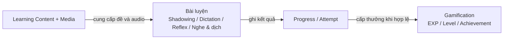

# 07. Module Design

## 1. Mục đích

Tài liệu này chia hệ thống KaiwaUp thành các module có trách nhiệm rõ ràng, xác định quan hệ giữa
chúng và thống nhất cách hiện thực module ở backend FastAPI lẫn frontend Next.js.

Tài liệu được dùng để:

- Tránh business rule bị đặt sai layer hoặc lặp lại ở nhiều nơi.
- Xác định module nào sở hữu dữ liệu và hành vi nghiệp vụ.
- Giới hạn dependency giữa các module, tránh import vòng và coupling không cần thiết.
- Làm cơ sở phân chia công việc, thiết kế API, database và test.
- Giúp một feature được tổ chức nhất quán từ route frontend đến endpoint, service và repository
  backend.

## 2. Phạm vi

Tài liệu thiết kế các module thuộc cả ba mức ưu tiên **P0 — Bắt buộc**, **P1 — Quan trọng** và
**P2 — Mở rộng** trong `02-requirements.md`. Nhãn ưu tiên giúp phân biệt module cần triển khai trong
MVP với module đã có boundary dự kiến nhưng chưa cam kết triển khai ngay.

Bao gồm:

- Xác thực và quản lý người dùng.
- Nội dung học tập và media phục vụ bài luyện.
- Shadowing.
- Dictation.
- Tiến độ và lịch sử luyện tập.
- EXP, cấp độ, thành tích và bảng xếp hạng.
- Phản xạ 3 giây và lặp lại ngắt quãng.
- Tích hợp AI dùng để đánh giá câu trả lời hoặc bản ghi âm.
- Dashboard tổng hợp dữ liệu người học.
- Hạ tầng health check.
- AI Tutor 1-1 ở P2.
- Nghe và dịch ở P2.
- Phân tích phát âm Shadowing nâng cao ở P2.

> **Trạng thái hiện tại:** codebase mới có khung kiến trúc, health endpoint, hạ tầng database,
> exception handler và skeleton của User service/repository. Danh sách module bên dưới là thiết kế
> mục tiêu cho P0/P1/P2, không có nghĩa tất cả module đã được triển khai. Module P2 chỉ được hiện thực
> sau khi P0/P1 ổn định và phạm vi triển khai được xác nhận.

## 3. Nguyên tắc thiết kế module

### 3.1. Module nghiệp vụ và cấu trúc vật lý

KaiwaUp dùng **logical domain module** kết hợp với cấu trúc backend **layer-first** đang có.

Ví dụ, module Shadowing không nằm trong một thư mục duy nhất mà được hiện thực xuyên qua các layer:

```text
app/
├── api/v1/endpoints/shadowing.py
├── services/shadowing.py
├── repositories/shadowing.py
├── schemas/shadowing.py
└── models/shadowing.py
```

Các file cùng tên domain tạo thành một logical module. Cách tổ chức này phải nhất quán với
`08-coding-convention.md`.

Nếu một module lớn đến mức một file không còn dễ quản lý, có thể chuyển file của riêng layer đó thành
package, ví dụ `services/shadowing/`. Không chuyển toàn bộ kiến trúc sang feature-first trong một Pull
Request cục bộ.

### 3.2. Data ownership

- Mỗi loại dữ liệu nghiệp vụ có đúng một module sở hữu.
- Module sở hữu định nghĩa rule tạo, đọc và thay đổi dữ liệu đó.
- Module khác không truy cập repository của module sở hữu để bỏ qua business rule.
- Foreign key không đồng nghĩa với quyền sở hữu. Module có thể lưu ID của dữ liệu module khác nhưng
  không được tự thay đổi dữ liệu đó.
- Dashboard và các read model tổng hợp không sở hữu dữ liệu nguồn.

### 3.3. Dependency direction

Dependency chuẩn trong một request:

```text
Frontend route
    -> generated API client
        -> FastAPI endpoint
            -> application service
                -> repository hoặc integration port
                    -> database, object storage hoặc AI provider
```

Quy tắc:

- Dependency chỉ đi từ layer ngoài vào layer trong; layer trong không import layer HTTP hoặc UI.
- Endpoint không gọi repository trực tiếp.
- Repository không gọi service.
- Service không phụ thuộc `Request`, `JSONResponse`, React hoặc chi tiết provider bên ngoài.
- Module gọi hành vi công khai của module khác qua service/interface, không import implementation private.
- Khi một use case cần nhiều module, service của use case gốc chịu trách nhiệm điều phối.
- Không tạo dependency hai chiều. Nếu `A` cần `B` và `B` cũng cần `A`, phải tách phần dùng chung hoặc tạo một orchestration service ở layer ứng dụng.

### 3.4. Mức độ tách module

Một module riêng được tạo khi có ít nhất một trong các yếu tố:

- Có business rule hoặc lifecycle riêng.
- Sở hữu một nhóm dữ liệu riêng.
- Có quyền truy cập hoặc yêu cầu bảo mật riêng.
- Có tích hợp hạ tầng bên ngoài cần cô lập.
- Có thể thay đổi độc lập với các feature khác.

Không tạo module chỉ vì có một màn hình hoặc một bảng database. Ngược lại, không gom nhiều domain
khác nhau vào các module mơ hồ như `CommonService`, `Manager` hoặc `Helper`.

## 4. Sơ đồ tổng quan

### 4.1. Quan hệ giữa các module

Có thể hiểu quan hệ module qua luồng học tập chính sau:



Đây là **luồng nghiệp vụ**, không phải sơ đồ import code:

1. Learning Content và Media cung cấp nội dung cho bài luyện.
2. Shadowing, Dictation, Reflex hoặc Nghe và dịch thực hiện rule riêng của từng loại bài.
3. Khi bài hoàn thành, kết quả chung được ghi vào Progress/Attempt.
4. Progress yêu cầu Gamification cấp EXP hoặc phần thưởng nếu đủ điều kiện.

Các module còn lại đóng vai trò hỗ trợ:

- **Auth** xác thực người dùng; **User/Profile** cung cấp thông tin hồ sơ.
- **AI Gateway** hỗ trợ đánh giá Shadowing/Reflex ở P1, AI Tutor và phân tích phát âm nâng cao ở P2.
  AI lỗi không được làm mất kết quả luyện cơ bản.
- **Review** quản lý lịch ôn từ kết quả Reflex; **Leaderboard** tạo bảng xếp hạng tuần từ lịch sử EXP.
- **Dashboard** chỉ đọc và tổng hợp dữ liệu từ các module khác; Dashboard không sở hữu hoặc tự thay
  đổi dữ liệu nguồn.

Quan hệ chi tiết được trình bày theo từng luồng nghiệp vụ để dễ hình dung:

| Luồng nghiệp vụ       | Các module phối hợp                                          | Cách phối hợp                                                                |
| --------------------- | ------------------------------------------------------------ | ----------------------------------------------------------------------------- |
| Đăng ký tài khoản     | Auth, User/Profile                                           | Auth tạo tài khoản; User/Profile tạo hồ sơ ban đầu                            |
| Chuẩn bị bài học      | Learning Content, Media/Storage                              | Content quản lý đề/transcript; Media cung cấp URL audio Cloudinary            |
| Luyện Shadowing       | Shadowing, Content, Media, Progress, AI Gateway              | Tải bài/audio, xử lý bản ghi tạm, đánh giá tùy chọn và ghi kết quả            |
| Luyện Dictation       | Dictation, Content, Media, Progress                          | Tải đề/audio, chấm đáp án ở backend và ghi kết quả                            |
| Luyện phản xạ         | Reflex, Content, Media, Progress, AI Gateway, Review         | Tải prompt, xử lý audio tạm, đánh giá phản hồi và yêu cầu cập nhật lịch ôn    |
| Luyện nghe và dịch    | Listening Translation, Content, Media, Progress              | Tải bài/audio, kiểm tra câu trả lời và ghi kết quả                            |
| Luyện với AI Tutor    | AI Tutor, AI Gateway                                         | Quản lý phiên hội thoại và chuẩn hóa phản hồi AI                              |
| Hoàn thành bài luyện  | Progress/Attempt, Gamification                               | Progress xác nhận completion; Gamification cấp thưởng đúng một lần            |
| Xem bảng xếp hạng     | Leaderboard, Gamification, User/Profile                      | Xếp hạng EXP tuần và bổ sung thông tin hiển thị người dùng                    |
| Hiển thị Dashboard    | Dashboard, User, Content, Progress, Gamification, Review, Leaderboard | Dashboard chỉ tổng hợp dữ liệu đọc từ các module nguồn                |

Khi các module phối hợp, module đang xử lý use case chỉ gọi **public service/read interface** của module còn lại. Module này không được truy cập repository private hoặc thay đổi trực tiếp database do module khác sở hữu.

### 4.2. Ví dụ phối hợp module khi hoàn thành bài Dictation

Phần này minh họa cách nhiều module cùng xử lý **một hành động của người dùng**. Ví dụ: người dùng nộp đáp án Dictation và đủ điều kiện nhận 10 EXP.

| Bước | Thành phần xử lý | Việc thực hiện                                                         |
| ---- | ---------------- | ---------------------------------------------------------------------- |
| 1    | Frontend         | Gửi đáp án người dùng đã nhập đến API                                  |
| 2    | Dictation        | Kiểm tra đáp án, tính kết quả đúng/sai và xác định bài đã hoàn thành   |
| 3    | Progress/Attempt | Lưu lần làm bài và cập nhật trạng thái hoàn thành                      |
| 4    | Gamification     | Kiểm tra điều kiện, ghi thêm 10 EXP và ngăn cộng thưởng trùng          |
| 5    | API/Frontend     | Trả và hiển thị kết quả bài làm cùng số EXP vừa nhận                   |

Dictation chịu trách nhiệm **chấm bài**, Progress chịu trách nhiệm **lưu lịch sử học**, còn Gamification chịu trách nhiệm **cấp thưởng**. Mỗi module chỉ xử lý rule thuộc phạm vi của mình.

#### Tại sao cần transaction?

Trong trường hợp này, “transaction” có thể hiểu đơn giản là: **lưu kết quả và cộng EXP được xem như một thao tác duy nhất — hoặc cả hai cùng thành công, hoặc không thay đổi gì cả**.

Ví dụ người dùng đang có 100 EXP:

| Tình huống                                              | Attempt mới | Tổng EXP | Kết quả                    |
| ------------------------------------------------------- | ----------- | -------- | -------------------------- |
| Lưu kết quả và cộng thưởng đều thành công               | Đã lưu      | 110      | Hợp lệ                     |
| Lưu attempt lỗi                                         | Không lưu   | 100      | Hoàn tác toàn bộ           |
| Cộng EXP lỗi sau khi chuẩn bị lưu attempt               | Không lưu   | 100      | Hoàn tác toàn bộ           |
| Cùng request bị gửi lại                                 | Không tạo trùng | 110   | Không cộng EXP lần thứ hai |

Hệ thống không được để xảy ra hai trạng thái sai:

- Người dùng đã nhận EXP nhưng không có kết quả bài làm tương ứng.
- Kết quả đã được ghi nhận nhưng phần thưởng bắt buộc lại bị mất.

Service của use case hoàn thành bài chịu trách nhiệm điều phối các module trong cùng transaction phù
hợp. Repository chỉ ghi dữ liệu theo yêu cầu và không tự `commit()`.

## 5. Danh sách module

| Module                        | Mức ưu tiên | Trách nhiệm chính                                      | Sở hữu dữ liệu chính                         |
| ----------------------------- | ----------- | ------------------------------------------------------ | -------------------------------------------- |
| System / Health               | Hỗ trợ P0   | Trạng thái sống của ứng dụng                           | Không có dữ liệu nghiệp vụ                    |
| Auth                          | P0          | Đăng ký, đăng nhập, đăng xuất và xác thực JWT           | Credential và trạng thái JWT nếu cần         |
| User / Profile                | P0          | Hồ sơ và thông tin công khai của người học              | User profile                                  |
| Learning Content              | Hỗ trợ P0   | Nội dung, cấu trúc và đáp án bài luyện                  | Lesson, exercise, prompt, answer              |
| Media / Storage               | Hỗ trợ P0   | Audio bài học trên Cloudinary và audio người dùng tạm   | File Cloudinary; không lưu audio người dùng   |
| Shadowing                     | P0          | Luồng luyện nghe, ghi âm và tự so sánh                  | Kết quả riêng của Shadowing                   |
| Dictation                     | P0          | Điền nội dung còn thiếu và chấm đáp án                  | Kết quả riêng của Dictation                   |
| Progress / Attempt            | P0          | Lịch sử làm bài, completion và tiến độ                  | Attempt, completion, learning progress        |
| Gamification                 | P0/P1       | EXP, level và achievement                              | EXP ledger, level và achievement              |
| Leaderboard                   | P0          | Bảng xếp hạng EXP theo tuần                            | Read model/cache xếp hạng nếu có              |
| Dashboard                     | P0          | Tổng hợp dữ liệu trang chính                            | Không sở hữu dữ liệu                          |
| Reflex                        | P1          | Phản xạ 3 giây và đánh giá câu trả lời                  | Kết quả chuyên biệt của Reflex                |
| Review / Spaced Repetition    | P1          | Tạo và cập nhật lịch ôn cá nhân                         | Review schedule và review history             |
| AI Gateway                    | P1/P2       | Cô lập provider AI/STT và chuẩn hóa kết quả             | Không sở hữu kết quả học tập                  |
| Listening & Translation       | P2          | Nghe, dịch và kiểm tra câu trả lời                      | Kết quả riêng của bài nghe và dịch            |
| AI Tutor                      | P2          | Phiên hội thoại, message và phản hồi AI                 | Conversation và message history               |
| Pronunciation Analysis        | P2          | Phân tích phát âm Shadowing nâng cao                    | Kết quả phân tích phát âm chi tiết            |

## 6. Thiết kế chi tiết từng module

### 6.1. System / Health

**Mục tiêu:** cung cấp tín hiệu tối thiểu để developer, deployment platform và monitoring biết ứng
dụng đang hoạt động.

Backend:

- Cung cấp health endpoint không chứa business logic.
- Có thể mở rộng thành liveness và readiness khi cần kiểm tra database hoặc dependency bắt buộc.
- Không trả secret, cấu hình nội bộ hoặc stack trace.

Frontend:

- Không cần feature UI riêng trong MVP.
- Có thể dùng trạng thái API để hiển thị thông báo dịch vụ tạm thời không khả dụng.

Phụ thuộc: hạ tầng ứng dụng; readiness có thể phụ thuộc database. Module này không phụ thuộc module
nghiệp vụ.

### 6.2. Auth

**Mục tiêu:** xác minh danh tính và tạo/ngắt phiên truy cập an toàn.

Backend:

- Đăng ký bằng email và mật khẩu.
- Kiểm tra email duy nhất và policy mật khẩu.
- Hash/verify mật khẩu thông qua primitive trong `core/security.py`.
- Đăng nhập và phát hành JWT theo cấu hình bảo mật của backend.
- Xác minh chữ ký, thời hạn và claims của JWT trước khi xử lý request.
- Cung cấp dependency `CurrentUser` để lấy danh tính từ JWT; không tin `user_id` do frontend gửi.
- Đăng xuất bằng cách xóa credential phía client và vô hiệu hóa refresh/revocation state nếu cơ chế
  token được chọn có yêu cầu.
- Không tiết lộ email có tồn tại hay chi tiết credential trong lỗi đăng nhập nếu điều đó làm tăng rủi
  ro bảo mật.

Frontend:

- Sở hữu route đăng ký, đăng nhập và trạng thái form tương ứng.
- Gửi credential qua API; không tự xác minh mật khẩu hoặc tự quyết định quyền truy cập.
- Thực hiện redirect mang tính UX. Backend vẫn là nơi kiểm tra authorization có thẩm quyền.
- Không đọc hoặc lưu secret/token theo cách làm lộ cho script không cần thiết.

Sở hữu: credential, password hash, cấu hình/primitive JWT và refresh/revocation state nếu được triển
khai. JWT secret chỉ tồn tại trong biến môi trường backend.

Phụ thuộc: User/Profile để tạo hồ sơ ban đầu; hạ tầng security. Không phụ thuộc các module luyện tập.

### 6.3. User / Profile

**Mục tiêu:** quản lý danh tính hiển thị và hồ sơ của người học.

Backend:

- Đọc hồ sơ của người dùng hiện tại.
- Cập nhật các field được phép như tên hiển thị. Ảnh đại diện chỉ được thêm sau khi cách lưu trữ được
  chốt rõ trong kiến trúc.
- Kiểm tra ownership đối với dữ liệu riêng.
- Cung cấp read interface tối thiểu cho Dashboard, Gamification và Leaderboard.
- Không xử lý mật khẩu, token, EXP hoặc tiến độ học tập.

Frontend:

- Sở hữu trang hồ sơ và form cập nhật hồ sơ.
- Hiển thị validation error từ API theo field.
- Dùng dữ liệu tổng hợp từ module tương ứng cho EXP/thành tích, không coi chúng là field có thể chỉnh
  sửa của profile.

Sở hữu: tên hiển thị và metadata hồ sơ. Email đăng nhập thuộc boundary Auth dù có thể cùng nằm trong
một aggregate/table ở giai đoạn đầu.

Phụ thuộc: ở HTTP boundary, dependency Auth cung cấp
`principal/user_id` cho endpoint; User service nhận ID này làm input và không gọi ngược Auth service.

### 6.4. Learning Content

**Mục tiêu:** cung cấp nguồn nội dung chuẩn cho mọi loại bài luyện.

Backend:

- Quản lý cấu trúc lesson/exercise, loại bài, độ khó, chủ đề và trạng thái publish.
- Cung cấp danh sách và chi tiết nội dung mà người học được phép truy cập.
- Lưu prompt, transcript, blank, đáp án theo đúng loại bài.
- Chỉ trả đáp án khi use case cho phép; endpoint lấy đề không được vô tình làm lộ đáp án Dictation.
- Không chấm bài, ghi tiến độ hoặc cộng EXP.

Frontend:

- Hiển thị danh sách và metadata bài luyện.
- Điều hướng đến feature tương ứng theo loại bài.
- Không hard-code nội dung hoặc đáp án có thẩm quyền trong bundle frontend.

Sở hữu: lesson, exercise, prompt, transcript, answer, difficulty, topic và quan hệ tới media.

Phụ thuộc: Media/Storage. Các module Shadowing, Dictation, Reflex và Listening & Translation phụ thuộc
module này.

Do MVP chưa có giao diện quản trị, nội dung có thể được tạo bằng seed/migration hoặc công cụ nội bộ; không đưa nghiệp vụ quản trị nội dung vào API công khai dành cho người học.

### 6.5. Media / Storage

**Mục tiêu:** quản lý hai lifecycle khác nhau: audio bài học được lưu lâu dài trên Cloudinary và audio
người dùng chỉ tồn tại tạm thời để xử lý.

Backend — audio bài học:

- Cloudinary lưu file audio bài học và cung cấp URL phát audio.
- PostgreSQL lưu `audio_url` cùng nội dung bài học; không lưu binary audio.
- Seed script chịu trách nhiệm liên kết `audio_url` với lesson/exercise và tránh tạo dữ liệu trùng.
- Backend trả URL cho frontend; không cần proxy file trong luồng phát audio thông thường.

Frontend:

- Tải và phát audio bài học trực tiếp từ URL Cloudinary do API trả về.
- Xin quyền microphone, hiển thị rõ trạng thái ghi âm và giữ bản ghi dưới dạng `Blob` trong phiên hiện
  tại để người dùng phát lại.
- Gửi audio tạm tới FastAPI khi cần AI xử lý; không chứa Cloudinary/AI credential.

Sở hữu: integration Cloudinary cho audio bài học và lifecycle file tạm của audio người dùng. Learning
Content sở hữu quan hệ giữa lesson/exercise và `audio_url`; không có persistent media record cho bản
ghi người dùng.

Phụ thuộc: Cloudinary cho audio bài học và filesystem/temp-file abstraction cho audio người dùng.
Learning Content, Shadowing, Reflex và Listening & Translation sử dụng module này.

### 6.6. Shadowing

**Mục tiêu:** điều phối trải nghiệm nghe, đọc đuổi theo, ghi âm và so sánh.

Backend:

- Lấy bài Shadowing đã publish từ Learning Content.
- Xác thực quyền truy cập bài học.
- Nhận audio người dùng dưới dạng file tạm khi cần đánh giá; không lưu tham chiếu bản ghi lâu dài.
- Xác định điều kiện hoàn thành Shadowing cơ bản.
- Gửi kết quả hoàn thành sang Progress/Attempt.
- Với P1, yêu cầu AI Gateway đánh giá khi tính năng được bật; lỗi AI không làm mất khả năng tự so
  sánh hoặc kết quả luyện cơ bản.
- Với P2, có thể gọi Pronunciation Analysis để phân tích ngữ điệu, trọng âm, nhịp điệu và độ chính
  xác từng âm.

Frontend:

- Sở hữu route danh sách và chi tiết bài Shadowing.
- Điều phối audio gốc, ẩn/hiện transcript, microphone, ghi âm và phát lại.
- Giữ state phát/ghi âm cục bộ trong feature.
- Hiển thị fallback tự so sánh khi AI không khả dụng.

Sở hữu: rule hoàn thành và kết quả chuyên biệt của Shadowing. Attempt chung thuộc Progress; audio
người dùng chỉ là file tạm do Media quản lý; lesson/transcript thuộc Learning Content.

Phụ thuộc: Auth/User, Learning Content, Media/Storage, Progress/Attempt và AI Gateway ở P1.

### 6.7. Dictation

**Mục tiêu:** cung cấp bài nghe điền từ/cụm từ và chấm kết quả một cách có thẩm quyền ở backend.

Backend:

- Lấy đề Dictation đã publish nhưng không trả đáp án trước khi nộp.
- Chuẩn hóa câu trả lời theo rule được thống nhất và so sánh với đáp án.
- Tính số câu đúng, kết quả từng blank và trạng thái hoàn thành.
- Trả đáp án sau khi người dùng nộp bài.
- Gửi kết quả sang Progress/Attempt.

Frontend:

- Sở hữu danh sách, màn hình làm bài, audio player và form điền đáp án.
- Cho phép chỉnh sửa trước khi nộp và khóa/hiển thị kết quả theo trạng thái của attempt.
- Không nhúng đáp án trong client hoặc tự quyết định kết quả chính thức.

Sở hữu: rule chuẩn hóa/chấm Dictation và chi tiết kết quả Dictation. Nội dung/đáp án nguồn thuộc Learning Content; attempt chung thuộc Progress.

Phụ thuộc: Auth/User, Learning Content, Media/Storage và Progress/Attempt.

### 6.8. Progress / Attempt

**Mục tiêu:** lưu lịch sử thực hiện bài, trạng thái hoàn thành và tiến độ tổng quát của người học.

Backend:

- Tạo và hoàn tất attempt theo một lifecycle rõ ràng.
- Lưu user, exercise, loại bài, thời điểm, trạng thái và điểm/kết quả tổng quát.
- Cung cấp lịch sử học tập và completion state cho danh sách bài.
- Đảm bảo người dùng chỉ truy cập attempt của chính mình.
- Phát hiện hoặc từ chối completion trùng khi việc cộng thưởng phải idempotent.
- Yêu cầu Gamification cấp thưởng sau khi một completion hợp lệ được ghi nhận.

Frontend:

- Hiển thị trạng thái chưa học, đang học, đã hoàn thành và lịch sử khi cần.
- Không tự đánh dấu completion chỉ dựa trên state trong trình duyệt.
- Dùng dữ liệu module này cho progress widget và bài gần đây trên Dashboard.

Sở hữu: attempt chung, completion và learning progress. Chi tiết chấm bài thuộc module hoạt động;
review schedule thuộc Review / Spaced Repetition.

Phụ thuộc: User/Profile, Learning Content và Gamification. Các module luyện tập gọi public service của module này.

### 6.9. Gamification

**Mục tiêu:** chuyển hành động học hợp lệ thành phần thưởng và thông tin động lực học tập.

Backend P0:

- Ghi EXP theo ledger thay vì chỉ cập nhật một con số không có lịch sử.
- Bảo đảm một sự kiện hoàn thành không được cộng EXP hai lần.
- Quản lý tập trung cơ chế EXP riêng của từng loại bài; module luyện tập chỉ gửi reward context đã
  chuẩn hóa, không tự cập nhật EXP.
- Tính level không giới hạn bằng công thức: từ level `L` lên `L+1` cần `50 × L` EXP; tổng EXP tối
  thiểu của level `L` là `25 × L × (L-1)`.
- Khóa dòng `user_progress` khi cấp thưởng để các attempt đồng thời không ghi đè tổng EXP của nhau.

Backend P1:

- Kiểm tra điều kiện và cấp achievement đúng một lần.
- Cung cấp danh sách achievement đã nhận và điều kiện công khai.

Frontend:

- Hiển thị tổng EXP, level, tiến độ tới level tiếp theo và reward vừa nhận.
- Không tự tính hoặc tự cấp EXP/achievement có thẩm quyền.

Sở hữu: EXP ledger, tổng EXP, level rule/snapshot và achievement grant. Leaderboard chỉ đọc lịch sử
EXP qua public read interface của module này.

Phụ thuộc: User/Profile; nhận sự kiện/yêu cầu cấp thưởng từ Progress/Attempt. Không phụ thuộc trực tiếp vào repository của từng loại bài luyện.

### 6.10. Dashboard

**Mục tiêu:** cung cấp một read model tổng hợp cho trang chính sau đăng nhập.

Backend:

- Tổng hợp lời chào/hồ sơ cơ bản, EXP/level, tiến độ, bài gần đây, bài cần ôn, thành tích và vị trí xếp
  hạng khi có.
- Có thể cung cấp một endpoint tổng hợp để tránh request waterfall, nhưng không sao chép business rule
  của các module nguồn.
- Chấp nhận dữ liệu từng phần khi dependency không thiết yếu tạm thời không khả dụng nếu product
  contract cho phép.

Frontend:

- Sở hữu route `/dashboard` và các component widget riêng của Dashboard.
- Compose typed data thành các section; không biến component Dashboard thành nơi gọi repository hoặc
  tái tính EXP/progress.
- Colocate `_components`, `_hooks`, `_types`, `_utils` theo quy ước trong
  `08-coding-convention.md`.

Sở hữu: không sở hữu dữ liệu nghiệp vụ. Cache/read model dẫn xuất nếu có phải có chiến lược làm mới rõ ràng và luôn truy nguyên được về module nguồn.

Phụ thuộc: User/Profile, Learning Content, Progress/Attempt, Gamification, Review / Spaced Repetition
và Leaderboard.

### 6.11. Reflex

**Mục tiêu:** luyện khả năng bắt đầu phản hồi trong ba giây và đánh giá chất lượng câu trả lời.

Backend:

- Cung cấp câu hỏi/tình huống phản xạ đã publish.
- Ghi nhận thời điểm prompt kết thúc và thời điểm người dùng bắt đầu phản hồi theo contract chống gian
  lận hợp lý; client timer chỉ phục vụ UX.
- Xác định `on_time` hay `late` theo rule “ba giây để bắt đầu phản hồi”.
- Nhận audio người dùng dưới dạng file tạm, gọi AI Gateway và bảo đảm file được xóa sau khi xử lý.
- Chuẩn hóa điểm AI trong khoảng 0–100 và chuyển kết quả sang Review service để tính lịch ôn.
- Gửi completion sang Progress/Attempt khi đủ điều kiện.

Frontend:

- Sở hữu timer, prompt/audio, trạng thái microphone và màn hình phản hồi.
- Gửi timestamp/dữ liệu cần thiết nhưng không tự quyết định kết quả chính thức.
- Hiển thị kết quả đúng hạn/chậm, AI feedback hoặc fallback khi AI lỗi.

Sở hữu: rule thời gian phản xạ ba giây, transcript/điểm/feedback và kết quả chuyên biệt của Reflex.

Phụ thuộc: Auth/User, Learning Content, Media/Storage, Progress/Attempt, AI Gateway và Review / Spaced
Repetition.

### 6.12. Review / Spaced Repetition

**Mục tiêu:** tạo và cập nhật lịch ôn cá nhân từ kết quả luyện phản xạ.

Backend:

- Nhận điểm đánh giá đã chuẩn hóa từ Reflex, không tự gọi provider AI.
- Tính `next_review_at` theo cấu hình MVP:

| Điểm AI | Lần ôn tiếp theo |
| ------: | ---------------: |
|    0–49 |       Sau 1 ngày |
|   50–69 |       Sau 3 ngày |
|   70–84 |       Sau 5 ngày |
|  85–100 |       Sau 7 ngày |

- Tạo hoặc cập nhật review schedule, priority và lịch sử ôn.
- Cung cấp danh sách bài đến hạn cho Dashboard và màn hình ôn tập.
- Chỉ trả dữ liệu ôn của người dùng hiện tại.

Frontend:

- Hiển thị bài cần ôn và ngày ôn tiếp theo.
- Điều hướng người dùng về bài Reflex tương ứng; không tự tính lịch ôn.

Sở hữu: review schedule, `next_review_at`, review priority và review history. Bảng khoảng thời gian là
cấu hình ban đầu và có thể thay đổi sau thử nghiệm mà không sửa Reflex module.

Phụ thuộc: User/Profile, Learning Content và kết quả do Reflex cung cấp.

### 6.13. AI Gateway

**Mục tiêu:** cô lập SDK/provider AI, speech-to-text và format prompt khỏi business module.

Backend:

- Định nghĩa interface/port theo capability, ví dụ transcription hoặc response evaluation.
- Adapter provider chuyển request nội bộ sang SDK/API và chuẩn hóa response về model nội bộ.
- Quản lý timeout, retry có giới hạn, rate limit và mapping lỗi provider.
- Không để API key, model-specific payload hoặc provider exception lan sang service nghiệp vụ.
- Cho phép thay provider hoặc fake adapter trong test mà không sửa Shadowing, Reflex, AI Tutor hoặc
  Pronunciation Analysis service.
- Ghi operational metadata cần thiết nhưng không log audio, transcript riêng tư hoặc secret tùy tiện.

Frontend:

- Không gọi AI provider trực tiếp và không chứa AI API key.
- Chỉ hiển thị trạng thái processing, feedback chuẩn hóa và khả năng retry do API cho phép.
- AI pending/error state không được khóa fallback cốt lõi của bài luyện.

Sở hữu: provider adapter, prompt kỹ thuật dùng chung và normalized AI result contract. Module này không sở hữu attempt, điểm, EXP hoặc quyết định hoàn thành bài.

Phụ thuộc: provider AI/STT bên ngoài và cấu hình hạ tầng. Shadowing, Reflex, AI Tutor và Pronunciation
Analysis phụ thuộc public interface của module này, không phụ thuộc provider cụ thể.

### 6.14. Leaderboard

**Mục tiêu:** xếp hạng người học dựa trên EXP nhận được trong tuần.

Backend:

- Đọc các entry EXP hợp lệ trong khoảng thời gian tuần từ Gamification.
- Tính `weekly_exp` của từng người dùng.
- Sắp xếp theo quy tắc đã chốt:

```text
weekly_exp DESC
→ user_id ASC
```

- Người có EXP tuần cao hơn đứng trước; nếu bằng điểm, sắp `user_id ASC` trước khi gán rank.
- Trả thứ hạng, tên hiển thị, avatar nếu có, EXP tuần và vị trí của người dùng hiện tại.
- MVP có thể tính trực tiếp từ EXP ledger; chưa cần Redis hoặc cache riêng.

Frontend:

- Sở hữu route `/leaderboard` và bảng xếp hạng.
- Hiển thị vị trí người dùng hiện tại nhưng không tự sắp xếp lại kết quả có thẩm quyền.

Sở hữu: rule xếp hạng và read model/cache dẫn xuất nếu sau này cần. Gamification vẫn sở hữu EXP
ledger; User/Profile sở hữu thông tin hiển thị.

Phụ thuộc: Gamification và User/Profile.

### 6.15. Listening & Translation — P2

**Mục tiêu:** cho phép người dùng nghe hội thoại tiếng Nhật và trả lời bằng bản dịch hoặc lựa chọn ý
nghĩa tương đương.

Backend:

- Lấy bài đã publish và URL audio từ Learning Content/Media.
- Hỗ trợ dạng nhập ý chính theo contract được chốt cho từng exercise.
- Chấm dạng câu trả lời tự do, dùng AI Gateway để đánh giá.
- Trả nhận xét, gửi completion sang Progress/Attempt.

Frontend:

- Sở hữu route danh sách/chi tiết `listening-translation`.
- Điều phối audio player, form trả lời, trạng thái nộp bài và kết quả.
- Không nhúng đáp án hoặc tự quyết định kết quả chính thức.

Sở hữu: rule kiểm tra và kết quả chuyên biệt của bài nghe và dịch. Lesson/audio thuộc Learning
Content/Media; attempt chung thuộc Progress.

Phụ thuộc: Auth/User, Learning Content, Media/Storage, Progress/Attempt và AI Gateway nếu chọn đánh
giá câu trả lời tự do bằng AI.

### 6.16. AI Tutor — P2

**Mục tiêu:** cung cấp phiên luyện hội thoại tiếng Nhật theo chủ đề, độ khó và ngữ cảnh.

Backend:

- Tạo/kết thúc conversation và lưu message theo đúng thứ tự.
- Nhận câu trả lời dạng text; dạng voice dùng Media file tạm và AI Gateway Speech-to-Text khi được bật.
- Gửi context cần thiết qua AI Gateway, chuẩn hóa phản hồi và lưu lịch sử nếu feature cho phép.
- Kiểm tra ownership của conversation và giới hạn context để kiểm soát chi phí/token.
- Xác định timeout, retry và trạng thái lỗi mà không làm mất message đã được ghi nhận hợp lệ.

Frontend:

- Sở hữu route `/ai-tutor`, màn hình chọn chủ đề/độ khó và giao diện hội thoại.
- Hiển thị trạng thái AI đang xử lý, lỗi có thể thử lại và lịch sử phiên.
- Không gọi trực tiếp AI provider hoặc chứa API key.

Sở hữu: conversation, message, topic, difficulty và normalized tutor feedback.

Phụ thuộc: Auth/User, AI Gateway và Media/Storage nếu hỗ trợ voice.

### 6.17. Pronunciation Analysis — P2

**Mục tiêu:** mở rộng Shadowing bằng phân tích phát âm chi tiết hoặc phản hồi gần thời gian thực mà
không làm thay đổi luồng Shadowing cơ bản.

Backend:

- Nhận audio tạm và transcript chuẩn từ Shadowing.
- Yêu cầu AI Gateway/provider phù hợp phân tích ngữ điệu, trọng âm, nhịp điệu, cao độ và độ chính xác
  từng âm.
- Chuẩn hóa kết quả để Shadowing không phụ thuộc payload của provider.
- Lưu kết quả phân tích nếu product quyết định cần xem lại; không lưu audio người dùng lâu dài.

Frontend:

- Hiển thị feedback nâng cao trong route Shadowing hiện có; không cần một route học tập độc lập.
- Luôn giữ trải nghiệm Shadowing cơ bản khi phân tích nâng cao lỗi hoặc chưa được bật.

Sở hữu: result schema và rule diễn giải kết quả phân tích phát âm. Không sở hữu lesson, attempt, audio
hoặc EXP.

Phụ thuộc: AI Gateway và Media/Storage cho lifecycle audio tạm. Shadowing gọi public interface của
module này; Pronunciation Analysis không gọi ngược Shadowing service.

## 7. Trách nhiệm các layer backend

FastAPI không cần thêm một hệ thống `Controller` class riêng. Các module trong `app/api/v1/endpoints/` chính là **controller/presentation layer**.

### 7.1. Router và endpoint/controller

Được phép:

- Khai báo HTTP method, path, tag, status code và response model.
- Nhận path/query/header/body đã được FastAPI/Pydantic parse.
- Nhận dependency như current user, database session và pagination.
- Gọi một application service/use case.
- Chuyển kết quả service thành response schema khi cần.

Không được phép:

- Viết SQL hoặc gọi repository trực tiếp.
- Chứa công thức EXP, chấm đáp án, ownership rule hoặc business workflow dài.
- `commit()` transaction.
- Catch mọi exception để tự tạo response khác global error contract.
- Gọi trực tiếp SDK AI, object storage hoặc dịch vụ bên ngoài.

### 7.2. Schema

Trách nhiệm:

- Định nghĩa request, response và validation tại API boundary.
- Giới hạn field được client gửi và field được phép trả ra.
- Tách create/update/internal/response model khi quyền đọc ghi khác nhau.

Schema không chứa query database, side effect hoặc business workflow. ORM model không được dùng thay response schema nếu có nguy cơ lộ field nội bộ.

### 7.3. Dependency

Trách nhiệm:

- Cấp resource theo request lifecycle, ví dụ `AsyncSession`.
- Xác thực và cung cấp current user/current principal.
- Parse concern dùng chung như pagination.
- Áp dụng concern HTTP dùng chung ở router level khi phù hợp.

Dependency không thay thế service. Authorization phụ thuộc resource, ví dụ “attempt này có thuộc user hiện tại không”, phải được kiểm tra trong use case/service vì cần dữ liệu nghiệp vụ.

### 7.4. Service

Service là nơi hiện thực application use case và business rule.

Trách nhiệm:

- Điều phối repository và public service/interface của module khác.
- Kiểm tra invariant, ownership và điều kiện chuyển trạng thái.
- Xác định transaction boundary cho use case có ghi dữ liệu.
- Đảm bảo idempotency đối với operation có thể được gửi lại.
- Raise `AppError` chuyên biệt cho lỗi nghiệp vụ dự kiến.
- Trả domain/result object độc lập với HTTP khi có thể.

Quy tắc transaction:

- Repository không tự `commit()`.
- Service/use case sở hữu commit/rollback hoặc chạy trong transaction manager được application layer
  kiểm soát.
- Các repository tham gia cùng use case phải dùng cùng session/transaction.
- Không thực hiện network call kéo dài bên trong database transaction nếu có thể tách an toàn.

### 7.5. Repository

Repository cô lập persistence và query.

Trách nhiệm:

- Đọc/ghi aggregate hoặc dữ liệu thuộc module qua SQLAlchemy.
- Cung cấp method theo ngôn ngữ domain như `get_by_email`, `list_due_reviews`,
  `add_exp_entry`; tránh public method mơ hồ kiểu `execute_query`.
- Tối ưu query, eager loading, pagination và concurrency control khi cần.
- `flush()` khi cần ID hoặc constraint check trong transaction, nhưng không tự commit.

Không được phép:

- Trả HTTP response hoặc raise FastAPI `HTTPException`.
- Chấm bài, tính level, cấp achievement hoặc điều phối nhiều use case.
- Gọi frontend, endpoint hoặc provider AI.
- Truy cập dữ liệu không thuộc boundary nếu có public repository/service phù hợp.

Repository nên được thiết kế theo aggregate/use case, không bắt buộc mỗi bảng có đúng một repository.

### 7.6. Model

Trách nhiệm:

- Ánh xạ table, column, relation, constraint và index bằng SQLAlchemy.
- Thể hiện invariant dữ liệu đơn giản có thể bảo vệ bằng database constraint.
- Dùng `Base`, typed `Mapped[...]` và mixin dùng chung của dự án.

Model không chứa HTTP concern. Business rule liên quan nhiều aggregate hoặc external service phải nằm
ở service.

### 7.7. Integration port và adapter

Khi triển khai AI và Cloudinary, thêm boundary rõ ràng, ví dụ:

```text
app/
└── integrations/
    ├── ai/
    │   ├── base.py          # Protocol/interface và normalized result
    │   └── provider.py      # SDK-specific adapter
    └── storage/
        ├── base.py
        └── cloudinary.py    # Adapter cho audio bài học
```

- Service phụ thuộc interface/port, không phụ thuộc SDK class cụ thể.
- Adapter chịu trách nhiệm authentication với provider, timeout, serialization và mapping lỗi.
- Dependency/app factory chọn implementation theo cấu hình môi trường.
- File audio người dùng tạm không đi qua Cloudinary adapter; dùng temp-file abstraction có cleanup
  bắt buộc sau khi AI xử lý.

## 8. Tổ chức module frontend

### 8.1. Route map đề xuất cho P0/P1/P2

```text
apps/web/src/app/
├── (public)/
│   └── page.tsx
├── (auth)/
│   ├── login/page.tsx
│   └── register/page.tsx
└── (protected)/
    ├── dashboard/
    │   ├── _components/
    │   └── page.tsx
    ├── shadowing/
    │   ├── _components/
    │   ├── _hooks/
    │   ├── [lessonId]/page.tsx
    │   └── page.tsx
    ├── dictation/
    │   ├── _components/
    │   ├── [lessonId]/page.tsx
    │   └── page.tsx
    ├── reflex/
    │   ├── _components/
    │   ├── _hooks/
    │   ├── [lessonId]/page.tsx
    │   └── page.tsx
    ├── review/page.tsx
    ├── listening-translation/       # P2
    │   ├── _components/
    │   ├── [lessonId]/page.tsx
    │   └── page.tsx
    ├── ai-tutor/                    # P2
    │   ├── _components/
    │   ├── _hooks/
    │   ├── [conversationId]/page.tsx
    │   └── page.tsx
    ├── leaderboard/page.tsx
    └── profile/page.tsx
```

Route group `(public)`, `(auth)` và `(protected)` dùng để tổ chức layout/boundary, không tạo URL
segment. Đây là cấu trúc mục tiêu; có thể bổ sung dynamic segment như `[lessonId]` khi thiết kế route
chi tiết.

### 8.2. Trách nhiệm trong một frontend feature

| Thành phần                   | Trách nhiệm                                                               |
| ---------------------------- | ------------------------------------------------------------------------- |
| `page.tsx`                   | Entry point, load dữ liệu server và compose feature                       |
| `layout.tsx`                 | Layout/boundary dùng chung cho route subtree                              |
| `_components/`               | UI chỉ dùng trong route/feature                                           |
| `_hooks/`                    | Client state/effect riêng của feature                                     |
| `_types/`                    | UI state/type nội bộ, không sao chép API type                             |
| `_utils/`                    | Pure helper riêng của feature                                             |
| `loading.tsx`                | Trạng thái chờ ở route boundary                                           |
| `error.tsx`                  | Unexpected rendering error boundary                                      |

Quy tắc:

- Server Component là mặc định; Client Component chỉ dùng cho tương tác, microphone, browser API
  hoặc client hook.
- Initial server data được fetch ở Server Component/Route Handler/Server Action phù hợp, không tải
  bằng `useEffect` chỉ vì thuận tiện.
- Mọi request/response type và client function lấy từ `@kaiwa-app/api-client` sau khi generator được
  cấu hình.
- Frontend feature không tái hiện business rule có thẩm quyền như chấm điểm, cộng EXP hoặc kiểm tra
  ownership.
- Validation phía client phục vụ UX; backend vẫn phải validate lại.
- Code chỉ dùng trong một route được colocate. Chỉ chuyển lên `src/components`, `src/hooks`, `src/lib`
  hoặc `src/types` khi thực sự dùng chung và không còn phụ thuộc feature cũ.
- Không tạo thêm `src/features/` để chứa một bản sao logic của route và không tạo `services/api/` để
  bọc lại generated client mà không bổ sung trách nhiệm rõ ràng. API contract/client dùng chung được
  lấy từ `@kaiwa-app/api-client`.

### 8.3. Shared frontend modules

- `components/ui`: UI primitive từ thư viện như shadcn/ui.
- `components/common`: component do dự án tự xây dựng và dùng tại nhiều feature.
- `components/layouts`: application shell, navigation và layout component dùng lại.
- `lib`: API adapter, server-only helper và utility dùng chung không phụ thuộc UI.
- `hooks`: custom client hook dùng chung giữa nhiều feature.

Shared module không được trở thành nơi chứa business logic của một feature. Quy tắc chi tiết tuân theo
phần 3.3 của `08-coding-convention.md`.

## 9. Giao tiếp giữa các module

### 9.1. Gọi đồng bộ trong cùng ứng dụng

Trong MVP monolith, các module có thể gọi public service/interface của nhau trong cùng process.

Ví dụ:

```text
DictationService
    -> ContentService: lấy đề và đáp án nội bộ
    -> ProgressService: ghi nhận completion
        -> GamificationService: cấp EXP idempotent
```

Không dùng endpoint nội bộ của chính ứng dụng để module backend gọi lẫn nhau.

### 9.2. Side effect và event

MVP chưa yêu cầu message broker. Side effect bắt buộc để use case nhất quán được thực hiện đồng bộ trong transaction phù hợp.

Các tác vụ có thể trì hoãn như phân tích AI dài, tạo waveform hoặc gửi notification chỉ được chuyển sang background/job khi đã xác định:

- Trạng thái `pending/succeeded/failed`.
- Cơ chế retry và idempotency.
- Cách người dùng theo dõi hoặc lấy kết quả.
- Cách xử lý job bị mất hoặc chạy trùng.

FastAPI in-process background task không được dùng cho công việc bắt buộc phải hoàn thành nếu chưa có
cơ chế bảo đảm độ bền.

### 9.3. Public contract

- Backend public contract là OpenAPI schema do FastAPI sinh.
- Frontend chỉ giao tiếp backend qua HTTP/generated API client.
- Internal service/repository model không được coi là API contract.
- Thay đổi contract phải cập nhật `06-api-contract.md` và regenerate package
  `@kaiwa-app/api-client` khi công cụ đã được cấu hình.

## 10. Quy tắc tránh coupling

- Không import ORM model backend vào schema/frontend.
- Không dùng một `BaseService` chứa CRUD chung nếu nó che mất rule riêng của domain.
- Không đặt query của nhiều domain tùy ý vào UserRepository hoặc CommonRepository.
- Không để Dashboard cập nhật dữ liệu của module nguồn.
- Không để Learning Content phụ thuộc Shadowing, Dictation, Reflex hoặc Listening & Translation;
  dependency phải đi từ loại bài về nội dung chung.
- Không để Gamification biết cấu trúc bảng chi tiết của từng bài; chỉ nhận completion/reward context
  chuẩn hóa.
- Không để Leaderboard cập nhật EXP; module này chỉ đọc EXP ledger từ Gamification.
- Không để Reflex tự tính hoặc lưu lịch ôn; module này chuyển điểm đã chuẩn hóa sang Review service.
- Không để AI Gateway quyết định điểm, completion hoặc EXP.
- Không sao chép API type và error mapping ở từng frontend feature.
- Không chia sẻ state client toàn cục nếu state chỉ thuộc một route.

## 11. Test theo module

Mỗi module chịu trách nhiệm cho test của chính business rule và contract của mình.

| Loại test                   | Phạm vi                                                                |
| --------------------------- | ---------------------------------------------------------------------- |
| Service unit test           | Business rule, transition, idempotency với fake/mock port              |
| Repository integration test | SQL query, constraint, transaction và mapping với database test        |
| API integration test        | Status, auth, validation, response/error contract                      |
| Frontend component test     | UI state và interaction phức tạp khi framework test được chấp thuận    |
| E2E                         | Luồng quan trọng xuyên module như hoàn thành bài và nhận EXP            |

Các boundary cần ưu tiên test:

- Auth không cho truy cập dữ liệu người dùng khác.
- Dictation không lộ đáp án trước khi nộp.
- Completion hoặc retry request không cộng EXP hai lần.
- Shadowing/Reflex vẫn có fallback khi AI lỗi.
- Audio người dùng được xóa cả khi AI thành công, timeout hoặc trả lỗi.
- Review schedule chỉ lấy dữ liệu của người dùng hiện tại và ánh xạ đúng các ngưỡng điểm đã chốt.
- Leaderboard chỉ tính EXP đúng khoảng tuần và phá hòa theo `user_id ASC`.
- AI Tutor không cho người dùng đọc hoặc gửi message vào conversation của người khác.

Kế hoạch và công cụ test chi tiết thuộc `10-testing-plan.md`.

## 12. Quy trình thêm module hoặc use case mới

Trước khi code:

1. Xác định module sở hữu dữ liệu và business rule.
2. Xác định input/output của use case và actor được phép gọi.
3. Liệt kê module phụ thuộc và kiểm tra không tạo dependency vòng.
4. Xác định transaction, idempotency và failure behavior.
5. Cập nhật API/database document nếu contract hoặc persistence thay đổi.

Khi triển khai backend:

1. Thêm/cập nhật schema boundary.
2. Thêm repository method theo ngôn ngữ domain.
3. Hiện thực service/use case và business error.
4. Wire dependency và endpoint mỏng.
5. Đăng ký router vào router version tương ứng.
6. Thêm migration nếu schema database thay đổi.
7. Thêm test ở layer phù hợp.

Khi triển khai frontend:

1. Regenerate API client nếu contract thay đổi.
2. Tạo route segment và colocate code feature.
3. Fetch dữ liệu ở server boundary phù hợp.
4. Tách client boundary nhỏ cho interaction/browser API.
5. Xử lý pending, empty, error và success state.

## 13. Checklist review module

- [ ] Module có trách nhiệm và data ownership rõ ràng.
- [ ] Mức ưu tiên P0/P1/P2 và trạng thái triển khai của module được ghi rõ.
- [ ] Dependency đi đúng chiều và không tạo import cycle.
- [ ] Endpoint/controller không chứa business rule hoặc query.
- [ ] Service sở hữu use case, authorization theo resource và transaction boundary.
- [ ] Repository không trả HTTP response và không tự commit.
- [ ] Module không truy cập repository private của module khác để bỏ qua rule.
- [ ] Frontend feature được colocate và không sao chép API/business contract.
- [ ] AI/storage provider được cô lập sau interface/adapter.
- [ ] Completion, reward và retry có chiến lược idempotency.
- [ ] Error/fallback của dependency bên ngoài đã được xác định.
- [ ] API, database, generated client và test liên quan đã được cập nhật.
