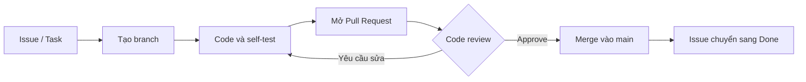
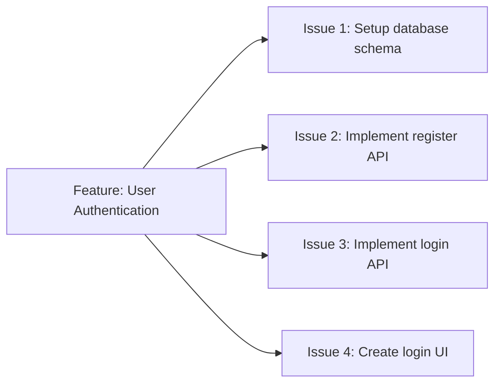
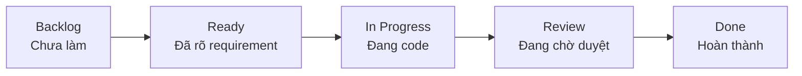
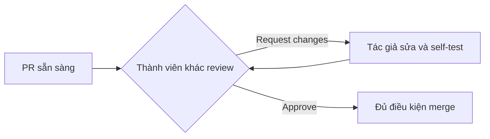
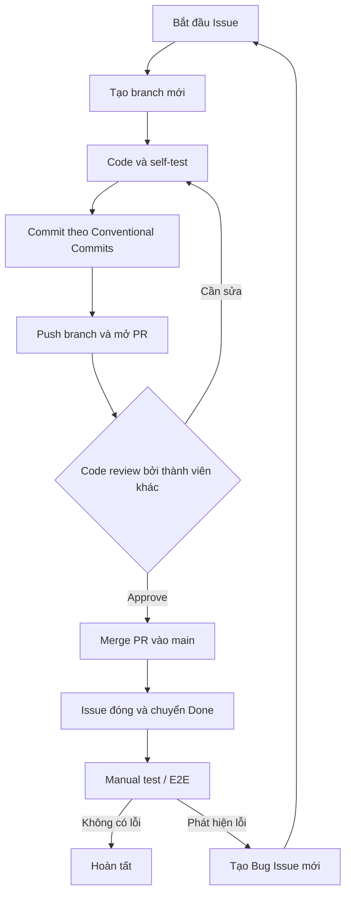

# 09. Git Workflow

## 1. Mục đích

Tài liệu này thống nhất cách làm việc với Git và GitHub trong dự án KaiwaUp, từ khi một công việc
được tạo thành Issue cho đến khi code được review, merge vào `main` và kiểm thử sau merge.

Mục tiêu của workflow:

- Mọi thay đổi đều truy vết được về Issue hoặc Task tương ứng.
- Nhánh `main` luôn ổn định và không nhận commit trực tiếp.
- Thay đổi được chia nhỏ để dễ review, kiểm thử và rollback.
- Mọi Pull Request (PR) đều được một thành viên khác review trước khi merge.
- Commit, branch và PR có tên rõ nghĩa, nhất quán trong toàn bộ repository.

Trong tài liệu này:

- **Bắt buộc**: thành viên phải tuân thủ; reviewer có quyền yêu cầu sửa trước khi approve.
- **Khuyến nghị**: nên áp dụng; có thể làm khác nếu nêu rõ lý do trong PR.

## 2. Nguyên tắc cốt lõi

1. **Không commit hoặc push trực tiếp lên `main`.**
2. **Một Issue tương ứng với một branch.** Không gom nhiều Issue độc lập vào cùng một branch.
3. Mọi thay đổi vào `main` phải đi qua Pull Request.
4. PR phải đủ nhỏ, chỉ giải quyết một mục tiêu và được liên kết với Issue tương ứng.
5. PR phải được ít nhất một thành viên khác review và approve trước khi merge.
6. Commit phải rõ nghĩa và tuân theo Conventional Commits.
7. Tác giả phải tự kiểm tra thay đổi trước khi commit và trước khi yêu cầu review.
8. Khi hành vi, cách cài đặt hoặc cách sử dụng dự án thay đổi, tài liệu liên quan cũng phải được cập
   nhật trong cùng PR.

Luồng tổng quát:



## 3. Quản lý công việc bằng Issue và Project Board

### 3.1. Phân rã tính năng

Một tính năng lớn phải được chia thành các Issue nhỏ, có thể triển khai và review độc lập. Ví dụ,
`User Authentication` có thể được chia thành:

- Thiết lập database schema.
- Xây dựng API đăng ký.
- Xây dựng API đăng nhập.
- Xây dựng giao diện đăng nhập.

Không tạo một Issue quá lớn chứa toàn bộ backend, frontend, database và kiểm thử của một tính năng
nếu các phần đó có thể được hoàn thành độc lập.



Mỗi Issue được tạo phải tuân theo template tương ứng đã dựng sẵn trong
[`.github/ISSUE_TEMPLATE`](../.github/ISSUE_TEMPLATE/) để bảo đảm cung cấp đủ các tiêu chí như
Description, Problem, Scope, Requirements, Acceptance Criteria và Notes.

### 3.2. Trạng thái trên Project Board

Issue di chuyển qua các trạng thái sau:

| Trạng thái    | Ý nghĩa                                                        |
| ------------- | -------------------------------------------------------------- |
| `Backlog`     | Công việc chưa được chọn để thực hiện.                          |
| `Ready`       | Requirement đã rõ, Issue đã có thể bắt đầu.                     |
| `In Progress` | Thành viên đã nhận Issue và đang triển khai.                    |
| `Review`      | PR đã sẵn sàng và đang chờ review.                              |
| `Done`        | PR đã merge, Issue đã hoàn thành theo điều kiện được chấp nhận. |



Khi bắt đầu làm, thành viên phải nhận Issue và chuyển nó sang `In Progress`. Khi PR sẵn sàng để review, chuyển Issue sang `Review`. Sau khi PR merge và Issue được đóng, Issue chuyển sang `Done` theo automation của GitHub Project nếu project đã cấu hình automation tương ứng.

## 4. Quy tắc branch

### 4.1. Nhánh chính

`main` là nhánh chính và phải luôn ở trạng thái có thể tích hợp, kiểm thử hoặc triển khai.

**Bắt buộc:**

- Không commit trực tiếp lên `main`.
- Không push thẳng thay đổi lên `main`.
- Không force-push lên `main`.
- Chỉ đưa thay đổi vào `main` thông qua Pull Request đã được review.

### 4.2. Một Issue, một branch

Mỗi Issue được thực hiện trên một branch riêng, tạo từ phiên bản `main` mới nhất. Nếu phát hiện một
công việc độc lập ngoài phạm vi Issue hiện tại, hãy tạo Issue và branch mới thay vì mở rộng âm thầm
phạm vi PR.

```bash
git switch main
git pull --ff-only origin main
git switch -c feature/login-api
```

### 4.3. Cách đặt tên branch

Tên branch dùng chữ thường, `kebab-case` và có cấu trúc:

```text
<type>/<short-description>
```

| Prefix      | Sử dụng cho                         | Ví dụ                          |
| ----------- | ----------------------------------- | ------------------------------ |
| `feature/`  | Tính năng hoặc hành vi mới          | `feature/login-api`            |
| `fix/`      | Sửa lỗi                             | `fix/invalid-refresh-token`    |
| `refactor/` | Cải tổ code, không đổi hành vi      | `refactor/auth-service`        |
| `docs/`     | Chỉ thay đổi tài liệu               | `docs/git-workflow`            |
| `test/`     | Thêm hoặc sửa kiểm thử              | `test/login-api`               |
| `chore/`    | Tooling, cấu hình hoặc bảo trì khác | `chore/update-prettier-config` |

Quy tắc đặt tên:

- Mô tả ngắn nhưng thể hiện đúng mục tiêu của Issue.
- Không dùng dấu cách, dấu tiếng Việt hoặc ký tự đặc biệt.
- Không dùng tên chung chung như `update`, `new-feature`, `fix-bug` hoặc tên cá nhân.
- Prefix của branch phải phù hợp với bản chất thay đổi chính.

Ví dụ hợp lệ: `feature/login-api`, `fix/audio-upload-timeout`, `docs/setup-guide`.

Ví dụ không hợp lệ: `my-branch`, `feature`, `fix_bug`, `linh/update`.

## 5. Code, self-test và commit

### 5.1. Trước khi commit

Tác giả phải tự kiểm tra phần thay đổi trong phạm vi liên quan:

- Code chạy đúng theo acceptance criteria của Issue.
- Test liên quan đã chạy thành công; bổ sung test khi thay đổi hành vi.
- Formatter, linter và type checker liên quan không báo lỗi.
- Không chứa secret, credential, token, file `.env`, log debug hoặc file sinh ra ngoài ý muốn.
- README, hướng dẫn setup và tài liệu liên quan đã được cập nhật nếu thay đổi ảnh hưởng đến cách sử
  dụng hoặc phát triển dự án.

### 5.2. Conventional Commits

Commit message tuân theo cấu trúc:

```text
<type>(<scope>): <description>
```

`scope` là tùy chọn. Repository đang kiểm tra commit message bằng `commitlint` với cấu hình
Conventional Commits.

| Type       | Ý nghĩa                                            | Ví dụ                                     |
| ---------- | -------------------------------------------------- | ----------------------------------------- |
| `feat`     | Thêm tính năng hoặc hành vi mới                    | `feat(auth): add login API`               |
| `fix`      | Sửa lỗi                                            | `fix(auth): reject expired refresh token` |
| `refactor` | Cải tổ code, không thêm tính năng hoặc sửa lỗi     | `refactor(auth): extract token service`   |
| `docs`     | Chỉ thay đổi tài liệu                              | `docs: add Git workflow`                  |
| `test`     | Thêm hoặc sửa test                                 | `test(auth): cover invalid password`      |
| `chore`    | Công việc bảo trì, dependency hoặc tooling         | `chore: update lint configuration`        |
| `build`    | Thay đổi hệ thống build hoặc dependency build-time | `build(web): update Next.js`              |
| `ci`       | Thay đổi pipeline CI/CD                            | `ci: run API tests on pull requests`      |
| `perf`     | Cải thiện hiệu năng                                | `perf(api): reduce lesson query count`    |
| `style`    | Thay đổi format, không ảnh hưởng logic             | `style(web): format lesson cards`         |
| `revert`   | Hoàn tác một commit trước đó                       | `revert: feat(auth): add login API`       |

Quy tắc viết commit message:

- Mỗi commit đại diện cho một thay đổi logic rõ ràng.
- `description` ngắn gọn, cụ thể và dùng động từ mô tả thay đổi.
- Không dùng message mơ hồ như `update`, `fix stuff`, `WIP` hoặc `changes`.
- Khi thay đổi có breaking change, dùng `!` hoặc footer `BREAKING CHANGE:` theo Conventional
  Commits.
- Không bỏ qua `commitlint` hoặc Git hook chỉ để đưa commit không hợp lệ vào repository.

Ví dụ:

```text
feat(auth): add login API
fix(web): show validation error on login form
refactor(auth): move password verification to service
docs: document local database setup
```

## 6. Pull Request

### 6.1. Tạo Pull Request

Sau khi code và self-test, push branch lên remote rồi tạo PR vào `main`:

```bash
git push -u origin feature/login-api
```

Mỗi Pull Request được tạo phải tuân theo
[`.github/PULL_REQUEST_TEMPLATE.md`](../.github/PULL_REQUEST_TEMPLATE.md) để bảo đảm cung cấp đủ các
phần Description, Related Issue, Type of Change, Changes Made, How to Test, Screenshots, Checklist và
Notes. Tác giả phải điền đầy đủ các phần phù hợp và không xóa nội dung template trước khi yêu cầu
review.

PR phải:

- Chỉ giải quyết một Issue hoặc một mục tiêu độc lập.
- Có tiêu đề mô tả rõ thay đổi.
- Liên kết Issue bằng closing keyword, ví dụ `Closes #123`.
- Mô tả thay đổi chính, cách kiểm thử và ảnh hưởng đáng chú ý.
- Kèm ảnh hoặc video khi thay đổi UI/UX.
- Không chứa thay đổi không liên quan hoặc file được format hàng loạt ngoài phạm vi.
- Được tự review lại trước khi yêu cầu người khác review.

## 7. Code review

### 7.1. Trách nhiệm của tác giả

- Chỉ yêu cầu review khi PR đã sẵn sàng và các kiểm tra liên quan đã pass.
- Cung cấp đủ bối cảnh để reviewer hiểu mục tiêu và cách kiểm tra.
- Phản hồi mọi comment; sửa code hoặc giải thích rõ khi không áp dụng đề xuất.
- Sau mỗi vòng sửa, tự kiểm tra lại và thông báo phần đã thay đổi cho reviewer.
- Không tự approve PR của mình và không merge khi chưa có approval bắt buộc.

### 7.2. Trách nhiệm của reviewer

Reviewer kiểm tra tối thiểu:

- Thay đổi đáp ứng requirement và không vượt phạm vi Issue.
- Logic đúng, dễ hiểu và tuân theo coding convention.
- Các trường hợp lỗi, bảo mật, dữ liệu và khả năng tương thích đã được cân nhắc.
- Test đủ để bảo vệ hành vi quan trọng.
- API contract, migration, generated client và tài liệu được cập nhật khi cần.
- PR không chứa secret hoặc thay đổi không liên quan.

Reviewer chọn một trong hai kết quả:

- **Request changes:** còn lỗi hoặc vấn đề cần sửa; PR quay lại vòng code và self-test.
- **Approve:** thay đổi đạt yêu cầu và có thể merge khi các kiểm tra bắt buộc đã pass.



## 8. Merge và hoàn tất Issue

Chỉ merge PR khi:

- Có ít nhất một approval từ thành viên khác.
- Tất cả comment cần xử lý đã được resolve.
- Các status check bắt buộc đã pass.
- Branch không còn conflict với `main`.
- PR vẫn đúng phạm vi và đã liên kết với Issue.

Việc merge phải thực hiện bằng chức năng merge của Pull Request, không push commit trực tiếp vào
`main`. Sử dụng merge strategy đang được repository cấu hình; không tự thay đổi strategy cho riêng
một PR nếu chưa có thống nhất của nhóm.

Sau khi merge:

1. Xác nhận PR đã đóng và thay đổi có trên `main`.
2. Issue được đóng tự động nhờ `Closes #<issue-number>`; Project Board chuyển Issue sang `Done` nếu
   automation đã được cấu hình.
3. Xóa branch đã merge nếu không còn sử dụng.
4. Đồng bộ local `main` trước khi bắt đầu Issue tiếp theo.

```bash
git switch main
git pull --ff-only origin main
git branch -d feature/login-api
```

## 9. Kiểm thử sau merge và xử lý lỗi

Sau khi PR merge, nhóm tiếp tục kiểm thử tích hợp, manual test hoặc E2E trên phiên bản đã hợp nhất.
Nếu phát hiện lỗi:

1. Không mở lại branch cũ để trộn thêm thay đổi ngoài PR đã hoàn tất.
2. Tạo một Bug Issue mới, mô tả bước tái hiện, kết quả mong đợi và kết quả thực tế.
3. Đưa Bug Issue về `Ready` khi requirement đã rõ.
4. Tạo branch `fix/<short-description>` mới và thực hiện lại đầy đủ workflow.



## 10. Checklist nhanh

### Khi bắt đầu Issue

- [ ] Requirement và acceptance criteria đã rõ.
- [ ] Đã assign Issue và chuyển sang `In Progress`.
- [ ] Đã cập nhật `main` và tạo một branch riêng, đúng quy tắc đặt tên.

### Trước khi mở PR

- [ ] Code đã được self-test; test, lint, format và type check liên quan đã pass.
- [ ] Commit message tuân theo Conventional Commits.
- [ ] PR nhỏ, đúng phạm vi và không chứa thay đổi ngoài Issue.
- [ ] README, hướng dẫn setup và tài liệu liên quan đã được cập nhật.
- [ ] PR có mô tả kiểm thử và `Closes #<issue-number>`.

### Trước khi merge

- [ ] Ít nhất một thành viên khác đã approve.
- [ ] Review comment đã được xử lý và resolve.
- [ ] Status check đã pass và branch không conflict.
- [ ] Merge thông qua Pull Request, không push trực tiếp vào `main`.

### Sau khi merge

- [ ] Issue đã đóng và chuyển sang `Done`.
- [ ] Branch đã merge được xóa khi không còn cần thiết.
- [ ] Thay đổi trên `main` được kiểm thử manual/E2E theo phạm vi.
- [ ] Nếu phát hiện lỗi, đã tạo Bug Issue và branch mới.
