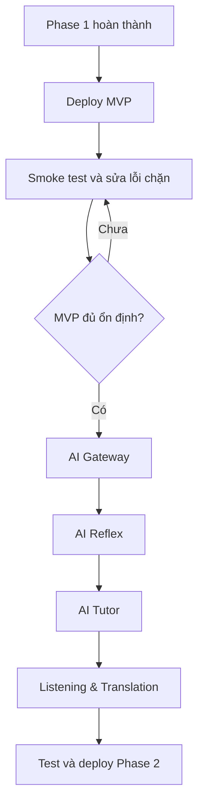

# 12. Kế hoạch triển khai sau Phase 1 và backlog Phase 2

## 1. Mục đích

Tài liệu này mô tả kế hoạch chuyển tiếp của KaiwaUp sau khi hoàn thành Phase 1 và danh sách task triển khai Phase 2.

Mục tiêu:

- Đưa phiên bản MVP của Phase 1 lên môi trường thật càng sớm càng tốt.
- Chạy thử các chức năng cốt lõi trước khi phát triển thêm chức năng nâng cao.
- Phát hiện sớm lỗi cấu hình, database, authentication, audio và trải nghiệm người dùng.
- Triển khai Phase 2 theo từng module độc lập.
- Mỗi module được chia thành Backend, Frontend và Integration.
- Mỗi task có phạm vi đủ để một thành viên hoàn thành trong khoảng một ngày làm việc.

---

## 2. Phạm vi đã hoàn thành trong Phase 1

Phase 1 bao gồm các chức năng MVP:

- Đăng ký.
- Đăng nhập và đăng xuất.
- Quản lý tài khoản cá nhân.
- Xem tiến độ học tập cá nhân.
- Bảng xếp hạng.
- Shadowing.
- Dictation.

Sau khi các chức năng trên hoạt động ổn định ở môi trường local, team chưa bắt đầu Phase 2 ngay mà thực hiện một vòng deploy và chạy thử MVP.

---

## 3. Giai đoạn chuyển tiếp — Deploy và chạy thử MVP Phase 1

### DEPLOY-01 — Chuẩn bị môi trường triển khai MVP

**Thời gian dự kiến:** 1 ngày
**Phụ thuộc:** Phase 1 đã hoàn thành và merge vào nhánh triển khai

**Nội dung:**

- Chốt nền tảng triển khai Frontend Next.js và Backend FastAPI.
- Tạo database PostgreSQL trên Neon cho môi trường triển khai.
- Cấu hình Cloudinary cho audio bài học.
- Khai báo biến môi trường của frontend và backend.
- Tách cấu hình development và production.
- Cấu hình CORS giữa frontend và backend.
- Kiểm tra không đưa secret, JWT secret hoặc database URL lên repository.
- Chuẩn bị migration và dữ liệu seed tối thiểu.

**Kết quả mong đợi:**

- Có đầy đủ môi trường frontend, backend, database và media để deploy.
- Biến môi trường được quản lý an toàn.
- Migration và seed có thể chạy trên database mới.

---

### DEPLOY-02 — Deploy Backend, Database và dữ liệu MVP

**Thời gian dự kiến:** 1 ngày
**Phụ thuộc:** DEPLOY-01

**Nội dung:**

- Deploy FastAPI backend.
- Kết nối backend với Neon PostgreSQL.
- Chạy database migration.
- Seed dữ liệu Shadowing và Dictation tối thiểu.
- Kiểm tra URL audio Cloudinary.
- Kiểm tra health endpoint.
- Kiểm tra Swagger/OpenAPI trên môi trường triển khai.
- Kiểm tra log lỗi nhưng không log password, token hoặc secret.

**Kết quả mong đợi:**

- Backend truy cập được từ Internet qua HTTPS.
- Database có schema và dữ liệu bài học cần thiết.
- Các endpoint Phase 1 phản hồi đúng trên môi trường triển khai.

---

### DEPLOY-03 — Deploy Frontend và kết nối Backend

**Thời gian dự kiến:** 1 ngày
**Phụ thuộc:** DEPLOY-02

**Nội dung:**

- Deploy Next.js frontend.
- Cấu hình API base URL của môi trường triển khai.
- Kết nối authentication với backend thật.
- Kiểm tra cookie hoặc JWT trên HTTPS.
- Kiểm tra route protection.
- Kiểm tra tải audio từ Cloudinary.
- Kiểm tra giao diện trên desktop và mobile cơ bản.

**Kết quả mong đợi:**

- Người dùng truy cập được KaiwaUp qua URL thật.
- Frontend gọi được backend và phát được audio.
- Luồng đăng nhập và route protection hoạt động chính xác.

---

### DEPLOY-04 — Smoke test và chạy thử MVP Phase 1

**Thời gian dự kiến:** 1 ngày
**Phụ thuộc:** DEPLOY-03

**Nội dung:**

Chạy thử toàn bộ luồng chính:

```text
Đăng ký
→ Đăng nhập
→ Xem và cập nhật tài khoản
→ Làm bài Shadowing
→ Làm bài Dictation
→ Kiểm tra EXP và Progress
→ Kiểm tra Leaderboard
→ Đăng xuất và đăng nhập lại
```

Kiểm tra thêm:

- Email trùng và mật khẩu không hợp lệ.
- Access token hết hạn hoặc không hợp lệ.
- Người chưa đăng nhập truy cập route cần xác thực.
- Audio bài học không tải được.
- Microphone bị từ chối quyền truy cập.
- Submit Shadowing hoặc Dictation nhiều lần.
- EXP có bị cộng trùng hay không.
- Progress có còn đúng sau khi refresh hoặc đăng nhập lại hay không.
- Database có ghi nhận đúng attempt và EXP transaction hay không.
- Giao diện có hiển thị lỗi dễ hiểu hay không.

**Kết quả mong đợi:**

- Có checklist kết quả smoke test.
- Ghi lại lỗi phát hiện được, mức độ nghiêm trọng và cách tái hiện.
- Xác định MVP đủ ổn định để cho người dùng thử hay chưa.

---

### DEPLOY-05 — Sửa lỗi chặn và phát hành MVP thử nghiệm

**Thời gian dự kiến:** 1 ngày cho mỗi nhóm lỗi
**Phụ thuộc:** DEPLOY-04

**Nội dung:**

- Ưu tiên sửa lỗi theo mức độ:
  - Blocker: không đăng nhập được, mất dữ liệu, sai EXP, không làm được bài.
  - Critical: lỗi bảo mật, truy cập dữ liệu người khác, lỗi database nghiêm trọng.
  - Major: chức năng hoạt động nhưng kết quả hoặc trải nghiệm sai đáng kể.
  - Minor: lỗi hiển thị hoặc trải nghiệm nhỏ.
- Deploy lại sau khi sửa lỗi.
- Chạy lại smoke test cho luồng bị ảnh hưởng.
- Gắn version hoặc release tag cho bản MVP thử nghiệm.

**Điều kiện bắt đầu Phase 2:**

- Không còn lỗi Blocker hoặc Critical.
- Đăng ký và đăng nhập hoạt động ổn định.
- Shadowing và Dictation có thể hoàn thành trên môi trường thật.
- EXP, Progress và Leaderboard cập nhật đúng.
- Database migration có thể chạy lại an toàn.
- Frontend, backend và audio đều truy cập được qua HTTPS.

Các lỗi Minor không nhất thiết phải chặn Phase 2 nhưng phải được ghi lại trong backlog.

---

## 4. Phạm vi Phase 2 — Chức năng nâng cao

Phase 2 gồm:

1. AI Gateway dùng chung.
2. AI Reflex và Spaced Repetition.
3. AI Tutor dạng văn bản, có gợi ý trả lời.
4. Listening & Translation bằng free-text, có AI đánh giá mức độ truyền tải đúng ý.
5. Hoàn thiện dữ liệu, kiểm thử và deployment.

### Quyết định phạm vi

| Nội dung | Quyết định Phase 2 |
|---|---|
| AI Tutor | Chỉ hỗ trợ text; voice input để giai đoạn sau |
| AI Tutor hints | Mỗi câu hỏi có tối đa 2–3 gợi ý trả lời phù hợp trình độ |
| Reflex | Ba giây để bắt đầu phản hồi, không phải hoàn thành câu trả lời |
| Translation | Người dùng bắt buộc nhập bản dịch tiếng Việt dạng free-text |
| Đánh giá Translation | AI đánh giá theo ý nghĩa, không yêu cầu khớp từng từ với bản dịch tham khảo |
| Audio người dùng | Chỉ giữ tạm trong khi xử lý rồi xóa |
| Gọi AI | Chỉ backend gọi thông qua AI Gateway |

---

## 5. Module AI Gateway

AI Gateway được triển khai trước vì Reflex, AI Tutor và Translation đều phụ thuộc vào module này.

### AI-01 — Backend: Xây dựng AI Gateway

**Thời gian dự kiến:** 1 ngày
**Phụ thuộc:** MVP Phase 1 đã deploy ổn định

**Nội dung:**

- Chọn và cấu hình AI provider.
- Tạo interface dùng chung cho:
  - Speech-to-Text.
  - Đánh giá câu trả lời Reflex.
  - Đánh giá bản dịch.
  - Sinh phản hồi AI Tutor.
- Xây dựng provider adapter.
- Quản lý prompt riêng cho từng chức năng.
- Chuẩn hóa transcript, score, feedback, correction, hints và error.
- Xử lý timeout, retry giới hạn và response không hợp lệ.
- Tạo fake adapter phục vụ unit test.
- Không để SDK, API key hoặc payload riêng của provider xuất hiện trong business module.

**Acceptance criteria:**

- Các business service chỉ phụ thuộc interface của AI Gateway.
- Có thể thay provider mà không sửa Reflex, Tutor hoặc Translation.
- Có test cho success, timeout, response lỗi và provider unavailable.

---

### AI-02 — Frontend: Xây dựng UI state dùng chung cho AI

**Thời gian dự kiến:** 0.5–1 ngày
**Phụ thuộc:** Không

**Nội dung:**

- Xây dựng trạng thái `idle`, `processing`, `success` và `failed`.
- Component hiển thị loading AI.
- Component hiển thị điểm, transcript, feedback và suggestion.
- Component hiển thị lỗi và nút thử lại.
- Đảm bảo không hiển thị thất bại khi request vẫn đang xử lý.

**Acceptance criteria:**

- Reflex, Tutor và Translation tái sử dụng được các component.
- Giao diện loading, lỗi và retry thống nhất.

---

### AI-03 — Integration: Kết nối và kiểm tra AI Gateway

**Thời gian dự kiến:** 0.5–1 ngày
**Phụ thuộc:** AI-01, AI-02

**Nội dung:**

- Cấu hình AI provider trên môi trường development.
- Tích hợp response chuẩn hóa với frontend.
- Kiểm tra success, timeout, malformed response và provider unavailable.
- Kiểm tra API key không xuất hiện trên frontend.
- Kiểm tra error response theo API contract chung.

**Acceptance criteria:**

- Có một luồng demo gọi AI hoàn chỉnh.
- Frontend hiển thị đúng loading, kết quả và lỗi.

---

## 6. Module AI Reflex và Spaced Repetition

### REFLEX-01 — Backend: Xây dựng API Reflex và lịch ôn tập

**Thời gian dự kiến:** 1 ngày
**Phụ thuộc:** AI-01

**Nội dung:**

- Hoàn thiện `reflex_exercises`, `exercise_attempts`, `ai_evaluations` và `review_schedules`.
- Xây dựng API:

```http
GET /api/v1/reflex/lessons
GET /api/v1/reflex/lessons/{lesson_id}
POST /api/v1/reflex/lessons/{lesson_id}/evaluate
GET /api/v1/review/due
GET /api/v1/review/schedule
```

- Nhận `audio_file` và `response_start_ms`.
- Kiểm tra MIME type, dung lượng, audio rỗng và thời gian phản hồi.
- Xác định `is_on_time` theo quy tắc bắt đầu phản hồi trong ba giây.
- Gọi AI Gateway để chuyển audio thành text và đánh giá câu trả lời.
- Chuẩn hóa điểm AI trong khoảng 0–100.
- Tạo lịch ôn dựa trên điểm AI và số lần ôn liên tiếp đạt yêu cầu.
- Khoảng ngày cơ sở theo điểm:

| Điểm AI | Khoảng ngày cơ sở |
|---:|---:|
| 0–49 | 1 ngày |
| 50–69 | 3 ngày |
| 70–84 | 5 ngày |
| 85–100 | 7 ngày |

- Với điểm từ 70 trở lên, tăng `successful_review_streak` thêm 1.
- Với điểm dưới 70, reset `successful_review_streak` về 0 để tránh tiếp tục kéo dài lịch khi người dùng đã quên bài.
- Chỉ tăng streak khi người dùng hoàn thành một lượt ôn đã đến hạn; việc làm lại nhiều lần trong cùng ngày không làm tăng hệ số.
- Công thức MVP:

```text
Nếu ai_score < 70:
    multiplier = 1

Nếu ai_score >= 70:
    multiplier = 2 ^ (successful_review_streak - 1)

interval_days = min(base_days × multiplier, 60)
next_review_at = completed_at + interval_days
```

- Giới hạn khoảng ôn tối đa ở 60 ngày trong MVP để người dùng không mất bài khỏi lịch ôn quá lâu.

Ví dụ một bài liên tục đạt 100 điểm:

| Lần ôn đạt yêu cầu | Cách tính | Lần ôn tiếp theo |
|---:|---:|---:|
| 1 | 7 × 1 | Sau 7 ngày |
| 2 | 7 × 2 | Sau 14 ngày |
| 3 | 7 × 4 | Sau 28 ngày |
| 4 | 7 × 8 | Sau 56 ngày |
| 5 trở đi | Kết quả vượt 60 nên áp dụng giới hạn | Sau 60 ngày |

Nếu lần tiếp theo chỉ đạt 55 điểm, streak bị reset và bài được đưa lại sau 3 ngày. Nếu đạt dưới 50 điểm, bài được đưa lại sau 1 ngày.

- Lưu attempt, AI evaluation và review schedule.
- Cộng EXP, cập nhật Progress và chống cộng EXP trùng.
- Xóa audio tạm cả khi thành công, timeout hoặc thất bại.
- Viết test cho service và API chính.

**Acceptance criteria:**

- Chỉ trả bài đã publish.
- `response_start_ms <= 3000` được đánh dấu đúng hạn.
- Điểm AI luôn thuộc khoảng 0–100.
- Lịch ôn được tạo hoặc cập nhật đúng theo điểm, streak và giới hạn tối đa.
- Làm lại nhiều lần trong cùng ngày không làm tăng `successful_review_streak`.
- Người dùng chỉ xem được lịch ôn của mình.
- Audio người dùng không được lưu lâu dài.

---

### REFLEX-02 — Frontend: Xây dựng giao diện AI Reflex

**Thời gian dự kiến:** 1 ngày
**Phụ thuộc:** Có thể làm song song REFLEX-01 bằng mock data

**Nội dung:**

- Xây dựng trang danh sách và trang thực hiện bài Reflex.
- Hiển thị prompt và phát audio câu hỏi.
- Bắt đầu bộ đếm ba giây sau khi audio kết thúc.
- Xin quyền microphone và ghi âm câu trả lời.
- Ghi nhận `response_start_ms`.
- Gửi audio và hiển thị trạng thái AI đang xử lý.
- Hiển thị đúng hạn/chậm, transcript, điểm, feedback, suggestion, EXP và lịch ôn.
- Xây dựng danh sách bài đến hạn cần ôn.
- Xử lý lỗi microphone, audio, API và AI.

**Acceptance criteria:**

- Timer bắt đầu đúng thời điểm.
- Không thể gửi khi chưa có audio.
- Không gửi request trùng khi AI đang xử lý.
- Khi AI lỗi, người dùng thấy thông báo và có thể thử lại.

---

### REFLEX-03 — Integration: Hoàn thiện luồng AI Reflex

**Thời gian dự kiến:** 1 ngày
**Phụ thuộc:** REFLEX-01, REFLEX-02

**Nội dung:**

- Kết nối danh sách, chi tiết và review với API thật.
- Tích hợp upload audio bằng `multipart/form-data`.
- Đồng bộ `response_start_ms` và kết quả AI.
- Kiểm tra EXP, Progress và review schedule.
- Viết integration hoặc E2E test cho luồng:

```text
Chọn bài
→ Nghe prompt
→ Đếm ba giây
→ Ghi âm
→ AI đánh giá
→ Nhận EXP
→ Tạo lịch ôn
```

**Acceptance criteria:**

- Luồng hoạt động hoàn chỉnh trên môi trường development.
- Refresh vẫn xem được trạng thái hoàn thành.
- AI timeout được hiển thị đúng và không tạo EXP trùng.

---

## 7. Module AI Tutor có gợi ý trả lời

Phase 2 chỉ hỗ trợ hội thoại bằng văn bản. Voice input được để lại cho giai đoạn sau.

### TUTOR-01 — Backend: Xây dựng API AI Tutor

**Thời gian dự kiến:** 1 ngày
**Phụ thuộc:** AI-01

**Nội dung:**

- Hoàn thiện `tutor_sessions` và `tutor_messages`.
- Xây dựng API:

```http
POST /api/v1/ai-tutor/conversations
GET /api/v1/ai-tutor/conversations
GET /api/v1/ai-tutor/conversations/{conversation_id}
POST /api/v1/ai-tutor/conversations/{conversation_id}/messages
```

- Tạo conversation theo topic và difficulty.
- Gọi AI tạo lời mở đầu.
- Lưu message theo đúng thứ tự.
- Gửi context hội thoại có giới hạn sang AI Gateway.
- Chuẩn hóa mỗi phản hồi AI gồm:
  - Nội dung phản hồi.
  - Câu hỏi tiếp theo.
  - Tối đa 2–3 gợi ý trả lời.
  - Nghĩa tiếng Việt của từng gợi ý.
  - Sửa lỗi ngữ pháp.
  - Gợi ý cách diễn đạt tự nhiên.
- Lưu gợi ý cùng message để có thể tải lại.
- Kiểm tra ownership conversation.
- Xử lý AI timeout mà không làm mất user message.
- Viết test cho service, thứ tự message và authorization.

**Acceptance criteria:**

- Người dùng tạo được conversation và nhận lời mở đầu.
- Câu hỏi AI có tối đa ba gợi ý phù hợp difficulty.
- Gợi ý không quá dài và không bắt buộc người dùng sao chép nguyên câu.
- Lịch sử message và hints được lưu đúng thứ tự.
- Người dùng không truy cập được conversation của người khác.

---

### TUTOR-02 — Frontend: Xây dựng giao diện AI Tutor

**Thời gian dự kiến:** 1 ngày
**Phụ thuộc:** Có thể làm song song TUTOR-01 bằng mock data

**Nội dung:**

- Xây dựng màn hình chọn topic và difficulty.
- Xây dựng danh sách lịch sử conversation.
- Xây dựng giao diện chat cho user và AI.
- Hiển thị trạng thái đang gửi và AI đang phản hồi.
- Hiển thị grammar correction và natural expression tip.
- Thêm nút `Xem gợi ý trả lời` dưới câu hỏi của AI.
- Hiển thị câu tiếng Nhật và nghĩa tiếng Việt của gợi ý.
- Cho phép bấm gợi ý để điền vào ô nhập nhưng không tự gửi.
- Cho phép chỉnh sửa gợi ý trước khi gửi.
- Xử lý gửi trùng, lỗi và retry.

**Acceptance criteria:**

- Gợi ý mặc định được thu gọn để khuyến khích tự trả lời.
- Không hiển thị khối gợi ý khi `answer_hints` rỗng.
- Bấm vào gợi ý không tự động gửi message.
- Refresh trang vẫn hiển thị được message và hints cũ.

---

### TUTOR-03 — Integration: Hoàn thiện luồng AI Tutor

**Thời gian dự kiến:** 1 ngày
**Phụ thuộc:** TUTOR-01, TUTOR-02

**Nội dung:**

- Kết nối tạo conversation, lịch sử và gửi message với backend.
- Đồng bộ trạng thái pending, processing, success và failed.
- Đồng bộ `answer_hints` trong lời mở đầu, phản hồi tiếp theo và lịch sử.
- Kiểm tra retry không tạo duplicate user message.
- Kiểm tra authorization bằng hai tài khoản.
- Viết E2E test cho luồng:

```text
Chọn topic và difficulty
→ Tạo conversation
→ Nhận câu hỏi và gợi ý
→ Chọn một gợi ý
→ Chỉnh sửa và gửi
→ Nhận feedback và câu hỏi tiếp theo
→ Tải lại lịch sử
```

**Acceptance criteria:**

- Message không sai thứ tự hoặc bị trùng.
- Gợi ý thay đổi phù hợp với difficulty.
- Refresh không làm mất lịch sử.
- User A không truy cập được conversation của User B.

---

## 8. Module Listening & Translation

Người dùng bắt buộc nhập bản dịch tiếng Việt dạng free-text. AI đánh giá mức độ truyền tải đúng ý dựa trên transcript và bản dịch tham khảo; không yêu cầu khớp từng từ và không có bước quiz trắc nghiệm.

### Luồng chính

```text
Nghe hội thoại tiếng Nhật
→ Nhập bản dịch tiếng Việt
→ AI đánh giá bản dịch
→ Hiển thị điểm, ý đúng, ý thiếu, gợi ý và bản dịch tham khảo
→ Lưu kết quả và hoàn thành attempt
→ Cộng EXP và cập nhật Progress
```

### TRANSLATION-01 — Backend: Xây dựng API Listening & Translation

**Thời gian dự kiến:** 1 ngày
**Phụ thuộc:** AI-01

**Nội dung:**

- Hoàn thiện dữ liệu bài nghe, transcript và bản dịch tham khảo.
- Xây dựng AI prompt đánh giá bản dịch theo ý nghĩa của transcript.
- Xây dựng API:

```http
GET /api/v1/listening-translation/lessons
GET /api/v1/listening-translation/lessons/{lesson_id}
POST /api/v1/listening-translation/lessons/{lesson_id}/submit
```

- API `submit` nhận free-text và dùng AI đánh giá mức độ truyền tải đúng ý.
- Lưu bản dịch của người dùng và AI evaluation trong cùng attempt.
- Chỉ hoàn thành bài và cộng EXP sau khi đánh giá bản dịch thành công.
- Xử lý AI timeout mà không làm mất bản dịch đã gửi.
- Viết test cho đánh giá bản dịch, attempt, retry và EXP.

**Acceptance criteria:**

- Bản dịch chỉ nhận free-text.
- Không thể submit bản dịch rỗng.
- AI đánh giá theo ý nghĩa, không yêu cầu khớp từng từ với bản dịch tham khảo.
- Kết quả gồm điểm, ý đúng, ý thiếu và gợi ý cải thiện.
- Submit lại không cộng EXP lần thứ hai.

---

### TRANSLATION-02 — Frontend: Xây dựng giao diện Listening & Translation

**Thời gian dự kiến:** 1 ngày
**Phụ thuộc:** Có thể làm song song TRANSLATION-01 bằng mock data

**Nội dung:**

- Xây dựng danh sách và trang thực hiện bài.
- Xây dựng audio player có phát, tạm dừng, phát lại và âm lượng.
- Xây dựng textarea nhập bản dịch tiếng Việt dạng free-text.
- Hiển thị trạng thái AI đánh giá và kết quả gồm điểm, ý đúng, ý thiếu và gợi ý.
- Sau submit, hiển thị bản dịch tham khảo, kết quả đánh giá và EXP.
- Xử lý lỗi audio, API và AI.

**Acceptance criteria:**

- Chỉ hỗ trợ nhập bản dịch tiếng Việt dạng free-text; không có quiz trắc nghiệm.
- Không thể submit bản dịch rỗng.
- Hiển thị trạng thái processing trong lúc AI đánh giá.
- Chỉ hiển thị hoàn thành bài sau khi đánh giá bản dịch thành công.

---

### TRANSLATION-03 — Integration: Hoàn thiện luồng Listening & Translation

**Thời gian dự kiến:** 1 ngày
**Phụ thuộc:** TRANSLATION-01, TRANSLATION-02

**Nội dung:**

- Kết nối danh sách và chi tiết với backend.
- Tích hợp audio Cloudinary.
- Tích hợp nộp bản dịch free-text và hiển thị AI evaluation.
- Kiểm tra bản dịch và AI evaluation thuộc cùng attempt.
- Kiểm tra EXP và Progress.
- Kiểm tra refresh vẫn tải lại được kết quả đã lưu.
- Kiểm tra retry không tạo duplicate attempt hoặc cộng EXP trùng.
- Viết E2E test cho luồng đầy đủ.

**Acceptance criteria:**

- Refresh sau khi hoàn thành vẫn hiển thị được kết quả đánh giá.
- AI timeout không làm mất bản dịch đã gửi.
- Retry sau lỗi không tạo duplicate attempt.
- Chỉ cộng EXP một lần sau khi đánh giá bản dịch thành công.

---

## 9. Hoàn thiện Phase 2

### PHASE2-01 — Chuẩn bị nội dung và seed data

**Thời gian dự kiến:** 1 ngày

- Tạo bài Reflex theo các độ khó ưu tiên của MVP.
- Upload audio prompt lên Cloudinary.
- Tạo bài Listening & Translation có transcript và bản dịch tham khảo.
- Tạo danh sách topic và scenario cho AI Tutor.
- Kiểm tra seed chạy được trên database mới.

---

### PHASE2-02 — Kiểm thử tổng thể Phase 2

**Thời gian dự kiến:** 1 ngày

- Chạy backend unit test và integration test.
- Chạy frontend test và E2E test.
- Kiểm tra microphone trên trình duyệt thật.
- Kiểm tra audio Cloudinary.
- Kiểm tra AI success, timeout và provider unavailable.
- Kiểm tra ownership bằng nhiều tài khoản.
- Kiểm tra audio tạm được xóa.
- Kiểm tra attempt, EXP và Progress không bị ghi trùng.

---

### PHASE2-03 — Deploy và smoke test Phase 2

**Thời gian dự kiến:** 1 ngày

- Cấu hình AI API key trên môi trường triển khai.
- Cấu hình timeout và rate limit cho AI endpoint.
- Chạy migration và seed Phase 2.
- Deploy frontend và backend.
- Smoke test Reflex, AI Tutor và Translation.
- Kiểm tra log và chi phí gọi AI.
- Cập nhật OpenAPI, `.env.example` và hướng dẫn troubleshooting.

---

## 10. Tổng hợp backlog

| Giai đoạn | Backend / Hạ tầng | Frontend | Integration / Kiểm thử |
|---|---|---|---|
| Deploy MVP Phase 1 | DEPLOY-01, DEPLOY-02 | DEPLOY-03 | DEPLOY-04, DEPLOY-05 |
| AI Gateway | AI-01 | AI-02 | AI-03 |
| AI Reflex | REFLEX-01 | REFLEX-02 | REFLEX-03 |
| AI Tutor | TUTOR-01 | TUTOR-02 | TUTOR-03 |
| Translation | TRANSLATION-01 | TRANSLATION-02 | TRANSLATION-03 |
| Hoàn thiện Phase 2 | PHASE2-01 | — | PHASE2-02, PHASE2-03 |

Tổng số task:

- Deploy và chạy thử Phase 1: 5 task.
- Phát triển Phase 2: 15 task.
- Tổng cộng: 20 task.

---

## 11. Thứ tự thực hiện



Backend và Frontend của cùng một module có thể được triển khai song song nếu API contract đã được chốt và frontend sử dụng mock data. Task Integration chỉ bắt đầu sau khi Backend và Frontend của module tương ứng đã sẵn sàng.

---

## 12. Definition of Done chung cho mỗi task

Một task chỉ được xem là hoàn thành khi:

- Code đã chạy được trên môi trường development.
- Đúng API contract và coding convention của dự án.
- Không chứa secret hoặc API key trong source code.
- Có test cho logic nghiệp vụ chính.
- Formatter, linter, type checking và test đều pass.
- Đã xử lý trạng thái loading, empty và error nếu có giao diện.
- Đã kiểm tra authorization đối với dữ liệu cá nhân.
- Pull request có mô tả cách kiểm thử.
- Không làm hỏng chức năng đã hoàn thành ở Phase 1.

---

## 13. Nguyên tắc dành cho MVP

- Deploy sớm để kiểm tra hệ thống thật, không chờ toàn bộ chức năng nâng cao hoàn thành.
- Ưu tiên luồng chính hoạt động ổn định hơn số lượng tính năng.
- Chưa triển khai voice input cho AI Tutor trong Phase 2.
- Không triển khai AI theo cách làm lộ API key ở frontend.
- Không lưu lâu dài audio do người dùng ghi âm.
- AI lỗi phải có thông báo rõ ràng và khả năng thử lại.
- Không để lỗi của tính năng AI làm hỏng Auth, Progress, EXP hoặc các chức năng Phase 1.
- Transcript, bản dịch tham khảo và nội dung seed phải được kiểm tra thủ công trước khi đưa cho người dùng thật.
